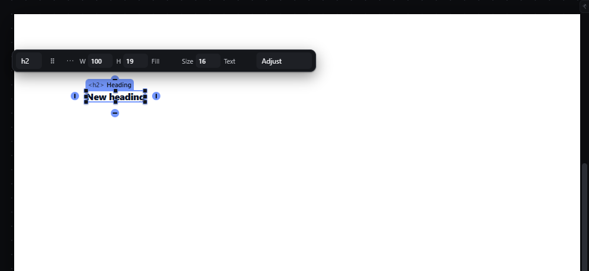

# absolute-anchors — Anchor positioned elements to edges and centres

How Pager behaves, observed by running it from `.cache/pager-run` (Chrome, window 1600×900) and read from its source. Source references are `path:line` inside Pager. Test: an absolutely positioned Heading (`left: 122px; top: 130px`), selected, canvas focused.

## Trigger

- `Alt+Shift+ArrowLeft/Right/Up/Down` toggles the anchor on that edge, when exactly one positioned (absolute/fixed) child is selected and not locked or hidden (`src/features/input/index.js:708-713`, `boxChildSelected` `src/features/resize/index.js:62-65`).
- Four round **anchor tabs** on the selection outline: a click (press and release on the same tab) toggles that edge (`resize/index.js:351-358`).
- Command-bar commands `Anchor horizontally to the centre` / `vertically to the centre` (`resize/index.js:395-400`); they have no key and no tab.

## Hit zones and thresholds

- Tabs are 14 × 14 px circles centred just outside the middle of each edge (observed positions for a 100 × 19 px element: left at x−26, right at x+112, top above, bottom below), shown only for a positioned child (`resize/index.js:379-385`).
- Toggling never moves the element: the current box is measured and re-expressed with the new anchors (`resize/index.js:254-276`, `nwPlaceBox`).
- Horizontal anchors: left, right, both (left + right, width `auto`), centre. Vertical: top, bottom, both, centre.

## Visual feedback

| Stage | What is drawn | Image |
|---|---|---|
| Positioned child selected | Four tabs; filled = anchored (left and top by default), hollow = free. The top tab sits under the selection chip. |  |
| After Alt+Shift+ArrowRight and Alt+Shift+ArrowDown | All four tabs filled; status `Anchored left and right · top and bottom.` |  |

## Result in the document

Observed writes:

| Key | Styles written |
|---|---|
| Alt+Shift+ArrowRight | `left: 122px; right: 1218px; width: auto; height: 19px; bottom: auto; translate: none` — status `Anchored left and right · top.` |
| Alt+Shift+ArrowDown | adds `bottom: 491px; height: auto` — status `Anchored left and right · top and bottom.` |

The element's measured box did not change (446, 218, 100 × 19 px before and after). Anchoring the centre stores `left: 50%` with a `translate` (`src/model/position.js`, `boxPlacement`).

## Undo and redo

Each toggle is one history entry.

## Nested elements

The distances are measured from the containing block (see `absolute-free-drag.md`: in Pager this is the page when the parent was never made relative, which is why `right: 1218px` was computed against the 1440 px page).

## Zoom other than 100 %

Values are CSS px; tabs keep their screen size.

## Keyboard equivalent

`Alt+Shift+Arrow` is the keyboard door; centre anchors are only in the command bar.

## Problems in Pager

1. **Anchor distances are computed against the page** when the parent is static (see `absolute-free-drag.md` problem 1), so "anchored right" means "right of the page". Required: anchors are relative to the parent, which rule 1 of `absolute-free-drag.md` makes the containing block; after resizing the parent the element keeps its distances to the anchored edges (features.json `absolute-anchors`).
2. **Centre anchors have no key and no tab.** Required: the Inspector's anchor control offers left / centre / right / both and top / centre / bottom / both, running the same command as the keys (features.json: "Use the anchor control in the inspector to anchor horizontally to the centre").
3. **The top tab is hidden under the selection chip.** Required: anchor tabs are never covered by other canvas chrome.
4. **`height: 19px` is frozen when anchoring left and right,** turning an auto-height text box into a fixed height. Required: toggling a horizontal anchor never changes the vertical size mode, and vice versa.
