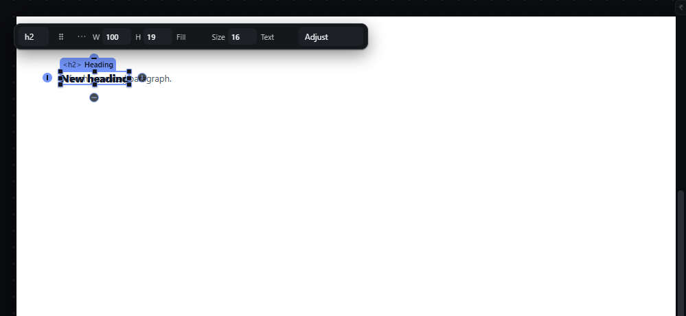
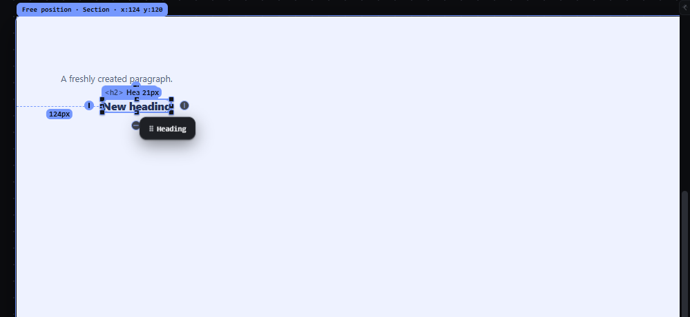
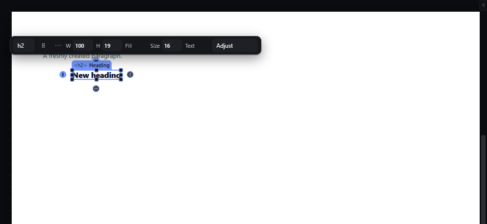

# absolute-free-drag — Free positioning of absolute children by dragging

How Pager behaves, observed by running it from `.cache/pager-run` (Chrome, window 1600×900, zoom 100 %) and read from its source. Source references are `path:line` inside Pager. Test document: Section (`padding: 56px 40px; height: 400px`, position static) > [Heading, Paragraph].

## Trigger

- Make the element absolute: Inspector → Layout → Position → **absolute** (or `position` in any property door).
- Drag the element like any element (press, 4 px threshold, release; `src/app/boot.js:449-516`). When every dragged node is absolutely or fixed positioned and the pointer is inside its parent's padding box (or inside the element's containing block while only climbing out of the parent), the proposal is a **free position** instead of a flow insertion (`src/features/drag/drag.js:475-484`, `canvasProp` `:679-708`).
- Ctrl during the drag duplicates and suspends snapping (`drag.js:307-311`); `Escape` cancels.

## Hit zones and thresholds

- The element keeps the grab offset: the pointer stays at the same point of the box during the drag (`drag.js:917-918`, `:685`).
- The box is clamped inside its containing block (`src/platform/box-geometry.js:100-106`, `boxMove`).
- Coordinates are measured from the **containing block's padding edge** (the nearest positioned ancestor, or the page when there is none; `src/platform/measure.js:270-286`) and rounded to whole CSS px (`drag.js:694`).
- With Snap on, edges and centres snap within the snap distance to targets (see `snap-while-moving.md`); Ctrl suspends (`drag.js:689`).

## Visual feedback

| Stage | What is drawn | Image |
|---|---|---|
| Heading after clicking "absolute" | Only `position: absolute` is written; the Heading shrinks to its content width (99.7 px) and stays where the static layout put it; the Section stays `position: static`. |  |
| Dragging 60 px right, 40 px down | The element itself moves live under the pointer (temporary `translate`, `drag.js:896-911`); the receiver (Section) is tinted; dashed alignment lines appear only when a snap engaged; distance markers show the gap to the nearest thing above (`96px`) and to the left (`124px`) (`src/platform/overlay.js:250-259`); the label chip reads `Free position · Section · x:124 y:120`; the status bar reads `Coordinates (124, 120)`, read-out "Absolute child of Section; overlap allowed, alignment guides active." |  |
| Released | Status `✓ Free position · Section · x:124 y:120`. |  |

## Result in the document

- Release writes `left` and `top` in px (and keeps `right`/`bottom` constraints consistent when they are set; `measure.js:291-306`) on the active breakpoint/state layer. Observed: `position: absolute; left: 124px; top: 120px`.
- The measured offset relative to the **Section** was 100 × 96 px; the stored 124 × 120 px are relative to the **page body**, because the Section was never made `position: relative` (observed: the Heading's `offsetParent` is `BODY`).
- Dragging past the parent's edge keeps the free proposal while the pointer is inside the containing block (`drag.js:477-484`); it does not reparent (observed: 60 px below the Section the proposal was still `Free position · Section · x:124 y:474`).

## Undo and redo

The drop is one history entry: Ctrl+Z removed `left`/`top` (back to `position: absolute` only).

## Nested elements

The containing block decides the coordinates; the label always names the DOM parent.

## Zoom other than 100 %

Coordinates are screen movement ÷ zoom (`drag.js:681`, `:694`).

## Keyboard equivalent

Arrow-key nudges (see `absolute-nudge.md`).

## Problems in Pager

1. **Making a child absolute does not make its static parent `position: relative` and does not store its current position.** The element jumps to its content width and later coordinates are relative to the page, not the parent. Required: setting `absolute` on a child of a static parent sets the parent to `position: relative` and writes `top`/`left` computed from the child's old place, so it does not move visually (manifest feature `absolute-free-drag`); both writes are one undo step.
2. **The label says `Section` while the numbers are page coordinates.** Required: the label and the status bar show coordinates relative to the element's containing block, which is its parent after rule 1.
3. **Ctrl duplicates while dragging** (the ghost reads `Copy of …`) and also turns snapping off. Required: the modifiers come from the one declaration in `manifest/interactions.json` (the `free-drag` gesture): holding **Ctrl** suspends snapping for that gesture, as it does while resizing (`snap-while-moving`), and Ctrl never duplicates; duplication-by-drag, if it is ever added, uses a modifier that is not a snap switch.
