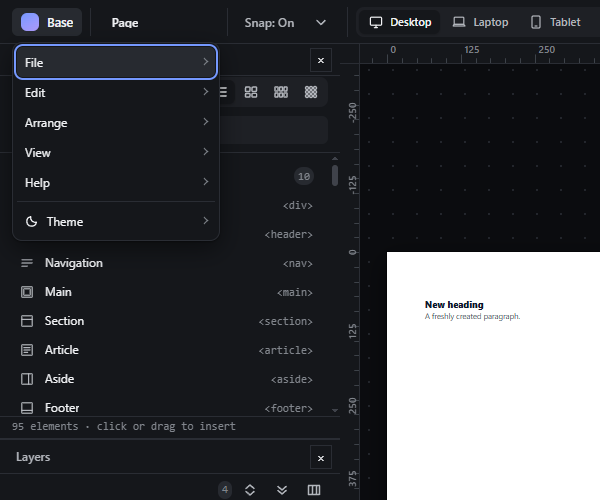
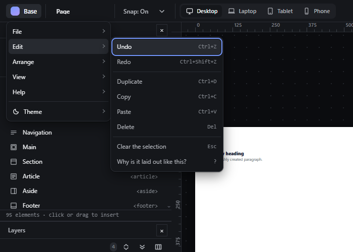

# app-menu — Application menu: File, Edit, Arrange, View, Help and Theme

How Pager behaves, observed by running it from `.cache/pager-run` (Chrome, window 1600×900) and read from its source. Source references are `path:line` inside Pager.

## Trigger

- Click the logo button (`#appBtn`): the app menu opens with **File, Edit, Arrange, View, Help, Theme**, each opening a submenu to its right (`src/features/workspace/dock.js:298-364`, `:375-387`).
- Keyboard (`dock.js:318-340`, `:352-363`): Enter or ArrowDown on the logo button opens the menu with focus on its first enabled item; ArrowDown/ArrowUp move (wrapping), Home/End jump; Enter on a row that opens a submenu opens it with focus on its first item; `Escape` closes every open menu and returns focus to the logo button (observed). A click outside closes.
- Menu rows run commands (`dock.js:446-493`): rows bound to key rows call `runKey`; Duplicate, Copy and Paste **dispatch a synthetic keydown** (`:474-479`).

## Hit zones and thresholds

- Submenus open at the right of the app menu, clamped to the window (`dock.js:311-317`).
- Rows marked `data-needs-selection` are disabled when nothing is selected (`dock.js:495-506`), with the title `Select an element first.`

## Visual feedback

| Stage | What is drawn | Image |
|---|---|---|
| App menu open | Six rows: File, Edit, Arrange, View, Help, Theme. |  |
| Edit submenu | Each row shows its shortcut on the right. |  |

Observed contents:

| Menu | Rows (shortcut) |
|---|---|
| File | Save project (JSON), Open project (JSON), Export page (HTML), New blank page, Commands (Ctrl+K) (`index.html:37-50`) |
| Edit | Undo (Ctrl+Z), Redo (Ctrl+Shift+Z), Duplicate (Ctrl+D), Copy (Ctrl+C), Paste (Ctrl+V), Delete (Del), Clear the selection (Esc), Why is it laid out like this? (?) |
| Arrange | Move up (Alt+↑), Move down (Alt+↓), Wrap in a row (R), Wrap in a column (C), Promote out of the parent (P), Take into the hand (M), Rename (F2) — all disabled with nothing selected |
| View | Elements, Layers, Properties, Inspector, Engine read-out, Guides & Grids (checkable), Elements / Layers (Ctrl+B), Inspector (Ctrl+Alt+B), Developer tools, Reset workspace |
| Help | a list of shortcuts (Undo, Redo, Duplicate, Delete, walk keys, Edit the text, Move up, R, C, P, M, ?) as runnable rows |
| Theme | Light, Dark, System |

## Result in the document

Each row produces the same document JSON as its shortcut (same code path, or a synthetic key event).

## Undo and redo

As for the underlying commands.

## Nested elements

Not applicable.

## Zoom other than 100 %

Not affected.

## Keyboard equivalent

As described in Trigger.

## Problems in Pager

1. **Rows are missing:** File lacks Import HTML; Edit lacks Cut and Select all in container; Arrange lacks Remove wrapper and Make child of previous layer; View lacks Explorer, Code, Timeline, Workbench, Canvas tools, Collapse every dock (Ctrl+\) and Developer tools as described; Help lacks a Keyboard shortcuts row. Required: the rows listed in features.json `app-menu`, in that order; rows whose feature is not built yet are disabled and labelled "not available yet", read from the one feature registry.
2. **Menu rows dispatch fake keyboard events** for Duplicate, Copy and Paste. Required: every row calls its command directly (the same command its shortcut calls).
3. **Help is a list of runnable shortcuts** rather than a door to the shortcuts panel. Required: Help → Keyboard shortcuts opens the shortcuts panel (see `shortcuts-panel.md`).
4. **Disabled rows give no reason other than a generic title.** Required: a disabled row's tooltip says why (`Select an element first`, `Needs a single selection`, `not available yet`).
