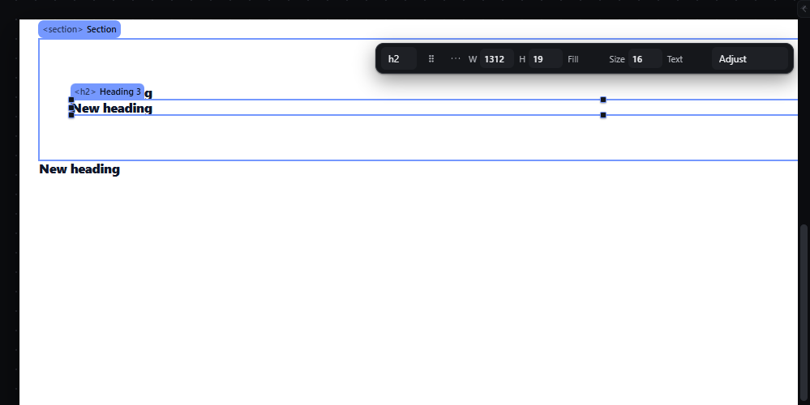

# clipboard-copy-paste — Copy and paste elements inside the editor with Ctrl+C and Ctrl+V

How Pager behaves, observed by running it from `.cache/pager-run` (Chrome, window 1600×900) and read from its source. Source references are `path:line` inside Pager. Test document: Section > Heading, and an empty Container after the Section.

## Trigger

- `Ctrl+C` / `Ctrl+V` with something selected, focus on the canvas or panel chrome (`src/features/input/index.js:675-678`).
- Other doors: context menu Copy / Paste, Edit menu (synthetic key events, `src/features/workspace/dock.js:406-407`).

## Hit zones and thresholds

- Copy stores a JSON clone of the **primary** selected node in a module variable (`src/features/layers/layers-panel.js:658-664`). It never touches the system clipboard; a multi-selection copies only the primary node.
- Paste target (`layers-panel.js:665-680`): if the selection is a container, the copy is appended as its last child; otherwise it is inserted right after the selection.
- Refused with a message when the target is locked or the nesting rules refuse it (`fitsInWhy`, `ancestorBad`, `siblingBad`).

## Visual feedback

| Stage | What is drawn | Image |
|---|---|---|
| Ctrl+C on the Heading | Nothing on the canvas; status `Copied: Heading`. | — |
| Ctrl+V with the Container selected, then with the Section selected | Each paste appears and is selected; status `Pasted: Heading 2`, then `Pasted: Heading 3`. |  |

## Result in the document

Observed: `Container.children = [Heading 2]` (appended into the empty container) and `Section.children = [Heading, Heading 3]` (the Section is a container, so the paste was appended inside it). The pasted nodes have new keys (`heading`, `heading-2`), new unique root names, and the same text and styles as the source.

## Undo and redo

Each paste is one history entry. Copy is not.

## Nested elements

The whole subtree of the copied node is pasted.

## Zoom other than 100 %

Not affected.

## Keyboard equivalent

`Ctrl+C`, `Ctrl+V`.

## Problems in Pager

1. **Copy takes only the primary node of a multi-selection.** Required: copy takes every selected root; paste inserts them in document order (see `multi-select-actions.md`).
2. **The clipboard is an in-memory variable,** lost on reload and invisible to other tabs and apps. Required for this entry: copy/paste inside the editor works as above; the system clipboard is covered by `clipboard-cut-system.md`.
3. **Pasting with a container selected always goes inside it,** even when the person wanted a sibling of the container. Required: behaviour as features.json states (container selected → last child; non-container → right after it), plus a status message that says which of the two happened (`Pasted Heading 3 into Section, position 2 of 2.`).
