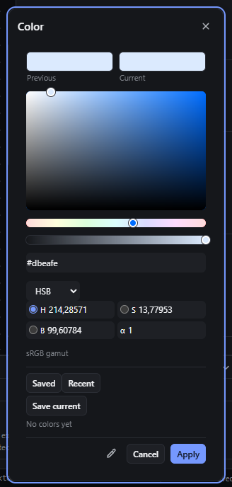
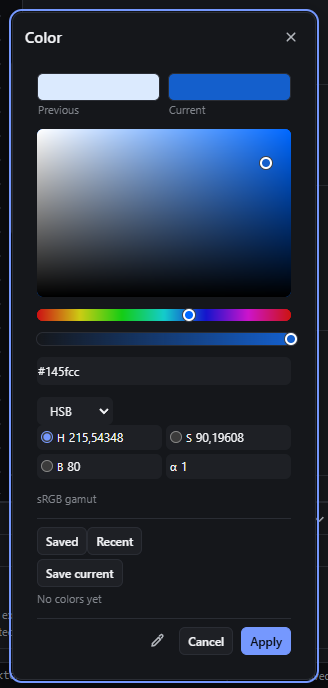
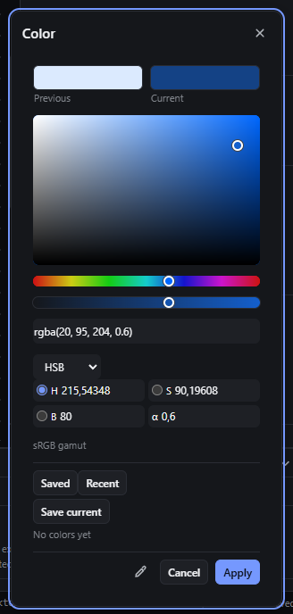
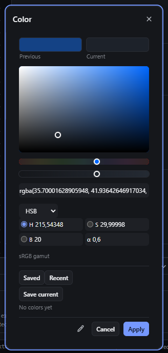

# color-picker — Colour picker: area, sliders, HSB/RGB/Hex fields, preview, Apply and Cancel

How Pager behaves, observed by running it from `.cache/pager-run` (Chrome, window 1600×900) and read from its source. Source references are `path:line` inside Pager. Test element: a Container with `background-color: #dbeafe`. The picker is `openColorPicker` (`src/features/inspector/properties.js:174-250`); every colour field (Paint → Colour, Text → Colour, gradient stop colour, shadow colour) opens this same component (observed for all four).

## Trigger

- Click the colour field (`button.field.colorfield`: swatch + value text) in the Inspector. It opens a modal popover titled `Color`, 304 px wide, anchored at the field (`properties.js:181`), with a shield over the rest of the app.
- Inside the popover:
  - **Area** (saturation × brightness): press and drag (`properties.js:159-172`); the value follows the pointer from the pointerdown on, clamped to the area.
  - **Hue strip** and **alpha strip**: press and drag horizontally (`:168-169`, `:241-247`).
  - **Text field** (`aria-label` "Color value"): any complete CSS colour is applied live while typing; incomplete text is ignored (`applyTypedColour`, `:186-201`).
  - **Format select** `HSB | RGB | Hex | OKLCH | OKLab` and one number field per channel plus `α` (`colorPickerChannels`, `:150-158`); a radio beside each of the first three channels picks which channel the strip controls (the area then shows the other two).
  - **Previous / Current** swatches at the top; clicking Previous restores the colour the picker opened with (`:214-215`).
  - **Library:** tabs `Saved` (up to 48, `Save current` button, `×` to remove) and `Recent` (up to 12, filled by Apply), stored in the preferences `workspace.colors.saved/recent` (`properties.js:133-148`).
  - **Eyedropper** button ("Pick color from screen"), using the browser `EyeDropper` (`:222`).
  - **Cancel** and **Apply** (`:223`); the popover's `×`, Escape, or Ctrl+Z also close it (they cancel).

## Hit zones and thresholds

| Part | Size (observed) | Mapping |
|---|---|---|
| Area | 254 × 168 px (painted from a 128 × 96 canvas) | x → saturation 0…1, y → brightness 1…0, clamped (`:163-165`) |
| Hue strip | 254 × 12 px | x → hue 0…360 (`:169`) |
| Alpha strip | 254 × 12 px | x → alpha 0…1 rounded to 0.01 (`:246`) |
| Drag start | immediate on pointerdown, pointer captured (`trackGesture(…, true)`) | `:169`, `:244` |

## Visual feedback

| Stage | What is drawn | Image |
|---|---|---|
| Open | Previous and Current swatches, the area with a ring dot, the hue strip with a knob, the alpha strip over a checkerboard, the text field, the format select and channel fields, the gamut line (`sRGB gamut`, or `Outside sRGB · wide gamut color preserved`, or `Linked token · …`), the library, then eyedropper, Cancel, Apply. |  |
| Dragging in the area | The dot follows the pointer; Current, the text field, the channels and **the canvas element** update live (observed: `#dbeafe` → `#145fcc`, computed `rgb(20, 95, 204)`). |  |
| Dragging alpha | The knob follows; the text becomes `rgba(20, 95, 204, 0.6)`; the canvas shows the transparency. |  |
| Previous vs Current | After a change, Previous keeps the opening colour and Current shows the new one. |  |

## Result in the document

- While the picker is open, every change is written to the node's style (the canvas preview is a real write inside an open history group, `ports.begin()`, `:178`).
- **Apply** closes the group (`ports.end()`) → one undo step with the final value; the value is added to `Recent`.
- **Cancel**, `×`, **Escape** and **Ctrl+Z** cancel the group (`ports.cancel()`, `:181`) → the stored value is back to the opening value (observed for Cancel, Escape and Ctrl+Z; the undo count went back).
- A click outside the popover does **not** close it (the modal shield takes the click; observed: the picker stayed open with the live value).
- Output format: hex when alpha = 1, `rgba(r, g, b, a)` otherwise (`ppColourOut`, `properties.js:132`); OKLCH/OKLab write `oklch(…)`/`oklab(…)`.
- Channel fields:
  - RGB 999 or −5 were **accepted and stored** as `rgb(255 999 254 / 1)` and `rgb(255 -5 254 / 1)`.
  - HSB S = 250 was clamped to 100 silently.
- Text field `nonsense` + Enter: nothing written and no message; the field keeps showing `nonsense`.

## Undo and redo

One Apply = one undo step (observed: Ctrl+Z → `#dbeafe`, Ctrl+Shift+Z → `rgba(20, 95, 204, 0.6)`). Cancel leaves no history entry.

## Nested elements

Not applicable.

## Zoom other than 100 %

Not affected (the picker is outside the canvas).

## Keyboard equivalent

- Focus goes to the popover container when it opens. The text field, the format select and the channel number fields are keyboard-operable; Escape cancels.
- The area and the two strips have **no tabindex, role or key handling** (observed: `tabindex` null, `role` null), so they cannot be operated from the keyboard.

## Problems in Pager

1. **Invalid channel values are stored** (`rgb(255 999 254 / 1)`, `rgb(255 -5 254 / 1)`). Required: invalid channel values are rejected and the field shows the last valid value (manifest feature `color-picker`).
2. **Dragging from a colour with alpha < 1 stores unrounded channels**, e.g. `rgba(35.70001628905948, 41.93642646917034, 51.00000926426479, 0.6)` (the rgb from HSB is not rounded before `ppColourOut`). Required: RGB channels are integers 0–255 in the stored value.
3. **Invalid text in the text field gives no feedback** and stays displayed. Required: on Enter or blur, an invalid colour is rejected with a message and the field shows the current colour again.
4. **The area and sliders are mouse-only.** Required: they are focusable sliders (`role="slider"` with value text); arrow keys move 1 % (Shift 10 %) on their axis.
