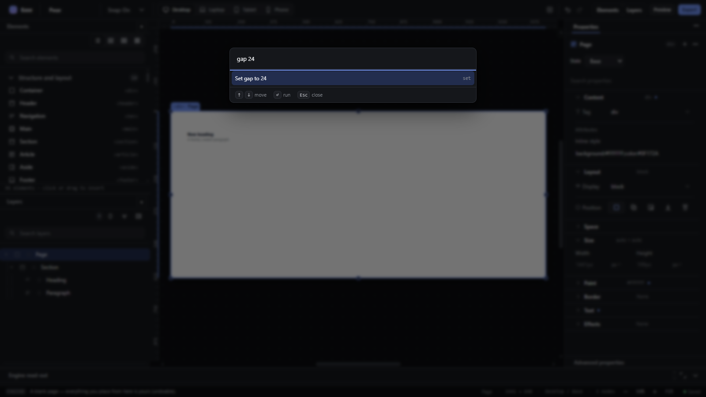

# command-bar-set-property — Set a property or jump to it from the command bar

How Pager behaves, observed by running it from `.cache/pager-run` (Chrome, window 1600×900) and read from its source. Source references are `path:line` inside Pager.

## Trigger

In the command bar (`Ctrl+K`), a query of the form `<property> <value>` (regex `^([a-z][a-z-]*)\s+(\S.*)$`) whose property matches a catalogue property id or its kebab-case name, with something selected, adds a first entry `Set <property> to <value>` (`src/features/workspace/camera.js:760-766`). Enter runs it through the quick-panel commit (`setPropertyTyped`, `src/features/inspector/quick-panel.js:430`) or, for bound properties, the Inspector's writer.

`Edit property <css-name>` entries reveal the property in the Inspector (`revealProperty`, `camera.js:689-690`).

## Hit zones and thresholds

- The value is **not validated before it is offered**: `width abc` offered `Set width to abc`.
- On Enter, invalid values are refused by the commit with a status message.

## Visual feedback

| Stage | What is drawn | Image |
|---|---|---|
| `gap 24` | First entry `Set gap to 24` with the hint `set`. |  |

Enter → status `Gap set to 24px.` `width 50%` → `W set to 50%.` `width abc` → offered, then on Enter refused: `W: "abc" is not a value this field takes.` `border-color` → `Edit property border-color`.

## Result in the document

`gap: 24px` and `width: 50%` were written to the selected element (observed on the selected Page root) in one transaction each, on the active breakpoint/state layer.

## Undo and redo

Each `Set …` is one history entry.

## Nested elements

Writes to the whole selection (the quick-panel commit writes every selected element).

## Zoom other than 100 %

Not affected.

## Keyboard equivalent

This is keyboard-only.

## Problems in Pager

1. **Invalid values are offered** and only refused after Enter. Required: `Set <property> to <value>` is offered only when the value is valid for that property (features.json `command-bar-set-property`).
2. **The quick-panel wording leaks into the status** (`W set to 50%.` for `width`). Required: the status names the CSS property (`width set to 50%.`).
