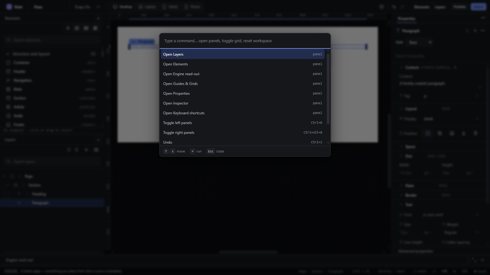
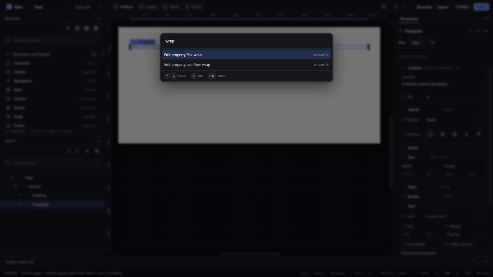

# command-bar — Command bar with Ctrl+K

How Pager behaves, observed by running it from `.cache/pager-run` (Chrome, window 1600×900) and read from its source. Source references are `path:line` inside Pager.

## Trigger

- `Ctrl+K` toggles the bar (`workspace.commandBar`, `src/features/workspace/dock.js:611-612`); File → Commands opens it (`dock.js:640`). While editing text, `Ctrl+K` is the link shortcut (the text editor stops the event, `src/app/boot.js:695-701`).
- In the bar's input: ArrowDown/ArrowUp move the highlight (wrapping), Enter runs it and closes, `Escape` closes, Tab keeps focus in the input (`dock.js:623-634`); a click on a row runs it; a click on the backdrop closes (`:635-639`).

## Hit zones and thresholds

- Entries (`cmdCommands`, `src/features/workspace/camera.js:680-692`): `Open <panel>` for every registered panel; every defined command whose `when` accepts the selection (with its shortcut hint); `Insert <element>` for every palette type; `Edit property <css-name>` for every property when something is selected.
- Matching (`camera.js:732-770`): substring of the label or of the hint; ranked label-prefix, word-prefix, substring, hint-only; at most **12** results. With an empty query, up to 5 recently run labels come first.
- A query `<property> <value>` adds `Set <property> to <value>` at the top (see `command-bar-set-property.md`).

## Visual feedback

| Stage | What is drawn | Image |
|---|---|---|
| Ctrl+K with a Paragraph selected | A centred bar with an input and the first 12 entries: `Open Layers`, `Open Elements`, `Open Engine read-out`, `Open Guides & Grids`, `Open Properties`, `Open Inspector`, `Open Keyboard shortcuts`, `Toggle left panels Ctrl+B`, `Toggle right panels Ctrl+Alt+B`, `Undo Ctrl+Z`, `Redo Ctrl+Shift+Z`, `Save project JSON`; each with its hint at the right. |  |
| Typing `wrap` | Only `Edit property flex-wrap` and `Edit property overflow-wrap` — **no Wrap in a row / column**, because those are key rows, not commands. |  |

Enter on `Edit property flex-wrap` ran it and closed the bar; reopening showed it first (recent). `insert hero` → `Insert Hero` (highlighted after ArrowDown; Escape closed the bar). `layers` → `Open Layers`.

## Result in the document

The bar runs the chosen command; it never changes the document by itself.

## Undo and redo

As for the command run.

## Nested elements

Not applicable.

## Zoom other than 100 %

Not affected.

## Keyboard equivalent

This is the keyboard feature.

## Problems in Pager

1. **Structural commands are missing** (wrap, promote, move, hand, rename, delete, select all in container are key rows or other code paths, not commands). Required: the bar lists every command of the keymap and the menus, each with its shortcut, from the one command registry (manifest feature `command-bar`: typing `wrap` and Enter wraps).
2. **Commands that cannot apply are not always filtered:** `Edit property …` is offered for every property, including properties that do not apply to the selected element. Required: commands that cannot apply to the current selection are not offered.
3. **Fuzzy search is substring-only.** Required: fuzzy matching (initials and out-of-order words, e.g. `insert hero`, `ins hero`).
