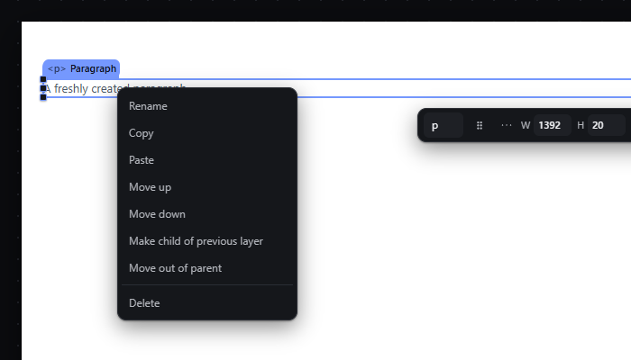
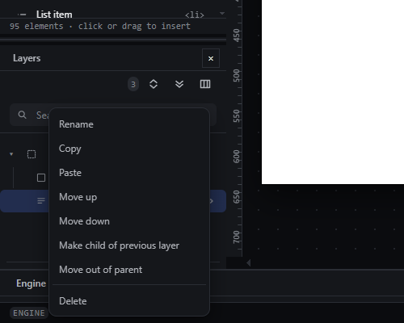

# context-menu — Right-click context menu on the canvas and in Layers

How Pager behaves, observed by running it from `.cache/pager-run` (Chrome, window 1600×900) and read from its source. Source references are `path:line` inside Pager.

## Trigger

- `contextmenu` on an element in the canvas selects it (if not already selected) and opens the row menu at the pointer (`src/features/layers/layers-panel.js:620-640`).
- `contextmenu` on a Layers row does the same (`layers-panel.js:610-619`).
- On the Page root the canvas handler returns without calling `preventDefault` (`layers-panel.js:631-632`), so the **browser's native context menu** opens instead.
- The menu closes on a click of an item, on any `pointerdown` outside it (`:646`) and on `Escape` (`:652`).
- Pager has a **second, separate list of element actions**: the `⋯` (More actions) button of the quick panel opens a strip of icon buttons (`src/features/selection/selection.js:167-202`, run by `runSelbarAction`, `src/app/boot.js:262-346`). Its buttons, in order: drag · move up · move down · wrap in a row · wrap in a column · promote · remove wrapper · take into the hand · duplicate · lock · hide · remove (`selection.js:121-137`). The new app has no such strip: these actions are items of this menu, and the quick panel's More actions opens this menu (features.json `context-menu`, `quick-panel`).

## Hit zones and thresholds

- Menu position: `left = min(clientX, innerWidth − menuWidth − 8)`, `top = min(clientY, innerHeight − menuHeight − 8)` (`layers-panel.js:616-618`, `:635-639`). Measured menu size: 200 × 259 px. A right-click on the last Layers row (y ≈ 735) opened the menu at y = 633, so it stays inside the window.
- Items are full-width buttons in a `role="menu"` container; there is no keyboard navigation inside the menu: ArrowDown with the menu open did nothing and focus stayed where it was (observed).

## Visual feedback

| Stage | What is drawn | Image |
|---|---|---|
| Right-click on a Paragraph on the canvas | The Paragraph is selected; a popup menu opens with its top-left at the pointer: **Rename, Copy, Paste, Move up, Move down, Make child of previous layer, Move out of parent**, a separator, **Delete** (danger colour). No item shows a shortcut and no item is ever disabled. |  |
| Right-click on a Layers row near the bottom | Same menu, shifted up to stay inside the window. |  |
| Pager's separate strip (quick panel → More actions) on a Container | An icon strip under the quick panel; the strip's lower row draws the quick panel's Margin, Padding and More… buttons on top of each other. Only five of its tooltips name a shortcut; remove wrapper is hidden (not disabled) unless the selection is a container with children. |  |

## Result in the document

Each item runs a Layers handler (`layers-panel.js:513-589`):

| Item | Handler | Notes |
|---|---|---|
| Rename | inline input in the Layers row (`:561-581`) | see `rename-element.md` |
| Copy / Paste | editor-internal clipboard (`:659-680`) | see `clipboard-copy-paste.md` |
| Move up / Move down | move by one index in the parent (`:515-528`) | silent at the ends |
| Make child of previous layer | append to the previous sibling if it is a container (`:530-544`) | see `nest-into-previous.md` |
| Move out of parent | insert after the parent in the grandparent (`:545-558`) | see `promote-out.md` |
| Delete | remove the primary node (`:582-589`) | no toast; ignores the rest of a multi-selection |

Observed: "Make child of previous layer" on a Paragraph after a Container → `Container > [Paragraph]`, status `Placed. Paragraph in Container, position 1 of 1.`

## Undo and redo

Every item that changes the document is one history entry.

## Nested elements

The menu acts on the right-clicked element, which becomes the selection.

## Zoom other than 100 %

The menu is window chrome; its position is the pointer's screen position at any zoom.

## Keyboard equivalent

None in Pager (no `Shift+F10` / ContextMenu key handling). The same commands exist as shortcuts on the canvas (Alt+Arrows, R, C, P, M, F2, Ctrl+D, Ctrl+C, Ctrl+V, Delete).

## Problems in Pager

1. **The menu is incomplete.** Missing: Cut, Duplicate, Wrap in a row, Wrap in a column, Remove wrapper, Take into the hand, Lock, Hide. Required: at least, in this order, Rename, Copy, Cut, Paste, Duplicate, Move up, Move down, Wrap in a row, Wrap in a column, Remove wrapper, Make child of previous layer, Move out of parent, Take into the hand, Lock, Hide, Delete (features.json `context-menu`); later features may add items.
2. **No shortcuts are shown and nothing is ever disabled.** "Make child of previous layer" on an element without a previous sibling stays enabled and silently does nothing (observed). Required: each item shows its shortcut where it has one and has a tooltip naming its action and that shortcut; items that cannot apply to the selection are disabled; items whose feature is not built yet are disabled and labelled "not available yet".
3. **The items run different code than the shortcuts** (e.g. Move up here moves only the primary node and is silent at the edges, while Alt+ArrowUp moves the whole selection and reports). Required: every item runs the same command as its shortcut and produces the same document JSON.
4. **No keyboard operation.** Required: the menu opens with focus on its first enabled item; ArrowUp/ArrowDown move between items (wrapping), Home/End jump, Enter runs, Escape or a click outside closes it and returns focus to where it was.
5. **Right-click on the Page root shows the browser's own menu.** Required: the editor menu opens for the Page root too, with the items that do not apply to the root disabled.
6. **Two lists of the same actions** (this menu and the More actions strip) with different items, tooltips and availability rules; the strip hides actions that cannot apply instead of disabling them, overlaps its own text and is out of the Tab order. Required: no separate action strip; the quick panel's More actions opens this menu at the button (features.json `quick-panel`). The strip's drag button has no counterpart: an element is moved by dragging it (`drag-reorder-canvas.md`) or with Take into the hand.
