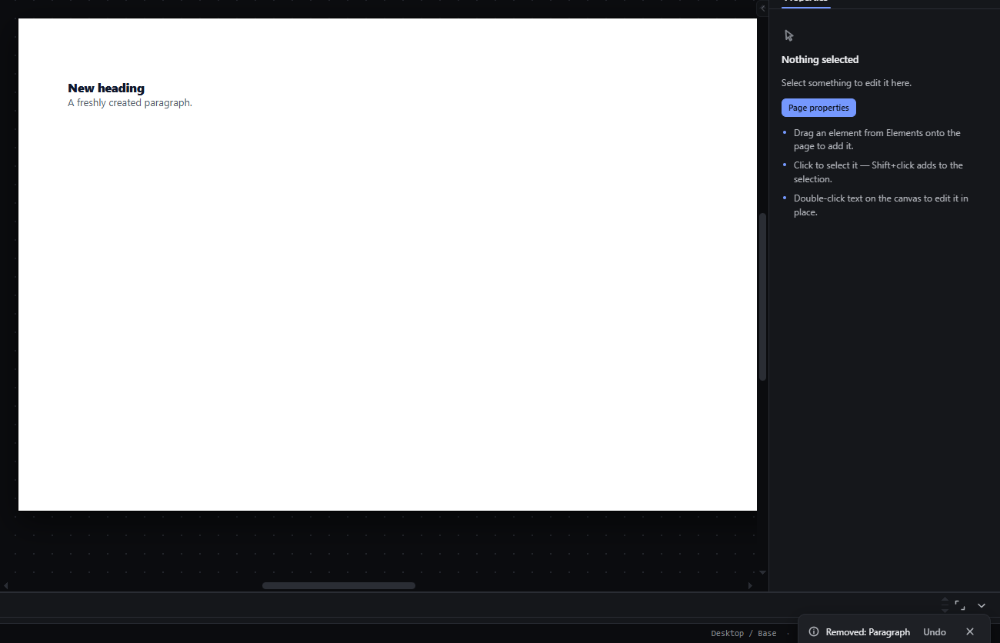

# delete-element — Delete the selected element with Delete or Backspace

How Pager behaves, observed by running it from `.cache/pager-run` (Chrome, window 1600×900) and read from its source. Source references are `path:line` inside Pager.

## Trigger

- `Delete` or `Backspace` with the canvas (or the page body) focused and something selected (`src/features/input/index.js:679-680`). The row carries no `focus` flag, so it does not fire while focus is on a panel control or in a text field (`keyAllowed`, `input/index.js:486-491`).
- In the Layers tree, `Delete`/`Backspace` on a focused row deletes the selection (`src/app/boot.js:150-159`).
- Other doors: the selection bar's Remove button, the context menu's Delete, the Edit menu's Delete (`boot.js:342`, `src/features/layers/layers-panel.js:582-589`, `src/features/workspace/dock.js:408`).

## Hit zones and thresholds

Not a pointer gesture. With a multi-selection, every selected root is removed; descendants of other selected nodes are skipped (`input/index.js:604-627`).

## Visual feedback

| Stage | What is drawn | Image |
|---|---|---|
| After Delete on the first Paragraph | The element disappears; **the selection is cleared** (no outline, Inspector shows "Nothing selected"); the status bar reads `Removed: Paragraph`; a toast `Removed: Paragraph` with an **Undo** button appears at the bottom (`input/index.js:622-626`). Toasts stack: three deletes left three toasts on screen. |  |
| Delete with the Page root selected | Nothing is removed; status tag turns to `REFUSED` with `The page root cannot be deleted.` (`input/index.js:606-608`). | — |
| Delete inside a locked ancestor | Refused with `Unlock “Section” before deleting it.` (`input/index.js:609-612`). | — |

## Result in the document

- Observed: Section > [Heading, Paragraph, Paragraph 2]; Delete on Paragraph → [Heading, Paragraph 2]. Backspace on the Section → the Page is empty.
- The node and its whole subtree leave the document JSON in one transaction (`input/index.js:616-621`).

## Undo and redo

One Ctrl+Z restored the Section with its children; a second restored the Paragraph at index 1 with its original id (`new-paragraph`), observed. After each undo the selection is the one saved with the snapshot (the node that was selected when it was deleted).

## Nested elements

Deleting a container deletes everything inside it. Locked ancestors block the delete (see `lock-element.md`).

## Zoom other than 100 %

Not affected.

## Keyboard equivalent

The keys are the primary door.

## Problems in Pager

1. **After a delete nothing is selected,** so the next keyboard command has no target. Required: after a delete the selection moves to the next sibling, else the previous sibling, else the parent (features.json `delete-element`).
2. **Toasts pile up** (one per delete, each with its own Undo). Required: at most one delete toast is visible; a new delete replaces it, and its Undo undoes the most recent delete only.
