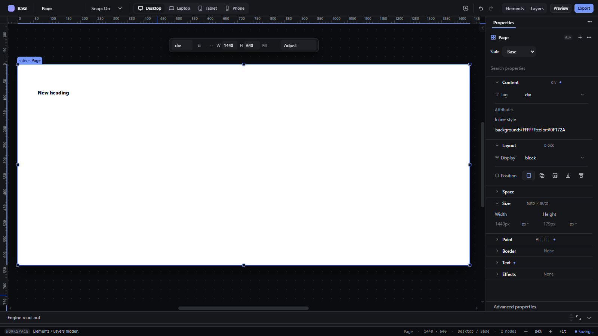
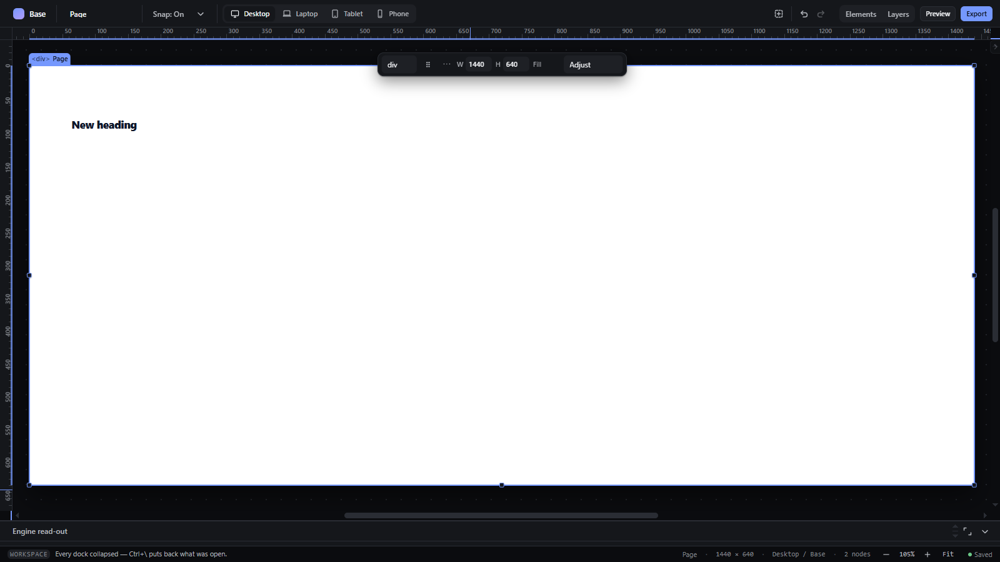

# dock-toggles — Show and hide the docks and panels

How Pager behaves, observed by running it from `.cache/pager-run` (Chrome, window 1600×900) and read from its source. Source references are `path:line` inside Pager.

## Trigger

| Input | Effect | Source |
|---|---|---|
| `Ctrl+B` | hide / show the left dock (Elements + Layers) | `src/features/workspace/dock.js:551`, `toggleDock` `:174-187` |
| `Ctrl+Alt+B` | hide / show the inspector | `dock.js:552` |
| `Ctrl+\` | collapse every dock; the second press restores what was open | `dock.js:576-595` |
| Panel `×` button | close that panel (Elements or Layers) | `src/features/windows/index.js:488`, `:523-525` |
| Top bar **Elements** / **Layers** toggles | show / hide each panel | `windows/index.js:334-342` |
| View menu rows (panels, Toggle left dock, Toggle inspector) | the same | `dock.js:535-549` |

While a text element is being edited, `Ctrl+B` is taken by the text editor as bold (observed: the Heading became `<strong>New heading</strong>` and the left dock stayed open), because the text editor stops the event (`src/app/boot.js:695-701`).

## Hit zones and thresholds

Not pointer gestures. Measured layout at 1600 × 900 (independent-panel mode):

| State | left dock | canvas stage | inspector |
|---|---|---|---|
| default | 0-280 px | 300-1299 px (999 px) | 1300-1600 px (300 px) |
| after Ctrl+B | hidden | 20-1299 px (1279 px) | unchanged |
| after Ctrl+Alt+B | unchanged | 300-1600 px (1300 px) | 0 px wide |
| after Ctrl+\ | hidden | 20-1600 px (1580 px) | 0 px wide |

The canvas refits in Fit mode (`refit`, `src/features/workspace/camera.js:618-635`).

## Visual feedback

| Stage | What is drawn | Image |
|---|---|---|
| Ctrl+B | Left dock gone; canvas grows; status `Elements / Layers hidden.` (then `… shown.`). |  |
| Ctrl+\ | Every dock collapsed; status `Every dock collapsed — Ctrl+\ puts back what was open.`, then `The docks are back as they were.` |  |

Ctrl+Alt+B says `Inspector hidden.` / `Inspector shown.` Closing Layers with its `×` and reopening it from the top bar toggle wrote **no** status message (observed).

## Result in the document

Never changes the document. The dock and panel state is saved in preferences (`workspace.independent-panels.v1`, `persistLayout`).

## Undo and redo

Not undo steps.

## Nested elements

Not applicable.

## Zoom other than 100 %

The zoom is kept; in Fit mode the canvas refits.

## Keyboard equivalent

The chords above.

## Problems in Pager

1. **Closing or reopening a single panel says nothing.** Required: the status bar reports each change (`Layers closed.` / `Layers opened.`), for every door (features.json `dock-toggles`).
2. **Two parallel panel systems** (independent Elements/Layers groups and the older dock layout) decide visibility; `Ctrl+B` goes through one or the other depending on a body class (`dock.js:174-180`). Required: one workspace owner for docks and panel visibility.
