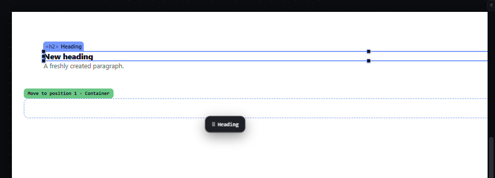
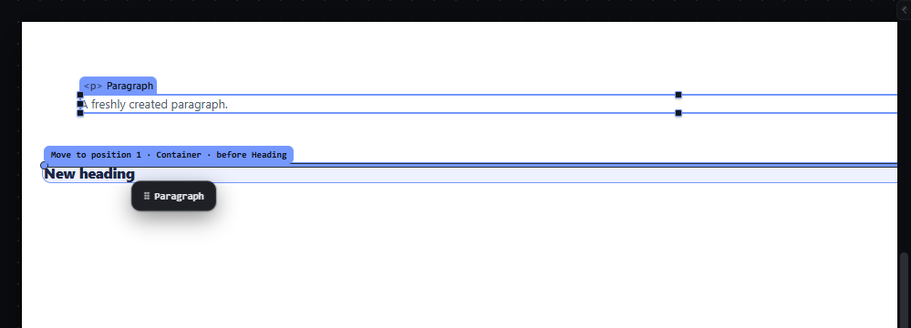
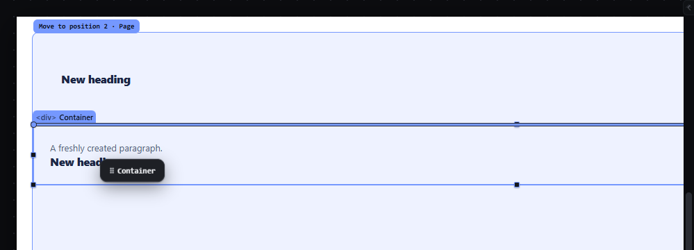

# drag-drop-inside — Drop an element inside a container and move it across parents

How Pager behaves, observed by running it from `.cache/pager-run` (Chrome, window 1600×900, zoom 100 %) and read from its source. Source references are `path:line` inside Pager. The gesture, threshold, ghost, line and label are the ones in `drag-reorder-canvas.md`; this file covers what differs when the receiver is a container.

## Trigger

Same as a canvas move drag: press on an element, move at least 4 px (`src/core/pointer.js:3`, `src/app/boot.js:507`), release to commit the last drawn proposal (`src/features/drag/drag.js:1118-1245`).

## Hit zones and thresholds

- **Empty container.** On the canvas an empty container keeps a visible minimum height of 40 px (editor-only; the iframe element carries the class `empty`). Its aim area is widened to at least 40 × 40 px, centred and shared with its neighbours, when the real box is smaller (`src/platform/measure.js:148-214`, `EMPTY:40`). The whole aim area is **inside** except an edge band of `min(8, 0.25 × extent)` px at both ends along the parent's axis, which means before/after the container (`src/platform/overlay.js:15-21`, `EMPTY_EDGE:8`). Measured: a 1392 × 40 px Container → aim `348, 263, 1392 × 40`, inside everywhere except the outer 8 px.
- **Container with children.** Edge band `min(clamp(0.25 × extent, 8, 32), 0.4 × extent)`; between the bands the pointer resolves to the nearest slot between children (inside), or, over a child, to that child's before/after halves (`drag.js:238-260`, `src/model/layout.js:12-39`).
- **Leaves are never receivers.** A leaf (heading, paragraph, image, input…) has no centre zone: its halves are before/after (edge band = extent/2). Measured: the Heading dragged over the exact middle of a Paragraph gave `before`/`after` that Paragraph, never `inside`.
- **The dragged element and its descendants are not targets.** The hit test skips them (`drag.js:405`), so the pointer over them resolves to the nearest ancestor that is not dragged. The validator also refuses any receiver that is the dragged node or one of its descendants with "An element cannot be placed inside itself or one of its descendants" (`drag.js:746-748`), but on the canvas that refusal is never reached because of the skip; it only shows in Layers (see `layers-drag.md`).
- Locked or hidden containers, or containers inside a locked/hidden ancestor, are not receivers (`drag.js:452-455`, `:749-753`).

## Visual feedback

| Stage | What is drawn | Image |
|---|---|---|
| Over an empty Container | The container's box gets a 1.5 px **dashed** accent outline with no fill (`#hl.scope`, `style/06-canvas-chrome.css:96`); the label chip is green (`#lbl.ok`, `:136`) and reads `Move to position 1 · Container`; no insertion line. The status bar reads `Into Container (first child)`; the read-out adds "Empty container: aim widened to 40px, dotted fill." Every empty container whose aim area is larger than its real box shows a dashed aim box for the whole drag (`drag.js:1001-1018`, `.aimbox` `:128`). |  |
| Dropped | The Heading is the Container's only child and is selected; the container loses its empty minimum height. |  |
| Over the upper half of the Heading inside the Container | Insertion line above the Heading, the Container tinted as receiver, label `Move to position 1 · Container · before Heading`. |  |
| The Container dragged over its own Paragraph | No refusal: the proposal is the Container's current place in the Page (`Move to position 2 · Page`, status `Into Page · index 1`). Release leaves the document JSON unchanged. |  |

## Result in the document

- Heading dragged onto the empty Container → `Container.children = [Heading]`; the Section loses it.
- Paragraph dragged over the upper half of that Heading → `Container.children = [Paragraph, Heading]`.
- The dropped node keeps its id and its styles; flow coordinates (grid cell, absolute offsets) are cleared when it enters a flow parent (`drag.js:1217-1225`).
- The Container dragged onto its own child → no change.

## Undo and redo

One drop is one history entry; `Ctrl+Z` puts the node back in its old parent at its old index with the same id.

## Nested elements

Moving into a container nested several levels deep uses the same zones at each level; near an ancestor's real edge the escape ladder offers the outer level (see `drag-reorder-canvas.md`), and ArrowUp/ArrowDown change the level explicitly (see `drag-level-keys-escape.md`).

## Zoom other than 100 %

The 40 px minimum aim and the 8 px empty band are measured in screen px on the zoomed boxes (the aim box is computed from `getBoundingClientRect` after mapping), so at 50 % a 40 CSS px empty container is 20 screen px tall and its aim is widened back to 40 screen px.

## Keyboard equivalent

With something in the hand (`M`), ArrowDown/ArrowRight step through every insertion slot, including the first slot inside an empty container, and Enter places it (see `hand-keyboard-move.md`).

## Problems in Pager

1. **No refusal when the pointer is over the dragged element's own subtree on the canvas.** The indicator silently falls back to the element's current place in its ancestor, so the person cannot tell that the target is invalid. Required: while the pointer is over the dragged element or any of its descendants, show the refusal state (no insertion line, receiver outline in the danger colour, chip "An element cannot be placed inside itself or one of its descendants", cursor `not-allowed`); release changes nothing.
2. **The empty-container label says `Move to position 1 · Container`,** which reads like a reorder. Required: the label reads `Into <container name>` for an empty container (features.json `drag-drop-inside`), and `Into <container name> · position N of M` for a non-empty one.
3. **The status line and the label use different words** (`Into Container (first child)` vs `Move to position 1 · Container`). Required: the label, the status bar and the layout read-out use the same sentence for the same decision.
4. **Stale overlay text survives in the DOM** (`#why` still held `✚ <li> will be created here` from an earlier drag while hidden). Required: every indicator element is cleared when the drag ends, so assistive technology and tests never read a previous decision.
