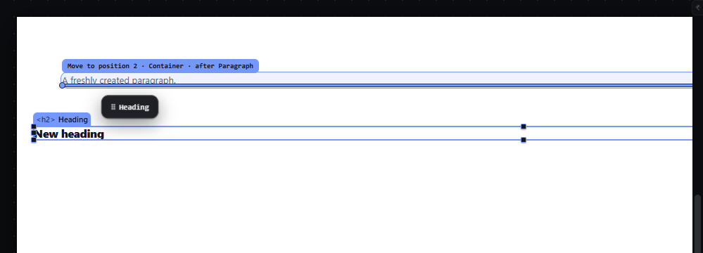
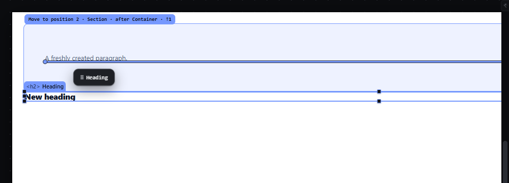
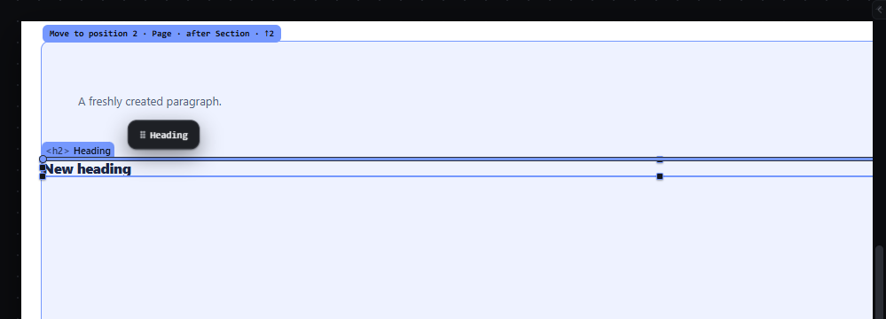
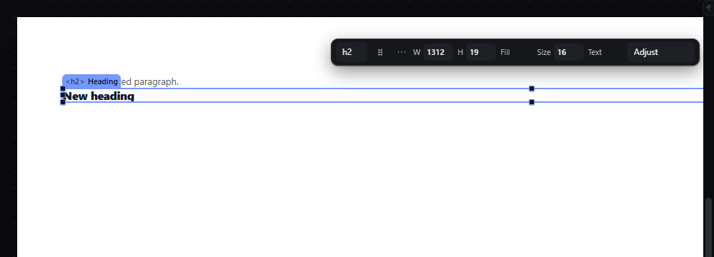
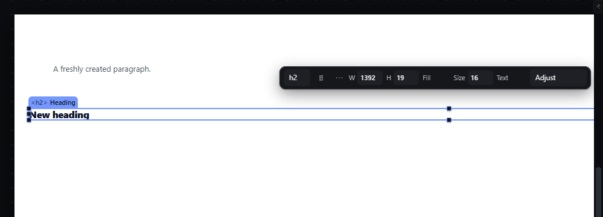
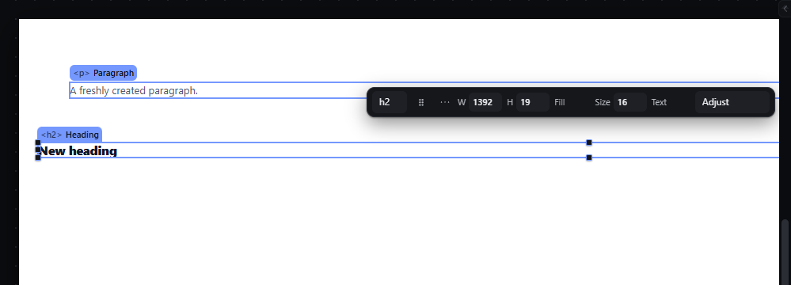

# drag-level-keys-escape — Change the drop level with arrow keys and cancel a drag with Escape

How Pager behaves, observed by running it from `.cache/pager-run` (Chrome, window 1600×900, zoom 100 %) and read from its source. Source references are `path:line` inside Pager. Test document: `Section > Container > Paragraph`, then a Heading after the Section. The pointer gesture itself is described in `drag-reorder-canvas.md`.

## Trigger

- During a live pointer drag every key goes to the drag first: a capture-phase `keydown` listener on `window` handles it and then calls `preventDefault` and `stopImmediatePropagation`, so no other shortcut runs (`src/app/boot.js:548-554`).
- `ArrowUp` raises the level counter by one, `ArrowDown` lowers it by one (not below 0), `Escape` cancels (`src/features/input/index.js:660-667`).
- The counter resets to 0 when a drag starts (`src/features/drag/drag.js:920`) and when it ends (`:1331`).
- Before the 4 px threshold is crossed (pending drag) `Escape` also cancels and every other key is swallowed (`boot.js:549-553`).

## Hit zones and thresholds

- With a level counter *n* > 0 the escape ladder is skipped; the proposal is computed from the zones of the target under the pointer and then climbed *n* times: `before X` becomes `before Parent(X)` and `after X` or `inside X` becomes `after Parent(X)`, stopping at the Page root (`drag.js:488-490`, `:713-724`).
- The counter is not clamped at the top: pressing ArrowUp at the root level keeps increasing it (observed `↑3` while the proposal stayed `after Section`), and ArrowDown then has to undo those extra presses before the level changes.
- Changing the level resets the hysteresis anchor (`input/index.js:665-667`), so the new level is drawn without moving the pointer.

## Visual feedback

| Stage | What is drawn | Image |
|---|---|---|
| Over the lower half of the Paragraph | Line below the Paragraph, Container tinted, label `Move to position 2 · Container · after Paragraph`. |  |
| ArrowUp | Line after the Container, Section tinted, label `Move to position 2 · Section · after Container · ↑1`; status `After Container`; read-out "… · forced level ↑". |  |
| ArrowUp again | Line after the Section, Page tinted, label `Move to position 2 · Page · after Section · ↑2`. |  |
| ArrowDown, then release | The label returns to `Move to position 2 · Section · after Container · ↑1`; on release the Heading lands after the Container inside the Section (`Section > [Container, Heading]`), is selected, and the status reads `✓ Move to position 2 · Section · after Container`. |  |
| Escape | The line, tint, label and dashed source outline disappear at once; the ghost animates back to 8 px inside the source element's top-left corner and fades out in 140 ms (`drag.js:1304-1321`, `style/03-shell.css:46-47`). Status `Cancelled — nothing changed`; read-out "The ghost flew back to its origin." The selection chrome and quick panel come back. (Captured 40 ms after Escape.) |  |
| Mouse released after Escape | Nothing happens; the document JSON is byte-identical to before the drag (observed). |  |

Note on a second observed sequence: ↑ ↑ ↑ ↓ ↓ ↑ left the counter at 2 but the drawn proposal stayed `after Container` until the pointer moved 2 px, after which it switched to `after Section · ↑2`; the release then dropped after the Section (`Page > [Section, Heading]`). The drop always executes the last drawn proposal, so what the person saw is what happened, but the indicator lagged behind the key.

## Result in the document

Release inserts the dragged node at the drawn level. Pressing ↑ ↑ ↓ from `after Paragraph` and releasing places the Heading after the Container, inside the Section. Escape leaves the document JSON unchanged and no history entry is added.

## Undo and redo

A drop at a forced level is one history entry like any drop. A cancelled drag adds nothing.

## Nested elements

Each ArrowUp climbs exactly one ancestor of the resolved receiver; the root is the ceiling. ArrowDown only walks back down the same ladder (it never descends into a child that was not on it).

## Zoom other than 100 %

Keys do not depend on zoom.

## Keyboard equivalent

The same levels are reachable without a pointer with the hand: `M`, then ArrowUp climbs a receiver level and ArrowLeft descends (see `hand-keyboard-move.md`).

## Problems in Pager

1. **The level counter is not clamped.** ArrowUp at the root keeps counting (`↑3`, `↑4`…) with no visible change, and the next ArrowDown presses do nothing visible. Required: the level stops at the highest valid ancestor; an ArrowUp there is ignored and the status says `Already at the top level`; one ArrowDown always goes one level down from what is shown.
2. **The indicator can lag behind a level key** until the pointer moves (observed once in ↑ ↑ ↑ ↓ ↓ ↑). Required: every level key redraws the indicator and label in the same frame, without pointer movement.
3. **`↑N` counts key presses, not levels.** Required: the label names the level by its receiver (`Level: Section`), and the count shown is the number of levels actually climbed.
4. **The ghost's return animation is 140 ms and ends 8 px inside the source corner,** too fast to be noticed. Required: on Escape the ghost returns to the source element over 150-250 ms (design token for motion) and the status says `Drag cancelled — nothing changed`.
