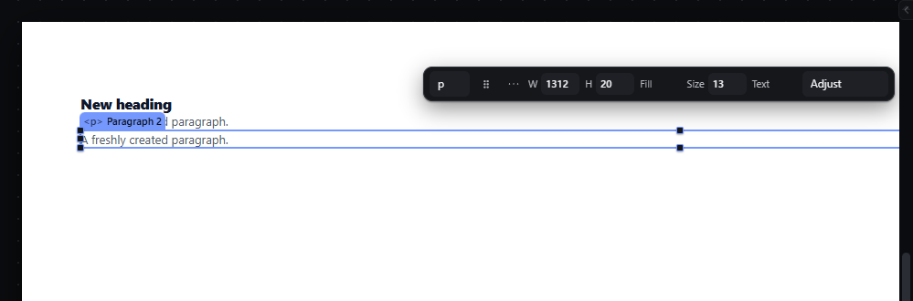
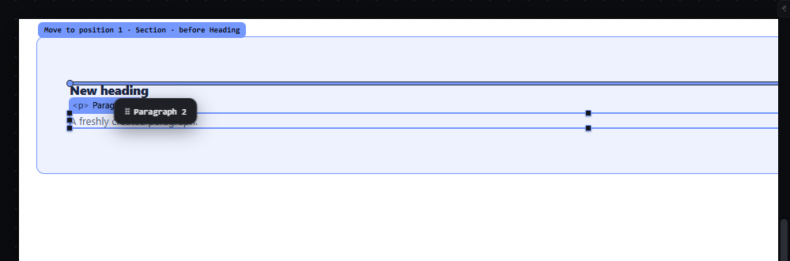
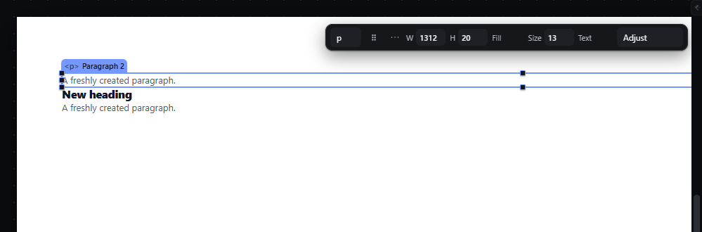
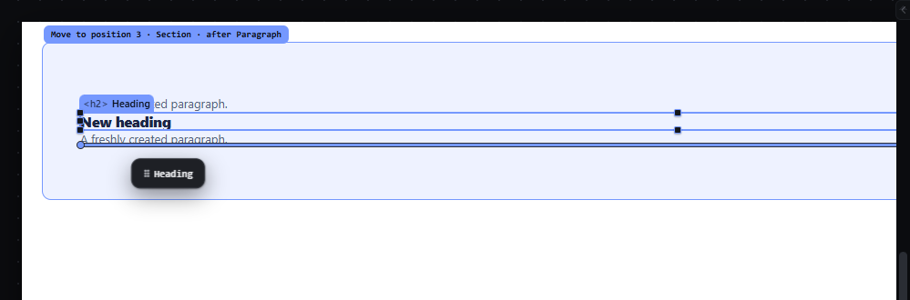
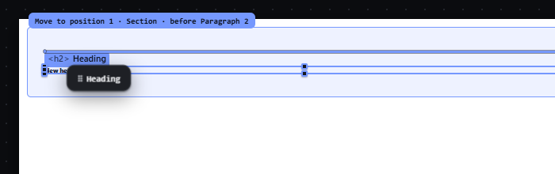

# drag-reorder-canvas — Drag an element before or after a sibling on the canvas

How Pager behaves, observed by running it from `.cache/pager-run` (Chrome, window 1600×900, zoom 100 % unless stated) and read from its source. Source references are `path:line` inside Pager. Test document: a Section (padding 56 px 40 px) holding a Heading and two Paragraphs.

## Trigger

1. Primary-button press on an element (or on its selection/hover chip) arms the gesture: the element is selected and a pending drag is stored with the press point (`src/app/boot.js:449-502`, `dragArm` at `:497`, pointer captured at `:501`).
2. The drag starts on the first `pointermove` whose distance from the press point is at least **4 px** (Euclidean, screen pixels; `src/core/pointer.js:3`, check at `src/app/boot.js:507`). Below that nothing is drawn and release is a plain click that only selects (observed: press + 3 px + release left the document JSON unchanged and the element selected).
3. While dragging, a `requestAnimationFrame` loop resolves one drop proposal per frame from the pointer position (`src/features/drag/drag.js:945-997`).
4. Release commits exactly the last proposal that was drawn (`drag.js:1118-1245`); `Escape` or a lost pointer capture cancels (`drag.js:1304-1321`, `src/app/boot.js:540-554`).

## Hit zones and thresholds

The target is the deepest element under the pointer, skipping the dragged element, its descendants and locked elements (`drag.js:395-412`). For a target inside a parent whose flow runs on axis *A* (vertical for block and column flex, horizontal for row flex), with the target's extent *S* along *A* and the pointer at offset *pos* from its start (`drag.js:238-260`, `src/platform/overlay.js:15-21`, limits in `src/platform/measure.js:40-49`):

| Target | Edge band *e* | Pointer in band | Else |
|---|---|---|---|
| Leaf (text, image, input…) | *S*/2 | first half → **before** it, second half → **after** it | — (a leaf is never a receiver) |
| Empty container | min(8, 0.25·*S*) | before / after | **inside** as first child |
| Container with children | min(clamp(0.25·*S*, 8, 32), 0.4·*S*) | before / after | **inside**, at the slot nearest the pointer |

- Measured on the Paragraph (19.5 px tall): pointer 1 px above its middle → `before Paragraph`, 1 px below → `after Paragraph`.
- Measured on the Section (151 px tall, two paragraphs): top 0-31 px → before Section; 40 px (padding) → inside at index 0; over a child → that child's halves; 111 px (bottom padding) → inside at the end; last 32 px → after Section.
- Inside a container the insertion slot is the number of children whose centre lies before the pointer on axis *A* (`src/model/layout.js:12-39`); in wrapping and grid flows the row is chosen first, then the position within it.
- Escape ladder: when the pointer is within `min(12, extent/2 − 8)` px (plus 2 px slop) of an ancestor's real edge along its parent's axis, the proposal climbs to before/after that ancestor; the outermost matching ancestor wins (`drag.js:163-211`, `:506-526`). For a small container the band shrinks: on a 19.5 px container it is 1.75 px.
- Hysteresis: a new decision replaces the drawn one only after the pointer has moved **4 px** from where the drawn one was taken (`drag.js:975-985`, `HYST:4`).
- Lateral wrapper: see `wrap-row-column` for the side bands (≤ 26 px) that offer "create a row/column" instead of a reorder.
- Autoscroll: within **56 px** of a scroll container's edge the view scrolls by up to **22 px per frame**, only after the pointer has once been more than 56 px inside the stage (`drag.js:1054-1080`, `SCROLL_ZONE:56`, `SCROLL_MAX:22`).
- A proposal whose line lies outside the visible stage (tolerance 8 px) is drawn in the warning colour with arrow heads and is refused on release with "Not committed — the destination was outside the visible stage…" (`overlay.js:64-68`, `drag.js:1126-1130`).

## Visual feedback

| Stage | What is drawn | Image |
|---|---|---|
| Pressed, under 4 px | Nothing new: the element is selected, no ghost, no line. |  |
| Dragging over the upper half of the Heading | **Insertion line**: 3 px accent line across the receiver's content width at the gap (`overlay.js:188-196`, `:276-280`), with round end caps. **Receiver tint**: the receiving parent's box (+2 px each side) gets a 1.5 px accent outline and a soft accent fill (`style/06-canvas-chrome.css:88`). **Label chip** at the receiver box's top-left, 20 px above it, clamped inside the stage (`overlay.js:283-294`): `Move to position 1 · Section · before Heading`. **Ghost chip** `⠿ Paragraph 2` follows the pointer at +14, +16 px (`drag.js:937`, `style/03-shell.css:44`). The source element keeps its place and gets a 2 px dashed accent outline (`style/06-canvas-chrome.css:30`). Cursor `grabbing`. The status bar reads `Before Heading`. |  |
| Dropped | The element moves; it flashes for 0.9 s (`drag.js:1237`) and stays selected; the status bar reads `✓ Move to position 1 · Section · before Heading`. |  |
| Over the lower half of the last Paragraph | Line below it; label `Move to position 3 · Section · after Paragraph`. |  |

Label grammar (`overlay.js:311-330`): `Move to position N · <receiver name> · before|after <sibling name>`, with ` · escape` when the ladder climbed and ` · ↑N` when the level was forced with the arrow keys. N is 1-based among the siblings without the dragged element.

## Result in the document

On release the dragged node is removed from its parent and inserted at the proposal's `(parent, index)` (`drag.js:1162-1226`). Observed: dragging Paragraph 2 over the upper half of the Heading turned `[Heading, Paragraph, Paragraph 2]` into `[Paragraph 2, Heading, Paragraph]`; dragging the Heading over the lower half of the last Paragraph gave `[Paragraph 2, Paragraph, Heading]`. The dropped element is selected. A drop that lands where the element already is leaves the document JSON identical and adds no history entry (observed: the next `Ctrl+Z` undid the command before the drag).

## Undo and redo

Each drop is one transaction (`runEditorOperation`, `drag.js:1158`): one `Ctrl+Z` restored the previous order exactly, `Ctrl+Shift+Z` re-applied it (history counter +1 per drop, observed).

## Nested elements

The receiver is always the parent of the sibling under the pointer. Near a nested container's edge the escape ladder offers the outer level; the arrow keys change the level explicitly (see `drag-level-keys-escape`).

## Zoom other than 100 %

At 50 % the same gesture produced the same proposal (`before Paragraph 2` in the Section) and the same document result. Zones are computed from measured screen boxes, so bands in CSS px scale with the zoom while the 4 px threshold, the 4 px hysteresis and the 12 px escape band stay in screen px. Chips (label, ghost) keep their screen size. 

## Keyboard equivalent

`M` takes the selection into the hand and the arrow keys aim (see `hand-keyboard-move`); `Alt+ArrowUp`/`Alt+ArrowDown` move among siblings (see `move-up-down`).

## Problems in Pager

1. **The selection chrome stays on during the drag.** The dragged element keeps its selection outline, its eight handles and its tag chip, which sit under the ghost and next to the insertion line (visible in `drag-reorder-canvas--02-before-heading.png`). Required: while a drag is live, hide the selection handles, the tag chip and the quick panel; keep only the dashed source outline.
2. **The status texts disagree about the index.** The label says `Move to position 3`, the read-out says `Sibling in Section · index 2 of 2` (0-based, counted without the dragged node). Required: one wording everywhere, 1-based, e.g. `Position 3 of 3 in Section, after Paragraph`.
3. **The label chip is anchored to the receiver's top-left corner,** far from the pointer and the line when the receiver is tall. Required: the label stays next to the insertion line (or the pointer), inside the canvas viewport.
4. **The escape band collapses on small containers** (1.75 px on a 19.5 px container), so the outer level is practically unreachable by pointer there. Required: the level can always be changed with ArrowUp/ArrowDown during the drag, and the drop indicator names the level; the escape band is at least 6 px wherever the container is at least 12 px tall.
5. **A container's flow was read along one axis only** (the user's real-use audit, item 2.1): a grid was taken for a vertical column, a wrapping flex for one line, row-reverse and column-reverse were ignored and inline children were stacked; in a grid of three cards the second and third empty cells and the gap between cards 1 and 2 proposed position 1, and a card's side edge nested into it. Required: the insertion point is the one nearest the pointer by the real boxes, in two dimensions: the line (row, or column in a column flow) the pointer is on, then its place along that line in the order shown, turned into the document's order (reverse included); a grid flows along its auto-flow (rows: along x), a flex along its direction, any other container along x when every child is inline-level; the halves of a leaf and the bands of a container are taken along that flow, before and after as shown; the insertion line stands between the neighbours shown side by side (a neighbour on another line is none). In a grid of 3 columns, a drop in the gap between cards 1 and 2 lands at index 1, and one in the third, empty cell at index 2.
