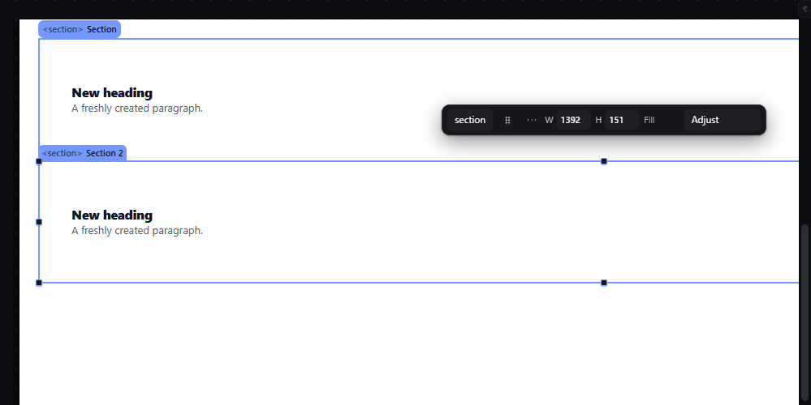

# duplicate — Duplicate the selection with Ctrl+D

How Pager behaves, observed by running it from `.cache/pager-run` (Chrome, window 1600×900) and read from its source. Source references are `path:line` inside Pager. Test document: Section > [Heading, Paragraph].

## Trigger

- `Ctrl+D` (declared as a command chord, `src/app/boot.js:228`, dispatched by `dispatchCommandChord`, `src/features/workspace/camera.js:693-703`). It runs with focus on the canvas or on panel chrome, not in text fields.
- Other doors: selection bar "duplicate", Edit menu Duplicate (which dispatches a synthetic `Ctrl+D` keydown, `src/features/workspace/dock.js:405`, `:476-479`).
- **Ctrl held during a pointer drag** also duplicates: the ghost reads `Copy of <name>`, and release inserts a copy at the drop point while the original stays (`src/features/drag/drag.js:307-311`, `:358-367`, `:1166-1170`).

## Hit zones and thresholds

- Every selected root is copied and each copy is inserted right after its original (`boot.js:325-336`).
- Refused when the selection is the Page root (`The page root cannot be duplicated.`), locked, or when the parent allows only one such child (`siblingBad`).

## Visual feedback

| Stage | What is drawn | Image |
|---|---|---|
| After Ctrl+D on the Section | A second Section appears below the first and is selected; status `Duplicated: Section 2`. |  |

## Result in the document

- A deep copy with fresh keys for every node (`duplicateNodes`, `drag.js:328-348`): observed keys `section`, `heading`, `paragraph` for the copy.
- Only the copy's **root** gets a new unique name (`Section 2`); its children keep the original names (`Heading`, `Paragraph`) — observed.
- DOM ids inside the copy are renamed with `-copy`, `-copy-2`… and `for`/`#fragment` references inside the copied group follow them (`drag.js:332-345`).
- Texts and styles are copied exactly.

## Undo and redo

One history entry for the whole duplication.

## Nested elements

The whole subtree is copied.

## Zoom other than 100 %

Not affected.

## Keyboard equivalent

`Ctrl+D`.

## Problems in Pager

1. **Descendants of a duplicated element keep their original names,** so the document has several `Heading` nodes that the BEM export must disambiguate later. Required: every node of the copy gets a new unique id **and** a unique name (features.json `duplicate`).
2. **The Edit menu item dispatches a fake keyboard event** instead of calling the command. Required: every door calls the one duplicate command directly.
