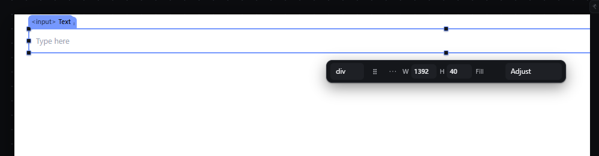
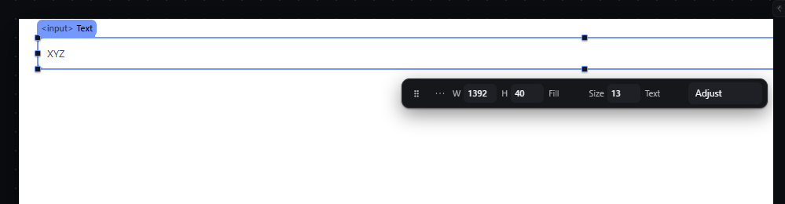

# elements-form-inputs-rules — Per-type input attributes, type switching, label targets and canvas focus

This file covers the pointer and keyboard part of the entry: what happens when a person clicks into, types on, or double-clicks a form control on the canvas. The attribute rules are not gestures and are not described here. Observed by running Pager from `.cache/pager-run` (Chrome, window 1600×900) and read from its source; references are `path:line` inside Pager. Test document: Form > Input (text).

## Trigger

- Press on an input, textarea, select, button or image on the canvas: `preventDefault` on the `pointerdown`, so the control never receives focus, caret or a native dropdown; the press selects the element and arms a drag like any element (`src/app/boot.js:370-375`, `:458`).
- Controls are rendered `readonly` with `tabindex="-1"` in the canvas (observed: `readOnly: true`, `tabIndex: -1`).
- Clicks on links, buttons and labels never navigate or submit in the editor: `preventDefault` on `click` and `submit` inside the canvas outside preview (`boot.js:410-431`). Observed: clicking a Button inside a Form selected it and the URL did not change.
- **Double-click** (or Enter) on an input or textarea makes it editable: `readOnly=false`, focused, its value selected; Enter (input) or blur commits the value, Escape restores it (`boot.js:608-627`).

## Hit zones and thresholds

The control's whole box. The press threshold and drag behaviour are those of `select-click.md` and `drag-reorder-canvas.md`.

## Visual feedback

| Stage | What is drawn | Image |
|---|---|---|
| Click into the input, then type `abc` | The input is selected; no caret appears inside it; the value stays empty. The typed letters go to the canvas keymap: `c` ran **Wrap in a column** (status `Wrapped Text in a column. Column selected.`), `a` and `b` did nothing. |  |
| Double-click, type `XYZ`, Enter | The input gets a caret and shows `XYZ`; after Enter it is read-only again. |  |

## Result in the document

- A click never changes the document; typed letters are canvas shortcuts (observed: the input was wrapped in a Column by `c`).
- Double-click + typing + Enter wrote the value: the node's `text` became `XYZ` (the value attribute), one history entry.

## Undo and redo

The value edit is one entry; the accidental wrap is its own entry.

## Nested elements

Not applicable.

## Zoom other than 100 %

Not affected.

## Keyboard equivalent

Enter on a selected input starts value editing (same door as double-click).

## Problems in Pager

1. **Double-click (or Enter) lets the input take focus and text on the canvas.** Required: inputs on the canvas never take focus or text while editing; the value is edited in the Inspector (features.json `elements-form-inputs-rules`). Double-click on an input selects it and moves focus to its Value field in the Inspector.
2. **Typing on a selected input runs single-letter shortcuts without warning** (`c` wrapped the input). Required: keep the shortcuts (they are the canvas keymap), but when the selection is a form control the status bar hint says `Type in the Inspector's Value field to change the value`, so a person who starts typing learns why the letters did not go into the field.
