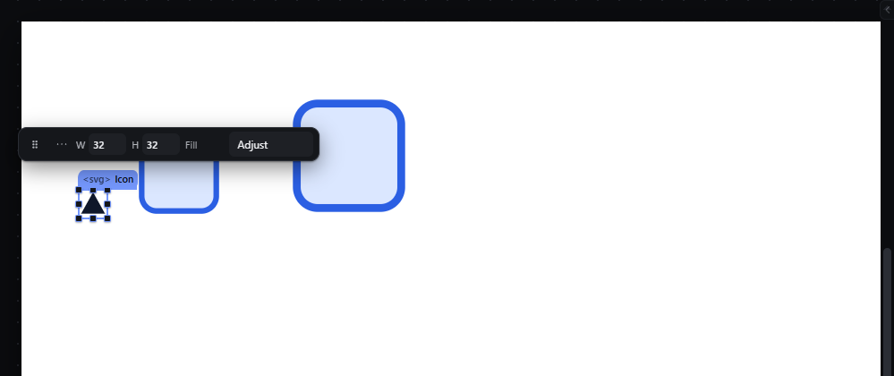
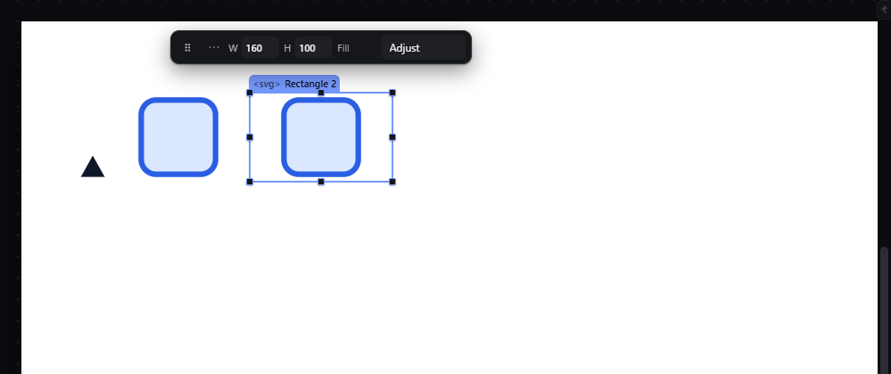
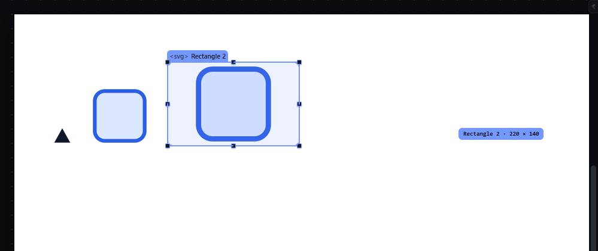

# elements-svg-shapes — SVG/Icon, Rectangle, Ellipse and Line

This file covers the pointer part of the entry: placing shapes and sizing them with the handles. Observed by running Pager from `.cache/pager-run` (Chrome, window 1600×900, clean storage) and read from its source; references are `path:line` inside Pager.

## Trigger

- Insert from the Elements panel (click or drag): **SVG/Icon**, **Rectangle**, **Ellipse**, **Line**.
- Size with the eight resize handles of the selection outline (the gesture of `resize-handles.md`).

## Hit zones and thresholds

- In Pager the **SVG/Icon is a leaf**: a fixed 32 × 32 px `<svg viewBox="0 0 24 24">` holding a triangle icon path. It cannot contain children; the model's validator rejects any tree with children under an `<svg>` ("<svg> cannot contain child nodes").
- **Rectangle, Ellipse and Line are standalone elements**, each its own `<svg viewBox="0 0 24 24">` with one shape inside, allowed in ordinary containers. Observed: with the SVG/Icon selected, clicking Rectangle placed it **after** the SVG in the Section (`Placed. Rectangle in Section, position 2 of 2.`).
- A new Rectangle is 160 × 100 px with `fill: #dbe7ff`, `stroke: #2b5fe3`, `stroke-width: 1.5px`, `border-radius: 4px` in its styles.
- The handles behave exactly as for any element: 4 px threshold, 8 px handles (`compact-handles` below 48 px — the 32 px SVG/Icon gets it), Shift/Alt/Ctrl modifiers.

## Visual feedback

| Stage | What is drawn | Image |
|---|---|---|
| SVG/Icon selected | 32 px icon with the selection outline in compact-handle form and eight handles. |  |
| Rectangle selected | Outline around the 160 × 100 px box. |  |
| Dragging its SE handle (+60, +40 px) | Live preview; label `Rectangle 2 · 220 × 140`. Release: `Resized to 220 × 140.` |  |

## Result in the document

- Resizing wrote `width: 220px; height: 140px` in the Rectangle's styles; the inner `viewBox` stayed `0 0 24 24` and the `<rect>` stayed `x=2 y=2 width=20 height=20`, so the drawing is stretched to the new box.
- The export writes one inline `<svg viewBox="0 0 24 24" role="img" aria-label="Rectangle">` per shape with its CSS class.

## Undo and redo

Insert and resize are one history entry each.

## Nested elements

Shapes cannot be nested in the SVG/Icon in Pager.

## Zoom other than 100 %

As for `resize-handles.md`.

## Keyboard equivalent

None beyond the Inspector's Size fields.

## Problems in Pager

1. **Shapes cannot go inside an SVG, and they can go anywhere else.** Required: Rectangle, Ellipse and Line are not palette items; they are added inside a selected SVG from the SVG's own controls and only go inside an SVG; moving a shape outside an SVG is refused by the nesting rules (manifest feature `elements-svg-shapes`, `nesting-grammar`).
2. **The viewBox never matches the size** (fixed `0 0 24 24`, content stretched when resized). Required: the SVG has a viewBox that matches its size; resizing the SVG updates its viewBox, and resizing a shape with its handles changes the shape's own geometry attributes (`x`, `y`, `width`, `height`, `cx`, `cy`, `rx`, `ry`, `x1`…`y2`) in the SVG's coordinate space, with the stroke width unchanged.
3. **A shape's handles resize its CSS box, not the shape.** Required: selecting a shape inside an SVG shows handles on the shape's own bounding box; dragging them rewrites the shape's attributes (stored in the document JSON and rendered/exported as `rect`, `ellipse`, `line` inside the one inline `<svg>`).
4. **An icon cannot be brought in as markup.** Required: markup typed or pasted into the SVG's markup field becomes the SVG's content, rendered and exported as written, with scripts and event attributes removed.
5. **Fill and stroke are inspector-only.** Required: the quick panel's Fill writes a shape's `fill` with the same command as the inspector.
