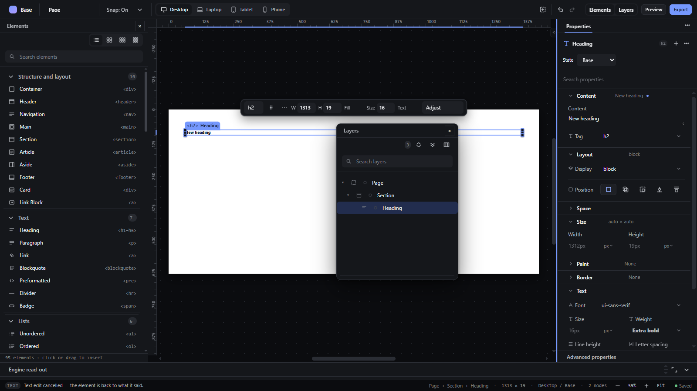
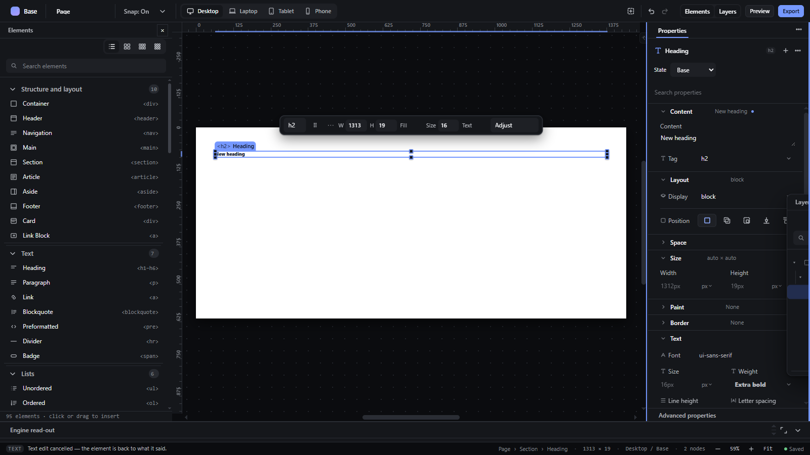
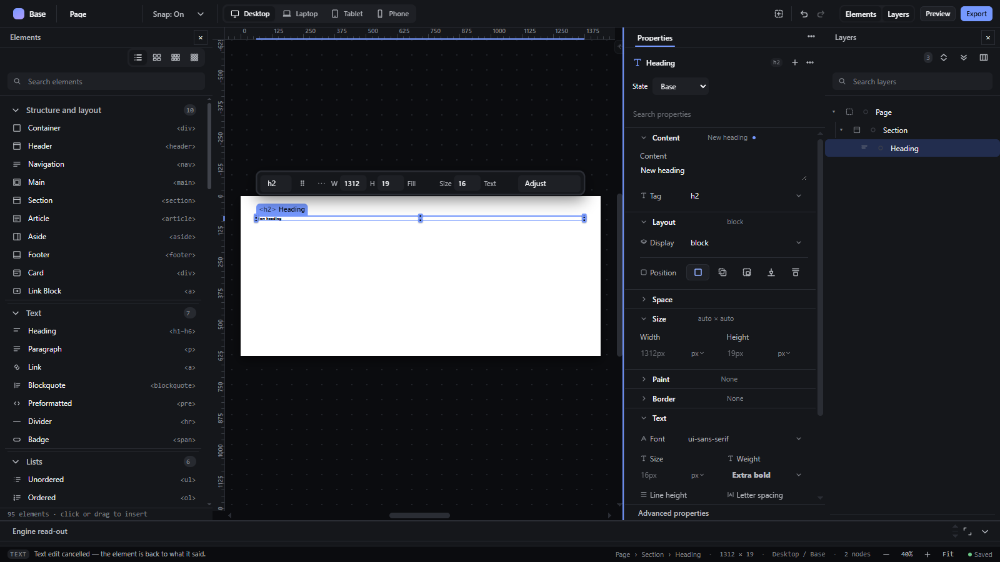

# floating-panels — Float a panel as a window and dock it again

How Pager behaves, observed by running it from `.cache/pager-run` (Chrome, window 1600×900) and read from its source. Source references are `path:line` inside Pager.

## Trigger

Pager has two panel-window systems:

- **Elements and Layers** ("independent panels", `src/features/windows/index.js:259-799`): press on a panel's bar (title or tab) and drag (`drag`, `:589-791`). Threshold **4 px** (`:662`).
- **Every other panel** (Inspector tabs, workbench tools, code): press on the panel header (`data-panel-drag`) and drag (`panelWindowDrag`, `:142-165`). Threshold 4 px.

`Escape` during either drag cancels and restores the previous arrangement (`:648-650`, `:163`).

## Hit zones and thresholds

Elements/Layers drag (`:708-753`):

| Pointer position | Drop |
|---|---|
| within **12 px** of the workspace frame's left, right, top or bottom edge (and not over a panel header) | dock to that edge (a new edge dock if none existed) |
| over another panel's header (its top 26 px) | combine as tabs, inserted before the tab under the pointer (see `panel-combine-tabs.md`) |
| over another panel's body | stack above (upper half) or below (lower half) |
| anywhere else | float at the drop point |

Other panels (`:154-160`): within **80 px** of the window's left or right edge → `Dock left` / `Dock right` (a text hint covering the dock area); over another panel → `Combine as tabs` (upper 45 %) or `Stack panels`; elsewhere → floating window.

Floating windows are kept inside the viewport: 240-280 px wide, 180-520 px tall, top ≥ 44 px (`:31-35`, `:247-251`); a floating Elements/Layers group gets eight resize handles (`:551-552`).

## Visual feedback

| Stage | What is drawn | Image |
|---|---|---|
| Dragging the Layers bar over the canvas | The panel follows the pointer (translated, semi-transparent to pointer events, z-index 300); no hint while over the canvas. |  |
| Released | A floating Layers window (280 × 360 px) at the drop point, with its own bar and `×`. |  |
| Near the right edge | A **3 px accent line** along the right edge of the workspace (no text). |  |
| Released there | Layers docked in a new right dock. |  |

## Result in the document

Never changes the document. The arrangement is saved in preferences (`workspace.independent-panels.v1`, observed after each drop) and restored after reload.

Observed sequence: float at (772, 284.5) → right edge → `edge: "right"` → left edge → `edge: "left"`; a further drag cancelled with Escape left the stored arrangement byte-identical.

## Undo and redo

Not undo steps.

## Nested elements

Not applicable.

## Zoom other than 100 %

Canvas zoom does not affect panels.

## Keyboard equivalent

None (panels can only be moved with the pointer).

## Problems in Pager

1. **For Elements and Layers the edge hint is a 3 px line with no words.** Required: near the left or right edge a `Dock left` / `Dock right` hint appears, and release docks the panel there (features.json `floating-panels`), the same for every panel.
2. **Two different panel-window implementations** with different thresholds (12 px vs 80 px edges), hints and limits. Required: one workspace owner and one drag behaviour for every panel.
3. **Edge docking can create top and bottom docks** for Elements/Layers (12 px from the top or bottom edge), which the layout does not otherwise expect (features.json lists left dock, right dock and the bottom workbench). Required: panels dock to the left dock, the right dock, or the bottom workbench, and nowhere else.
