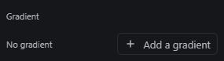
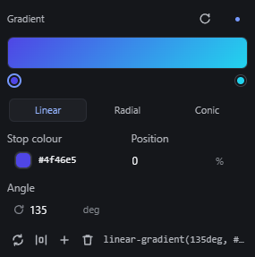
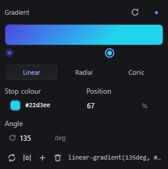
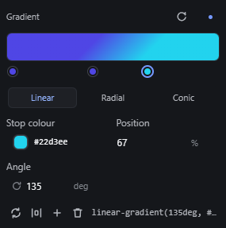
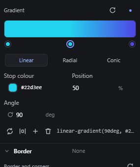

# gradient-editor — Gradient editor: linear, radial and conic gradients with stops

How Pager behaves, observed by running it from `.cache/pager-run` (Chrome, window 1600×900) and read from its source. Source references are `path:line` inside Pager. Test element: a Section. The editor is `ppGradient` (`src/features/inspector/properties.js:1351-1525`), shown in Paint → Gradient (`data-prop="background"`).

## Trigger

- **Add a gradient** (shown with `No gradient` while there is none) writes the default `linear-gradient(135deg, #4f46e5 0%, #22d3ee 100%)` and shows the editor (`properties.js:1371-1374`, `:1418-1425`).
- **Type:** segmented `Linear | Radial | Conic` (`:1376-1382`).
- **Stops:**
  - Each stop is a round button under the bar (`grad__stop`, `aria-label` "Stop N, at P per cent").
  - Press a stop and drag horizontally to move it (`startDrag`, `:1501-1512`).
  - Press an empty spot of the bar to add a stop there (`:1513-1517`).
  - Release a dragged stop far from the bar to remove it (`:1509`).
- **Fields and buttons:**
  - `Stop colour` opens the colour picker for the selected stop (`:1518-1519`).
  - `Position` is 0–100 % (`:1390-1392`).
  - `Angle`, in deg with a scrub glyph, is hidden for Radial (`:1395-1397`, `:1432`).
  - Footer: `Reverse the stops`, `Distribute evenly`, `Add a stop` (at 50 %), `Remove this stop` (`:1402-1412`), and the CSS read-out.
  - `Reset` in the header removes the gradient (`:1358`).

## Hit zones and thresholds

| What | Value | Source |
|---|---|---|
| Bar | 267 × 34 px (full Inspector width) | measured |
| Stop handle | 12 × 12 px, centred 33 px below the bar's centre line | measured |
| Stop drag | offset = (pointer x − bar left) / bar width × 100, clamped 0–100, starts on pointerdown | `:1506` |
| Drag-off removal | on release, if \|pointer y − bar centre y\| > **46 px** the stop is removed (only when more than 2 stops) | `:1509`, `:1495` |
| Minimum stops | 2 (`removeStop` refuses below) | `:1495` |
| New stop colour | copies the colour of the nearest stop at or before the click position | `:1487-1491` |
| Stop keys | ArrowLeft/ArrowRight ±1 %, Shift ±10 %; Delete/Backspace removes | `:1466-1471` |

## Visual feedback

| Stage | What is drawn | Image |
|---|---|---|
| No gradient | `No gradient` and `Add a gradient`. |  |
| Added | The bar paints the gradient over a checkerboard; stops under it (selected stop ringed); type, stop colour, position, angle, footer with the CSS read-out. |  |
| Dragging a stop | The stop follows the pointer; the bar, the read-out and the canvas update live (observed 100 % → 67 %). |  |
| Stop added by clicking the bar | A new stop at the click position (observed 40 %), selected. |  |
| Dragging a stop off the bar | **Nothing changes on screen:** the stop stays at its last position and gives no sign that releasing will delete it. |  |

## Result in the document

- Every change writes the **`background` shorthand** of the node: `linear-gradient(135deg, #4f46e5 0%, #22d3ee 100%)`, `radial-gradient(circle at 50% 50%, …)`, `conic-gradient(from 180deg at 50% 50%, …)` (observed in the stored styles). The iframe's computed `background-image` matches it.
- Because it is the shorthand, it **resets the element's background colour**: with `backgroundColor: #fde68a` stored, adding a gradient left the stored colour in place but the computed `background-color` became `rgba(0, 0, 0, 0)`; Reset brought it back (observed).
- Switching type changes the angle: Linear 135deg → Radial → Conic (`from 180deg`) → Linear gave `180deg` (observed).
- Reverse mirrors the positions (0/40/67 → 33/60/100); Distribute spreads them evenly (0/50/100).
- Position 150 + Enter: refused silently (max 100).
- Reset removes the `background` value (observed: computed `background-image: none`).

## Undo and redo

- Each change is one undo step: a stop drag (the whole gesture), a bar click, a type switch, the angle, Reverse, Distribute, a picker Apply (observed with Ctrl+Z / Ctrl+Shift+Z on the stop colour).
- Escape during a stop drag cancels it (the Inspector gesture, `properties.js:619-621`).

## Nested elements

Not applicable.

## Zoom other than 100 %

Not affected (the editor is in the Inspector).

## Keyboard equivalent

Stops are buttons with key handling: ArrowLeft/ArrowRight ±1 % (Shift ±10 %), Delete/Backspace removes the focused stop (observed with the stop focused: Delete removed stop 2; with two stops left it did nothing, and the canvas selection was not deleted). But the stops have `tabindex="-1"` (the region seal, see `keyboard-panel-navigation.md`), so Tab never reaches them. There is no key to add a stop other than the `Add a stop` button.

## Problems in Pager

1. **The gradient is written to `background`, which erases the background colour.** Required: the gradient is written to `background-image` only; `background-color` is kept and shows under a transparent gradient; removing the gradient returns `background-image` to `none` (features.json `gradient-editor`).
2. **Dragging a stop off the bar deletes it with no warning,** and the limit (46 px from the bar centre, only 13 px below the stop row) is easy to cross by accident. Required: while the pointer is beyond the removal distance, the stop is drawn detached and faded with a "Release to remove" hint; moving back cancels the removal.
3. **Switching the type changes the angle** (135deg became 180deg after Linear → Radial → Conic → Linear). Required: each type keeps its own angle when switching; switching back restores it.
4. **A new stop copies the colour of the stop before it,** which changes the look of the gradient (a flat band appears). Required: a new stop takes the colour the gradient already has at that position, so adding a stop does not change the rendering.
