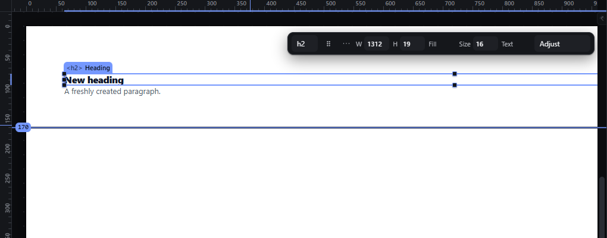
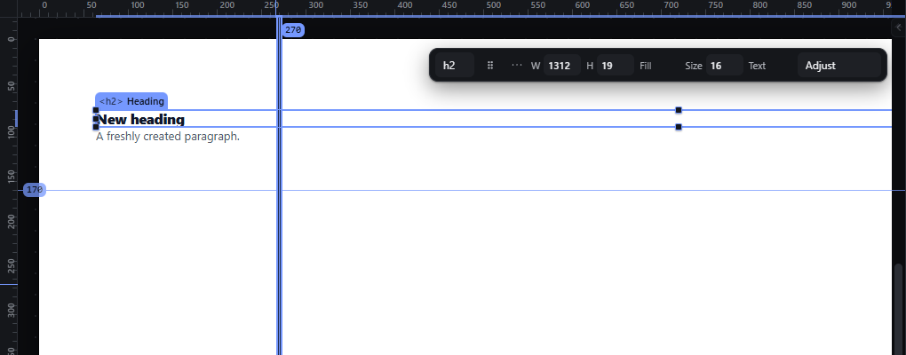
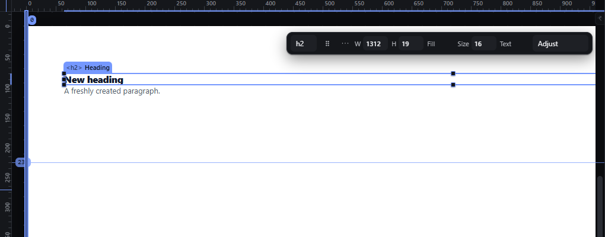

# guides-manual — Create, move and delete guides from the rulers

How Pager behaves, observed by running it from `.cache/pager-run` (Chrome, window 1600×900, zoom 100 %) and read from its source. Source references are `path:line` inside Pager.

## Trigger

- Press on the **top ruler** and drag down: a **horizontal** guide (axis `y`) is created at the press and follows the pointer; press on the **left ruler** and drag right: a **vertical** guide (axis `x`) (`src/features/rulers/index.js:372-382`, `beginGuideDrag` `:292-368`).
- Press on an existing guide and drag: moves it (`:384-395`). Locked guides do not move.
- With a guide active (last created, moved or clicked): `Delete`/`Backspace` removes it, `L` locks/unlocks it, arrows move it by 1 px (Shift 10 px) along its axis, `Escape` deactivates it (`:396-422`).
- Clicking the value label on a guide opens a typed field (`:227`).
- `Escape` during a guide drag cancels; a newly created guide is then removed (`:314-335`, `:396-399`).

## Hit zones and thresholds

- No drag threshold: the guide appears on press.
- The guide line is 1 px; its value label sits at the ruler end.
- Values are page CSS px = (pointer − page edge) ÷ zoom, clamped to 0 … page width/height (`:260-270`). **A guide dragged onto its ruler is clamped to 0, not deleted** (observed: the vertical guide dropped on the left ruler became `x: 0`).
- With Snap on, a guide being dragged snaps to page edges/centre, element edges, other guides and grid lines within the snap distance; Ctrl suspends (`:301-311`).

## Visual feedback

| Stage | What is drawn | Image |
|---|---|---|
| Dragging from the top ruler | A 1 px accent horizontal line across the canvas with a value chip at its left end (`170`), the guide marked active. |  |
| Two guides | Horizontal guide `170` and vertical guide `270` (value chip at its top end). |  |
| Vertical guide dragged onto the left ruler | It stays at `0` on the page's left edge. |  |

## Result in the document

- Guides are stored per page in the project as `{o: "h"|"v", at, locked}` (`:172-188`) through `editProject`, once per completed gesture; they are never exported.
- Observed sequence: create `y:170`, create `x:270`, move the horizontal guide +60 px → `y:230`, drag the vertical guide onto its ruler → `x:0`, Delete → only `y:230` left.

## Undo and redo

Guide changes are project edits: Ctrl+Z after the Delete restored the `x:0` guide (observed).

## Nested elements

Not applicable.

## Zoom other than 100 %

Values are page px; the guide stays on the same page coordinate at any zoom.

## Keyboard equivalent

Arrows / Shift+arrows move the active guide, Delete removes it, L locks it; the Guides & Grids panel adds a guide at a typed position.

## Problems in Pager

1. **Dropping a guide on its ruler does not delete it** (it is clamped to 0). Required: a guide released over its own ruler is deleted (manifest feature `guides-manual`); the ruler shows a delete hint while the guide is over it.
2. **A guide appears on press, before any movement,** so a click on a ruler creates nothing but flickers a guide. Required: the guide is created after 4 px of movement out of the ruler (the shared drag threshold).
3. **The guide keyboard handler captures arrows, Delete, Backspace, L and Escape globally while a guide is active,** even when the person has moved on to the canvas selection (it deactivates only on a press outside rulers and guides). Required: guide keys act only while the guide has focus; the canvas keys work as usual otherwise.
