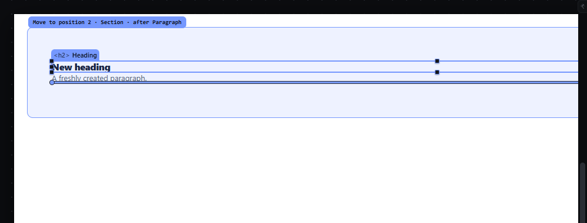
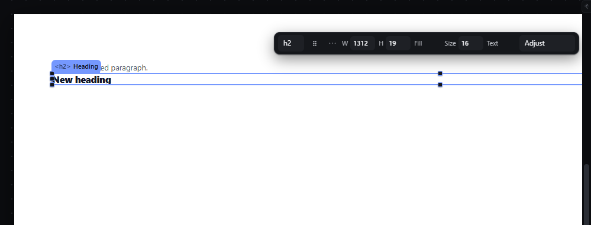

# hand-keyboard-move — Take the selection into the hand with M and place it with the keyboard

How Pager behaves, observed by running it from `.cache/pager-run` (Chrome, window 1600×900) and read from its source. Source references are `path:line` inside Pager. Test document: Section > [Heading, Paragraph], and a Container after the Section.

## Trigger

- `M` with the canvas focused and exactly one element selected takes it into the hand (`src/features/input/index.js:758-759`, `takeIntoHand` `:136-149`). The Page root, locked and hidden elements are refused.
- While something is in the hand, the canvas keymap is replaced by the hand keymap (`src/app/boot.js:566`, `input/index.js:694-705`):

| Key | Action |
|---|---|
| ArrowDown or ArrowRight | aim at the next insertion slot in document order (`moveAim(1)`) |
| ArrowUp | climb one receiver level (`climb(1)`): the aim moves to the **end** of the next containing ancestor |
| ArrowLeft | descend one receiver level (`climb(-1)`) |
| Enter | place the element at the aim (same commit as a drop, `commitHand` `:173-184`) |
| Escape | drop the hand; nothing changes (`dropHand` `:166-172`) |

- Other doors: selection bar "take into the hand", Arrange menu "Take into the hand".

## Hit zones and thresholds

- The slots are every legal `(container, index)` in reading order, skipping the element's own subtree and locked containers (`input/index.js:49-61`). The first aim is the element's current slot.
- Each aim is validated with the drop validator; a refused aim is announced with `Refused. <reason>` and Enter does nothing (`:63-72`, `:176`).
- The ladder is the list of containing ancestors of the current aim; `Level N of M` counts it (`:84-94`).
- `moveAim` clamps at the last slot; there is **no key that moves the aim backwards** (no binding calls `moveAim(-1)`).

## Visual feedback

| Stage | What is drawn | Image |
|---|---|---|
| After `M` on the Heading | The same indicator a mouse drag draws (receiver tint, insertion line, label chip) at the Heading's own slot; the receiver's row in Layers is marked; status `Holding Heading. Arrows aim, Enter places, Esc drops. Section will receive. Position 1 of 2. Level 1 of 2.` |  |
| ArrowDown, ArrowUp, ArrowLeft | ArrowDown → `Section will receive. Position 2 of 2. Level 1 of 2.`; ArrowUp → `Page will receive. Position 3 of 3. Level 2 of 2.`; ArrowLeft → `Section will receive. Position 2 of 2. Level 1 of 2.` The label chip shows `Move to position 2 · Section · after Paragraph`. |  |
| Enter | The Heading moves after the Paragraph; status `Placed. Heading in Section, position 2 of 2.` |  |
| Escape (other attempt) | The indicator disappears; status `Dropped. Nothing changed.`; the document is byte-identical (observed). | — |

## Result in the document

Observed: `Section > [Heading, Paragraph]` → after `M`, ArrowDown, ArrowUp, ArrowLeft, Enter → `Section > [Paragraph, Heading]`.

## Undo and redo

Enter is one history entry (the same transaction as a drop). Escape adds none.

## Nested elements

ArrowUp can climb up to the Page; ArrowLeft goes back down the same ladder only.

## Zoom other than 100 %

The indicator is drawn on the zoomed canvas like a drag indicator; keys are unaffected.

## Keyboard equivalent

This is the keyboard counterpart of drag and drop.

## Problems in Pager

1. **The aim cannot move backwards.** ArrowDown and ArrowRight both step forward and ArrowUp/ArrowLeft change level, so an earlier slot is only reachable by dropping the hand and starting again. Required: keep the features.json keys (ArrowDown/ArrowRight next position, ArrowUp climbs a receiver level, ArrowLeft descends) and add one binding in the keymap owner that aims at the previous position, listed in the shortcuts panel.
2. **ArrowUp jumps to the end of the ancestor** rather than to the slot right after the current receiver, which is where "one level out" lands during a mouse drag. Required: climbing aims at the slot right after the current receiver inside its parent, the same result as ArrowUp during a mouse drag (see `drag-level-keys-escape.md`).
