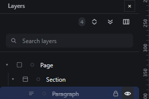
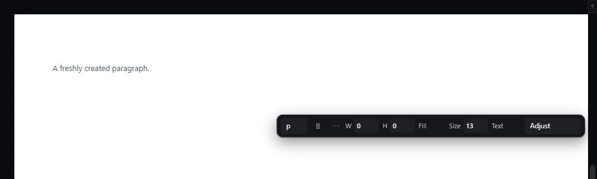

# hide-element — Hide and show an element

How Pager behaves, observed by running it from `.cache/pager-run` (Chrome, window 1600×900) and read from its source. Source references are `path:line` inside Pager. Test document: Section > [Paragraph, Paragraph 2].

## Trigger

- The eye button at the right end of a Layers row (24 × 28 px, title `Hide` / `Show`; `src/features/layers/layers-panel.js:334`, `toggleNodeFlag` `:722-733`).
- The selection bar's "hide/show" button (`src/app/boot.js:339-341`).
- No shortcut. Hiding is refused inside a locked ancestor.

## Hit zones and thresholds

The eye button only. A click on the rest of the row selects the row and scrolls the canvas to the element (observed: a click that missed the eye by a few pixels selected the row instead and scrolled the canvas).

## Visual feedback

| Stage | What is drawn | Image |
|---|---|---|
| Paragraph hidden | The row gets the `hidden-layer` class (dimmed), the eye button stays pressed with title `Show`. In the iframe the element gets `display: none` and Paragraph 2 moves up into its place. **No status message** from the Layers toggle. |  |
| Hidden Paragraph selected from Layers | The canvas shows **no outline**; the selection chip is built with a `hidden` flag (`hidden
Paragraph`) but the frame is not drawn (`src/features/selection/selection.js:213-230`). |  |

## Result in the document

`hidden: true` on the node in the document JSON; computed `display` in the iframe `none` (observed). Showing it again removes the flag and restores the layout exactly (observed: Paragraph 2 returned to its previous position).

Hidden elements are not drop receivers and cannot be dragged on the canvas (`src/features/drag/drag.js:452-455`, `:1355-1363`); in Layers a hidden element can be dragged (`allowHidden`, `boot.js:485`).

## Undo and redo

Both hide and show are history entries: Ctrl+Z after hiding restored the visible state, Ctrl+Shift+Z hid it again (observed).

## Nested elements

Hiding a container hides its subtree.

## Zoom other than 100 %

Not affected.

## Keyboard equivalent

None in Pager.

## Problems in Pager

1. **A hidden selected element shows nothing on the canvas,** so the person cannot tell where it is. Required (changed by the user's real-use audit, A3.11: the dashed outline drawn on the nearest shown ancestor covered the whole page): a hidden selected element, hidden itself or inside a hidden element, has no box on the page, and the canvas draws nothing for it, neither outline nor label; its Layers row, selected and dimmed with its Hide pressed, says where it is. Shown again, its outline and label are drawn on its own box.
2. **Toggling from Layers says nothing.** Required: the status bar reads `Hidden: <name>` / `Visible: <name>` for every door.
3. **The eye did not say it hides the element on the published page too** (the user's real-use audit, A3.11): the export writes the `hidden` attribute. Required: the Layers eye is named "Hide on the published page" (its label and tooltip); the export keeps the element with `hidden`.
