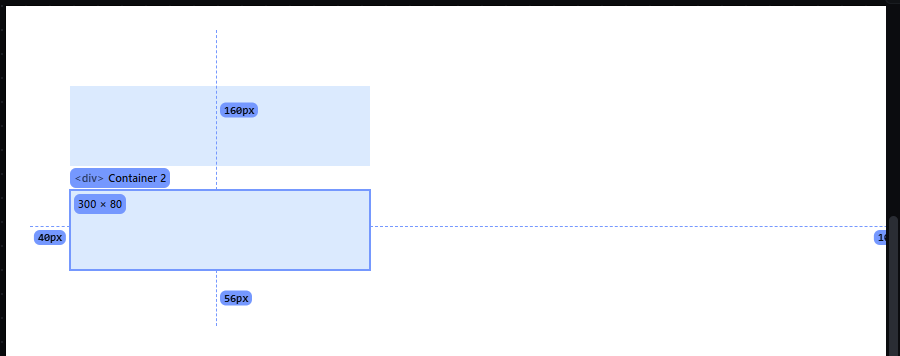
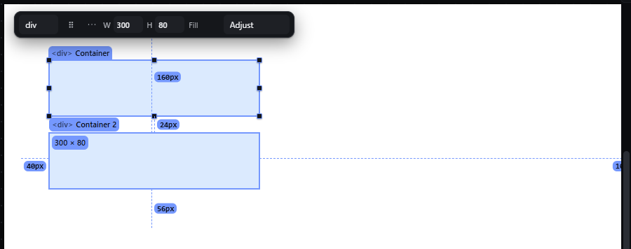

# hover-measure — Measure sizes and distances on the canvas

How Pager behaves, observed by running it from `.cache/pager-run` (Chrome, window 1600×900) and read from its source. Source references are `path:line` inside Pager. Test page: Section > [Container 300 × 80, Container 2 300 × 80 with `margin-top: 24px`].

## Trigger

- Pager measures while **Ctrl** (or Meta) is held and the pointer is over an element (`src/features/spacing/handles.js:472-487`, wired by `initMeasureHover`, `src/app/boot.js:817`). Pressing Ctrl over an element shows the measurement at once; releasing Ctrl hides it.
- A plain hover measures nothing, and Alt does nothing (observed: no lines, no size label).

## Hit zones and thresholds

What is measured for the hovered element (`measureHover`, `handles.js:353-362`):

| Measurement | Rule | Source |
|---|---|---|
| Size | the hovered element's box, rounded to whole px | `measureSize`, `:323-326` |
| Inside | distances from the hovered element to its **parent's** four edges (top, bottom, left, right), drawn at the element's centre lines | `measureInside`, `:328-338` |
| Between | when something else is selected, the gap between the hovered element and the selection on each axis where they do not overlap | `measureBetween`, `:340-351` |
| Values | screen px divided by the canvas scale, rounded, so they are CSS px at any zoom | `measurementDisplayValue`, `:389` |

The Page root is never measured (`handles.js:429`). The parent distances are also handles: dragging one sets that side of the parent's padding (`mhDown`, `:458-465`, `mhRelease`, `:466-470`).

## Visual feedback

| Stage | What is drawn | Image |
|---|---|---|
| Ctrl held over Container 2, nothing selected | A size chip `300 × 80` at the element's top-left, and four dashed accent lines to the Section's edges, each labelled: `160px` (top), `56px` (bottom), `40px` (left), `1052px` (right). |  |
| Container selected, Ctrl held over Container 2 | The same lines, plus a line between the two boxes labelled `24px`. |  |

At 50 % zoom the labels were identical (`300 × 80`, `160px`, `56px`, `40px`, `1052px`), so the values are CSS px.

## Result in the document

Measuring changes nothing. Dragging a parent-distance line changes the parent's padding, which is outside this entry.

## Undo and redo

Nothing to undo for a measurement.

## Nested elements

The inside distances always refer to the hovered element's direct parent.

## Zoom other than 100 %

Values are CSS px at any zoom (observed at 50 %).

## Keyboard equivalent

Ctrl is the modifier; there is no keyboard way to pick the measured element.

## Problems in Pager

1. **The modifier is Ctrl, which the new app uses for Ctrl+click toggling.** Required: hovering an element always shows its size (W × H in CSS px) next to its hover outline, and holding **Alt** shows distances (features.json `hover-measure`).
2. **Distances are measured to the hovered element's parent, not from the selection.** Required: with a selection, holding Alt over another element draws distance lines between the nearest edges of the selection and that element, each labelled in CSS px; over an ancestor of the selection it shows the distances from the selection to the ancestor's inner edges.
3. **A measurement line is also a padding handle,** so a measuring gesture can change the document. Required: measuring never changes the selection or the document JSON.
