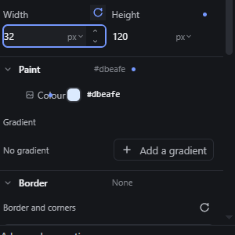
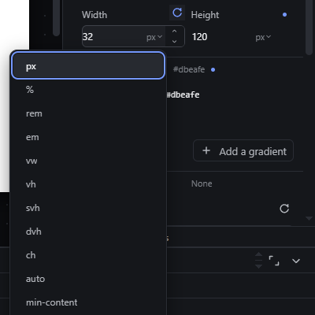
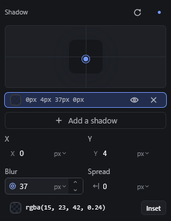

# inspector-number-fields — Numeric property fields: typing, units, steppers and scrubbing

How Pager behaves, observed by running it from `.cache/pager-run` (Chrome, window 1600×900) and read from its source. Source references are `path:line` inside Pager. Test element: a Container (`div`) with `width: 300px; height: 120px`. One field component, `ppNumberField` (`src/features/inspector/properties.js:870-1018`), is used for Width, Height and every other length (spacing, radius, shadow X/Y/blur/spread, gradient angle and stop position).

## Trigger

- **Typing:** the input is `type="text"`, `inputmode="decimal"`, `role="spinbutton"` (`properties.js:887-891`, `:979-982`). Enter commits (`:976`); leaving the field (`change`) commits too; Escape puts back the value it had before typing and blurs (`:977`).
- **Keys in the field** (`properties.js:969-978`): ArrowUp/ArrowDown step ±1; with Shift ±10, with Alt ±0.1 (`mult`, `:936`); PageUp/PageDown ±10; Home/End jump to the min/max when the field has bounds.
- **Step buttons:** `Step up` / `Step down` beside the input, the same step and modifiers (`:924-933`). They are out of the Tab order (`tabIndex = -1`).
- **Unit button:** opens a menu of the units the property allows (`:896-917`). For Width/Height the observed list: `px, %, rem, em, vw, vh, svh, dvh, ch, auto, min-content, max-content, fit-content`. A keyword entry commits the keyword; a length unit converts the current value (`convertUnit`) and commits the converted number, or shows the toast `inspector.unitNotConverted` when it cannot convert.
- **Scrub:** pressing on the field's glyph (the small icon or letter at its left, `aria-label` "Drag to change — Shift ×10, Alt ×0.1", cursor `ew-resize`) and dragging horizontally (`:1000-1013`). **Width and Height have no glyph** (they are built with `glyph: null`), so they cannot be scrubbed; dragging their text label changed nothing (observed: width stayed `300px`).

## Hit zones and thresholds

| What | Value | Source |
|---|---|---|
| Glyph (scrub handle) | 24 × 26 px box at the left of the field (measured on the shadow Blur field) | measured |
| Scrub rate | `round(dx / 2) × step` → 1 unit per 2 px; Shift ×10, Alt ×0.1, read on every move | `properties.js:1004` |
| Scrub start | immediately on pointerdown (no dead zone) | `properties.js:1012`, `:629` |
| Scrub bounds | clamped to the field's `min`/`max` on every move | `properties.js:1006-1007` |
| Arrow step | `step` (1 by default) × 1 / 10 / 0.1 | `properties.js:936`, `:970-971` |
| PageUp/PageDown | ±10 | `properties.js:972-973` |
| Accepted text | a number with an allowed unit; `auto`, `none`, `min-content`, `max-content`, `fit-content`, `inherit`, `initial`, `unset`; `calc()/clamp()/min()/max()`; a token reference; arithmetic on digits and `+ - * / ( )` | `properties.js:984-996` |

Observed with Width = 300px: ArrowUp → `301px`, Shift+ArrowUp → `311px`, Alt+ArrowUp → `311.1px`; `Step up` 240→241, `Step down` twice → 239; typing `64/2` + Enter → `32px`. Scrubbing the shadow Blur glyph (starting at 12): +50 px → 37; Shift, +20 px → 137; Alt, +20 px → 138; −400 px → 0 (min 0).

## Visual feedback

| Stage | What is drawn | Image |
|---|---|---|
| Focused field | Accent focus ring around the field; the step buttons show on hover/focus; the unit button shows the current unit with a chevron. |  |
| Unit menu open | A menu under the unit button, the current unit checked. |  |
| Scrubbing | The value in the field and on the canvas update live on every move; the cursor is `ew-resize`. No other overlay. |  |

## Result in the document

Enter (or blur) writes `<number><unit>` (or the keyword) into the node's style for the current breakpoint and state; the iframe's computed style follows. Invalid text (`abc`) is **silently** put back to the previous value (`properties.js:998`); a unit the property does not allow is also refused silently (`:994`). Escape restores the value without writing.

## Undo and redo

- A typed commit is one undo step.
- A scrub is one gesture: the Inspector gesture wrapper (`createInspectorGesture`, `properties.js:571-630`) opens a history group on pointerdown and closes it on pointerup, so a whole scrub is **one** undo step (observed: two Ctrl+Z after four scrubs went 0 → 138 → 137).
- Escape during a scrub cancels the gesture and restores the value (`properties.js:619-621`).
- Each step-button click is its own undo step (observed: 240 → 241 → 240 → 239, one Ctrl+Z → 240).
- Ctrl+Z pressed **inside** the field did not change the document (the input handles it); Delete and Backspace in the field edit the text only (observed; the canvas selection stayed).

## Nested elements

Not applicable: the field edits the selected node(s) only.

## Zoom other than 100 %

Not affected (the Inspector is outside the zoomed canvas); the scrub rate is in screen pixels.

## Keyboard equivalent

The keys listed under Trigger. The glyph has no keyboard action; the arrow keys in the input are the keyboard equivalent of the scrub.

## Problems in Pager

1. **Width and Height cannot be scrubbed** (no glyph, and the label does nothing). Required: every numeric field, Width and Height included, scrubs by dragging its label (and its glyph where it has one): 1 unit per 2 px, Shift ×10, Alt ×0.1, the whole gesture one undo step (features.json `inspector-number-fields`).
2. **Invalid input is refused without a word.** Required: invalid text is rejected with a visible message (status bar / field hint) and the previous value stays.
