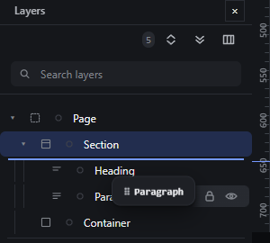
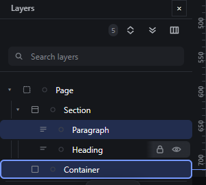
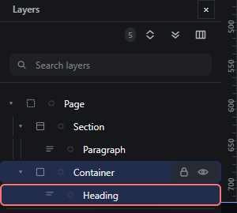
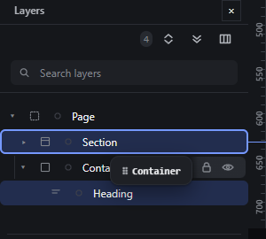

# layers-drag — Reorder and nest by dragging rows in the Layers panel

How Pager behaves, observed by running it from `.cache/pager-run` (Chrome, window 1600×900) and read from its source. Source references are `path:line` inside Pager. Test document: a Section holding a Heading and a Paragraph, and an empty Container after the Section. Layers rows are 28 px tall.

## Trigger

- Primary-button press on a Layers row arms a move drag of that row's node (`src/app/boot.js:463-501`). Presses on the row's buttons (caret, lock, eye), inputs, or with Shift held do not arm (`boot.js:464`). The row click itself selects (`boot.js:131-148`).
- The pointer is captured only once the 4 px threshold is crossed, so a plain click keeps its normal target (`boot.js:500`, `:508`).
- During the drag, whenever the pointer is over a Layers row the proposal comes from the row geometry (`layerDropAt`, `src/features/layers/layers-panel.js:356-371`); anywhere else it comes from the canvas, so one gesture can start in Layers and drop on the canvas or the reverse. Both go through the same validator and the same commit (`src/features/drag/drag.js:438-442`, `:1118-1245`).

## Hit zones and thresholds

For the row under the pointer, with `at` = (pointer y − row top) / row height (`layers-panel.js:362-368`):

| Row | Zone | Result |
|---|---|---|
| Container row (has or may have children) | 0.25 ≤ at ≤ 0.75 | **inside**, appended as last child |
| Container row | at < 0.25 | **before** that node |
| Container row | at > 0.75 | **after** that node |
| Leaf row | at < 0.5 | before |
| Leaf row | at ≥ 0.5 | after |
| Page row | anywhere | inside (appended) |

On a 28 px row: before = top 7 px, inside = 7-21 px, after = bottom 7 px (containers); leaves split at 14 px. The dragged rows are excluded when computing the index (`:366-368`).

A collapsed row is **not** expanded by hovering it during a drag: after 800 ms over the collapsed Section row it was still `aria-expanded="false"` (observed); there is no timer in the code.

## Visual feedback

| Stage | What is drawn | Image |
|---|---|---|
| Paragraph row over the top quarter of the Heading row | A 2 px accent line on the top edge of the Heading row (`data-drop-position="before"`, `style/99-base.css:58-64`); the receiving parent's row (Section) is highlighted with the receiver colour (`.rc`, `style/04-panels.css:149`); the ghost chip `⠿ Paragraph` follows the pointer. **Nothing is drawn on the canvas** (no line, no tint, no label chip): a Layers proposal only updates the read-out (`src/platform/overlay.js:243`, `drag.js:92`). Status `Before Heading`. |  |
| Heading row over the middle of the Container row | The Container row gets a 2 px accent outline (`data-drop-position="inside"`); status `Into Container · index 0`. |  |
| Container row over its own child (Heading) row | The target row gets a 2 px danger outline (`data-drop-position="refused"`); status `Rejected`; read-out "An element cannot be placed inside itself or one of its descendants. …". Release → `Cancelled — nothing changed`. |  |
| Container row held 800 ms over the collapsed Section row | The Section row is outlined for inside; the branch stays collapsed. |  |

## Result in the document

- Paragraph over the top quarter of the Heading row → `Section.children = [Paragraph, Heading]`.
- Heading over the middle of the Container row → `Container.children = [Heading]`.
- A Layers drop within the same parent keeps the node's grid cell / absolute placement (`drag.js:1221`); a drop into another parent clears it, exactly like a canvas drop.
- The dropped node is selected and its row scrolled into view (`drag.js:1239-1240`).
- For the same source and target, the Layers drop and the canvas drop produce the same document JSON, because both commit through `finish()` with the same `(parent, index)`.

## Undo and redo

One drop, one history entry; `Ctrl+Z` restores the previous tree.

## Nested elements

Any depth: the row's own node is the receiver for inside, its parent for before/after. Deep rows are indented by 12 px per level.

## Zoom other than 100 %

Canvas zoom does not affect Layers.

## Keyboard equivalent

`Alt+ArrowUp`/`Alt+ArrowDown` on a focused row move the node among its siblings (`layers-panel.js:410-417`); the row menu offers Move up, Move down, Make child of previous (indent) and Move out of parent (outdent) (see `layers-keyboard-navigation.md`, `context-menu.md`).

## Problems in Pager

1. **Hovering a collapsed row during a drag never expands it,** so a node cannot be dropped at a precise position inside a collapsed branch. Required: hovering a collapsed container row for 600 ms during a drag expands it (manifest feature `layers-drag`); leaving it before 600 ms cancels the timer.
2. **The canvas shows nothing during a Layers drag.** Required: while the pointer is over Layers, the canvas mirrors the same proposal (receiver tint and insertion line on the canvas, when the receiver is visible), so both views show one decision.
3. **No label chip in Layers.** The only text is in the status bar. Required: the same one-line label as on the canvas appears next to the pointer in Layers (`Position 1 of 2 in Section, before Heading`).
4. **The receiver row stays highlighted in the receiver colour while the proposal is refused** (Container stays `.rc` while its child row shows the refusal). Required: during a refusal no row is marked as receiver; only the refused target row is outlined in the danger colour.
5. **The before/after line is drawn on the row edge but not indented to the drop depth,** so "after the last child" and "after the parent" look the same. Required: the line starts at the indentation of the level it inserts into.
