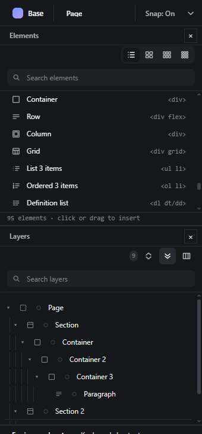
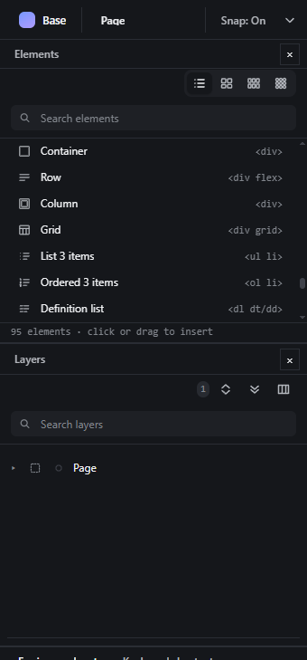

# layers-expand-collapse-all — Collapse and expand every branch in Layers

How Pager behaves, observed by running it from `.cache/pager-run` (Chrome, window 1600×900) and read from its source. Source references are `path:line` inside Pager. Test tree: Page > [Section > Container > Container 2 > Container 3 > Paragraph, Section 2 > Container 4 > Heading].

## Trigger

- Two icon buttons in the Layers header: `Collapse every branch` (`#layerCollapseAll`) and `Expand every branch` (`#layerExpandAll`) (`index.html:352-353`), handled by `foldAll` (`src/features/layers/layers-panel.js:504-511`).
- Collapse adds **every** node that has children, the Page root included, to the folded set. Expand clears the set.
- Single branches: the twisty on each row (`layers-panel.js:276-283`), or ArrowRight/ArrowLeft on a focused row (`:430`, `:440`).

## Hit zones and thresholds

The two header buttons are icon buttons (≈ 24 px) at the right of the Layers header, beside the row count badge.

## Visual feedback

| Stage | What is drawn | Image |
|---|---|---|
| After `Collapse every branch` | Only the `Page` row is left, with a closed twisty (`aria-expanded="false"`). |  |
| After `Expand every branch` | All nine rows, every twisty open. |  |
| Collapse all, then click the deep Paragraph on the canvas | The Paragraph is selected on the canvas, but **Layers still shows only `Page`**. Its row stays hidden and nothing is scrolled. |  |

## Result in the document

None: folding is view state (`treeFolded`, a `Set` of node ids inside the Layers panel). It is not saved and not part of the document.

## Undo and redo

Not in the history.

## Nested elements

Collapse folds every level. Expand opens every level. Selecting a node inside a folded branch does not unfold it: no code path deletes from `treeFolded` on selection (the only deletions are the twisty click, `layers-panel.js:283`, and ArrowRight, `:430`).

## Zoom other than 100 %

Not affected.

## Keyboard equivalent

None for collapse/expand all. Single branches: ArrowRight / ArrowLeft on a focused row (see `layers-keyboard-navigation.md`).

## Problems in Pager

1. **Selecting a hidden descendant does not reveal it in Layers.** Required: selecting a node whose row is inside a collapsed branch (from the canvas or anywhere else) expands its ancestors and scrolls its row into view (manifest feature `layers-expand-collapse-all`).
