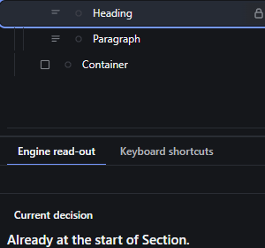

# layers-keyboard-navigation — Operate the Layers tree with the keyboard

How Pager behaves, observed by running it from `.cache/pager-run` (Chrome, window 1600×900) and read from its source. Source references are `path:line` inside Pager. Test document: Page > [Section > [Heading, Paragraph], Container].

## Trigger

With a Layers row focused (`src/features/layers/layers-panel.js:398-446`):

| Key | Effect |
|---|---|
| ArrowDown / ArrowUp | focus the next / previous visible row **and select it** |
| Home / End | first / last visible row, selected |
| ArrowRight | on a collapsed row with children: expand; on an expanded row: go to its first child (selected) |
| ArrowLeft | on an expanded row: collapse; otherwise go to the parent row (selected) |
| Enter / Space | select the row's node (it already is) |
| Alt+ArrowUp / Alt+ArrowDown | move the node among its siblings (`runKey`, `:410-417`) |
| Delete / Backspace | delete the selection (`src/app/boot.js:150-159`) |
| F2 | **nothing** (F2 is a canvas-only key row) |

## Hit zones and thresholds

The tree has `role="tree"`, rows `role="treeitem"` with `aria-level`, `aria-expanded` (only on rows with children) and `aria-selected`; exactly one row has `tabindex="0"` (the selected one, else the first root row) (`layers-panel.js:239-266`). The tree itself is reached only by clicking a row (rows are sealed out of the Tab order).

## Visual feedback

| Stage | What is drawn | Image |
|---|---|---|
| Focused, selected row | The selected-row background; the row is scrolled into view (`focusRow`, `:399-404`). |  |

Observed sequence from the Page row: ArrowDown → Section, ArrowDown → Heading, ArrowUp → Section, ArrowLeft → Section collapsed (rows: Page, Section, Container), ArrowRight → expanded, ArrowRight → Heading, End → Container, Home → Page, ArrowDown ×2 → Heading, Alt+ArrowUp → `Already at the start of Section.`, Enter → no change, F2 → nothing.

## Result in the document

Only Alt+Arrow and Delete change the document (same commands as on the canvas; observed `Removed: Container`).

## Undo and redo

As for those commands.

## Nested elements

The arrows follow the visible (unfolded) rows.

## Zoom other than 100 %

Not affected.

## Keyboard equivalent

This is the keyboard feature.

## Problems in Pager

1. **Moving focus changes the selection on every arrow key,** so walking through the tree repaints the canvas and the Inspector for each row and loses a multi-selection. Required: arrows move focus as in the WAI-ARIA tree pattern (roving tabindex); Enter selects the focused element (features.json `layers-keyboard-navigation`).
2. **F2 does nothing on a row.** Required: F2 renames the focused row's node (inline), Delete deletes it and Alt+ArrowUp moves it, with the same commands as the canvas.
3. **The tree is not reachable with Tab.** Required: the tree is one Tab stop; focus lands on its current row.
