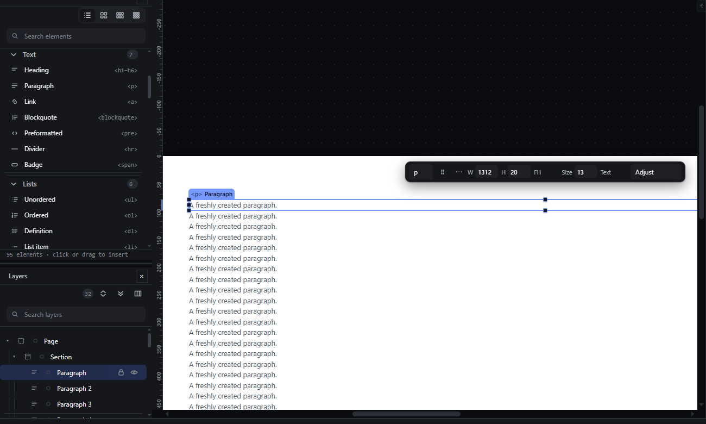
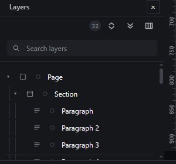
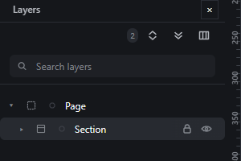

# layers-tree — Layers panel shows the document tree and selects in sync with the canvas

How Pager behaves, observed by running it from `.cache/pager-run` (Chrome, window 1600×900) and read from its source. Source references are `path:line` inside Pager.

## Trigger

- A click on a row selects its node (`src/app/boot.js:131-148`, row focus at `src/features/layers/layers-panel.js:447-451`). Shift+click adds to or removes from the selection (`boot.js:135`, see `multi-select-click.md`).
- A click on the caret (`button.twisty`) folds or unfolds that branch without touching the selection (`layers-panel.js:273-286`).
- Any selection change, from any surface, repaints the row marks (`markTreeSelection`, `layers-panel.js:681-700`); any document change rebuilds the rows when the tree signature changes (`drawTree`, `:228-347`).

## Hit zones and thresholds

| Part of a row (28 px tall, full panel width) | Effect |
|---|---|
| Caret (left, indented by 12 px per level: grid column `16px + depth × 12px`, `style/04-panels.css:642`) | fold/unfold |
| Icon, name, meta | select (press also arms a drag, see `layers-drag.md`) |
| Colour dot | opens the colour label picker (`layers-panel.js:466-479`) |
| Lock and eye buttons at the right end (24 × 28 px each) | toggle lock / hidden (`:323-335`) |

## Visual feedback

| Stage | What is drawn | Image |
|---|---|---|
| Row clicked | The row gets the selected background; the canvas scrolls the element to the vertical centre of the stage (`boot.js:142-143`) and draws the selection outline there. |  |
| Element selected on the canvas | The matching row gets the selected background, `aria-selected="true"` and `tabindex="0"`. **The row is not scrolled into view**: with 32 rows, selecting the last paragraph on the canvas left its row at y = 1576 px while the tree viewport spans 665-833 px (observed). |  |
| Caret clicked | The branch's rows disappear; the caret rotates; the selection is unchanged. The count badge in the panel header drops from 32 to 2. |  |

Each row shows, from left: indentation guides, caret (only when the node has children), element-type icon, colour dot, name, optional meta (tag, id, classes, attributes; see `layers-row-columns`), and the lock and eye buttons. The row's tooltip reads `Name — <tag> — layout` (`layers-panel.js:337`). The tree has `role="tree"`, rows `role="treeitem"` with `aria-level` and `aria-expanded` (`:239-266`).

## Result in the document

Selecting and folding never change the document JSON. Fold state is kept in memory only (`treeFolded`, `layers-panel.js:136`); it is not saved.

## Undo and redo

Not undo steps.

## Nested elements

Rows follow document order depth-first; every level is indented 12 px. Selecting on the canvas a node whose branch is folded does **not** unfold its ancestors (observed: after folding the Section, selecting its fifth paragraph on the canvas left the branch folded and no row visibly selected).

## Zoom other than 100 %

Not affected by canvas zoom.

## Keyboard equivalent

See `layers-keyboard-navigation.md` (ArrowUp/ArrowDown move and select, ArrowRight/ArrowLeft unfold/fold or go to child/parent, Home/End, Enter).

## Problems in Pager

1. **Selecting on the canvas does not scroll the Layers row into view.** Required: whenever the selection changes from a surface other than Layers, the primary selected row is scrolled into view (nearest edge, no smooth animation longer than the motion token).
2. **Selecting a node inside a folded branch leaves the branch folded,** so the selection is invisible in Layers. Required: selecting a hidden descendant unfolds its ancestors and scrolls its row into view (features.json `layers-expand-collapse-all`).
3. **The header badge counts visible rows, not nodes** (32 → 2 after folding one branch). Required: the badge shows the number of nodes in the document and updates after every insert and delete, regardless of folding.
4. **The Page row's tooltip and canvas chip say `
`** although the Page renders as `<body>`. Required: show the exported tag.
