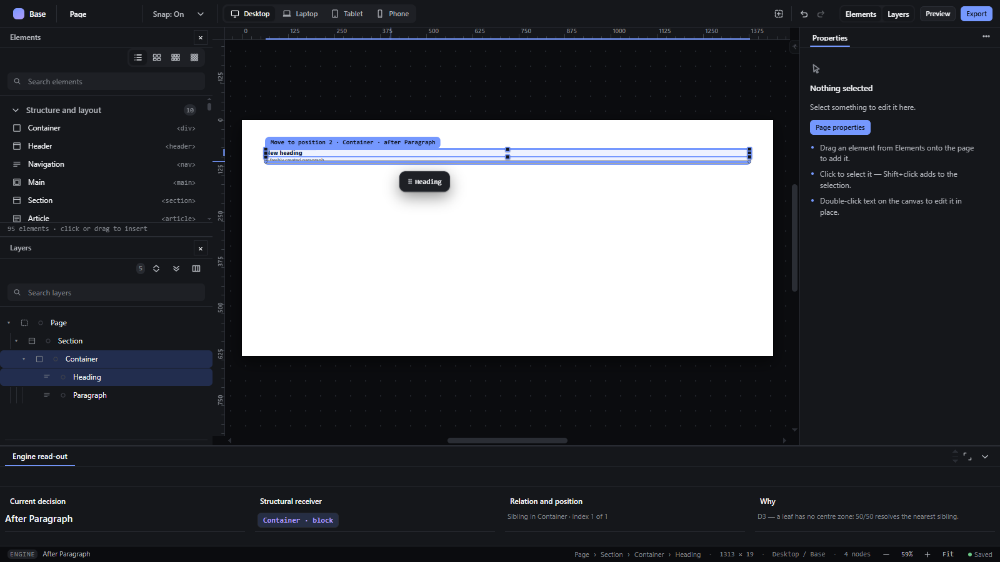

# layout-explanation — Explain drops and layout decisions

How Pager behaves, observed by running it from `.cache/pager-run` (Chrome, window 1600×900) and read from its source. Source references are `path:line` inside Pager.

## Trigger

- The **Engine read-out** is a workbench tab (`src/features/workspace/dock.js:694`); View → Engine read-out, or the tab itself, opens it.
- During every drag (canvas, palette, Layers, hand) the read-out is rewritten each frame from the drawn proposal (`paintProposalReadout`, `src/features/layers/layers-panel.js:79-132`).
- `?` with the canvas focused and something selected explains the selection's layout in the status bar (`src/features/input/index.js:686-691`); Edit → "Why is it laid out like this?" runs the same row.

## Hit zones and thresholds

Not a pointer gesture. The read-out has four lines: **decision** (`#dec`), **receiver** (`#recv`: `<parent> · <layout>`), **relation** (`#rel`), **rule** (`#rul`), e.g. `D3 — a leaf has no centre zone: 50/50 resolves the nearest sibling.`

## Visual feedback

| Stage | What is drawn | Image |
|---|---|---|
| Dragging the Heading below the Paragraph inside a Container | Read-out: decision `After Paragraph`, receiver `Container · block`, relation `Sibling in Container · index 1 of 1`, rule `D3 — a leaf has no centre zone: 50/50 resolves the nearest sibling.` The decision line is mirrored in the status bar. |  |
| After the drop | Decision `✓ Move to position 2 · Container · after Paragraph`; rule `The drop executed exactly the last visible indicator — nothing was recomputed.` | — |
| `?` on the Paragraph | Status: `display is block. The parent lays out as block, and this is child 2 of 2 — so the parent decides where the box goes.` | — |

Other rule texts (`src/core/i18n.js:1835-1847`): edge zone "D1/D2 — edge zone (25%, 8–32px) on the parent's flow axis.", centre zone, escape "D8–D11 — within 12px of an ancestor's real edge…", empty "D4 — 100% of the area is INSIDE; 8px are left on the outer edges for siblings.", grid, canvas, assist.

## Result in the document

None: the read-out only describes; the drop executes exactly the last shown decision (the commit reads the same proposal object, `src/features/drag/drag.js:1118-1245`).

## Undo and redo

Not applicable.

## Nested elements

The receiver line names the actual parent, `(contents) → …` for `display: contents` parents (`src/platform/overlay.js:313`).

## Zoom other than 100 %

Not affected.

## Keyboard equivalent

`?`.

## Problems in Pager

1. **The rule lines are internal codes** ("D3 — …", "D8–D11 — …") and the relation line uses a 0-based index while the label is 1-based. Required: plain sentences in the UI language; the relation line uses the same 1-based position as the label; the decision states the receiving parent, its layout, the relation and position, and why that target was chosen (features.json `layout-explanation`).
2. **The escape rule text claims "within 12px"** while the real band shrinks to `extent/2 − 8` px on small containers (see `drag-reorder-canvas.md`). Required: the explanation states the band that was actually used.
3. **`?` writes only to the status bar.** Required: `?` explains the selection's layout in the status bar and in the read-out.
