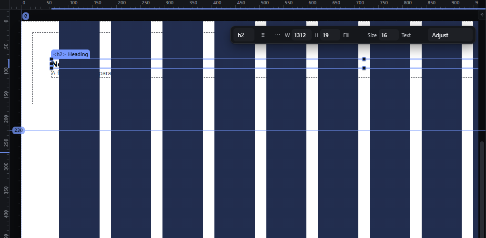

# layout-grid-overlay — Column grid, row grid and dot grid overlays

How Pager behaves, observed by running it from `.cache/pager-run` (Chrome, window 1600×900, dark theme) and read from its source. Source references are `path:line` inside Pager.

## Trigger

- `Ctrl+'` toggles the column grid (`view.toggleLayoutGrid`, `src/features/workspace/dock.js:571`, which clicks `#gridBtn`, `src/features/precision/index.js:486-511`, `:528-539`).
- The Canvas tools menu / Guides & Grids panel switch the column grid, row grid and dot grid (`precision/index.js:396-417`, `:446-452`).
- The grid is drawn only while the canvas "guides" (element outlines) flag is on; turning the grid on with that flag off also turns the flag on, and turning the grid off turns it off again if the grid had turned it on (`:486-511`).

## Hit zones and thresholds

- Defaults (`gdpGrid`, `:95-106`): 12 columns, 1280 px wide, 24 px gutter, 80 px margin; rows 80 px with 24 px gutter; dots every 24 px.
- Column band placement: inset = max(margin, (page width − grid width) ÷ 2) (`gdpGridLines`, `:541-555`); columns fill the band with the gutters between them. The overlay is a CSS gradient on the page (`--grid-cols`, `:140-168`).
- Grid lines are snap targets when snap is on (`:564-570`).

## Visual feedback

| Stage | What is drawn | Image |
|---|---|---|
| After `Ctrl+'` | Twelve filled column bands over the page; every element also gets a dashed outline (the guides flag was switched on with it); status `Layout grid on, 12 columns — guides were off, so they are on too: the grid is drawn with them.` In the dark theme the bands are opaque and **hide the page content** under them (the Heading and Paragraph text are covered). |  |
| `Ctrl+'` again | Grid and outlines removed; status `Layout grid off, 12 columns — the guides came on with it, so they are off again.` | — |

## Result in the document

The grid settings (`on`, columns, width, gutter, margin, rows, dots) are stored per page in the project (`page.grid`) through `editProject`; never exported.

## Undo and redo

Toggling the grid is a project edit and therefore undoable.

## Nested elements

Not applicable.

## Zoom other than 100 %

The overlay is in page px and scales with the page.

## Keyboard equivalent

`Ctrl+'`.

## Problems in Pager

1. **The column bands are opaque and cover the page content** (dark theme). Required: overlays are translucent (design token for overlay colour) and never hide the content beneath.
2. **Turning the grid on also turns on element outlines.** Required: the grid overlay is independent of element outlines; `Ctrl+'` toggles only the column grid.
