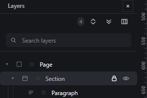

# lock-element — Lock an element so it cannot be moved, edited or deleted

How Pager behaves, observed by running it from `.cache/pager-run` (Chrome, window 1600×900) and read from its source. Source references are `path:line` inside Pager. Test document: Section > [Paragraph, Paragraph 2].

## Trigger

- The lock button on a Layers row (second-to-last control, 24 × 28 px; `src/features/layers/layers-panel.js:323-335`, handler `toggleNodeFlag` `:722-733`).
- The selection bar's "lock/unlock" button (`src/app/boot.js:337-338`).
- No shortcut.

## Hit zones and thresholds

- A lock applies to the node and every descendant (`lockedAncestorOf`). Only the node that carries the lock can be unlocked; toggling a descendant's lock while an ancestor is locked is refused (`layers-panel.js:724-728`).
- Locked nodes can still be selected; the press on them is a selection only (`boot.js:480-481`), no drag is armed.
- Refused while locked (document JSON unchanged), observed on a Paragraph inside a locked Section:
  - drag → no drag starts; status `🔒 Section is locked — click the lock in its bar to move it`;
  - Delete → `Unlock “Section” before deleting it.` (refusal tag);
  - R → refused with the lock message;
  - double-click on the text → no editing starts (`editText` checks `lockedAncestorOf`, `boot.js:587`);
  - drag of its Layers row → nothing moves.
- Locked containers and their descendants are not drop receivers (`src/features/drag/drag.js:406`, `:749-751`).

## Visual feedback

| Stage | What is drawn | Image |
|---|---|---|
| Section locked from its row | The row gets the `locked` class (dimmed name) and the lock button stays pressed (`aria-pressed="true"`, title `Unlock`). **No status message** is written by the Layers toggle. |  |

## Result in the document

The node gets `locked: true` in the document JSON (observed); unlocking removes it.

## Undo and redo

Lock and unlock are history entries (`nwToggleBoolean` inside a transaction).

## Nested elements

Everything inside a locked container is protected; the children can still be selected and inspected.

## Zoom other than 100 %

Not affected.

## Keyboard equivalent

None in Pager.

## Problems in Pager

1. **The refusal message points to the wrong place** (`click the lock in its bar`), while the lock is on the Layers row. Required: messages such as `Unlock <name> before deleting it` / `Unlock <name> before moving it`, naming the locked ancestor (features.json `lock-element`).
2. **Toggling the lock from Layers says nothing.** Required: the status bar reads `Locked: <name>` / `Unlocked: <name>` for every door (the selection bar already does).
3. **A double-click on locked text does nothing and says nothing.** Required: the status bar says `Unlock <name> before editing its text`.
