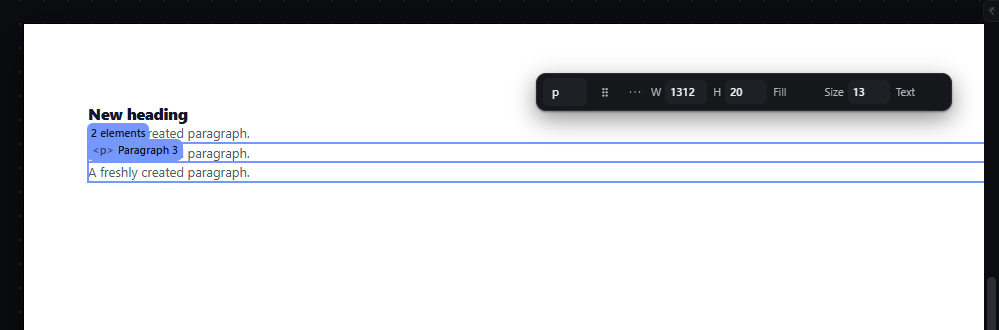
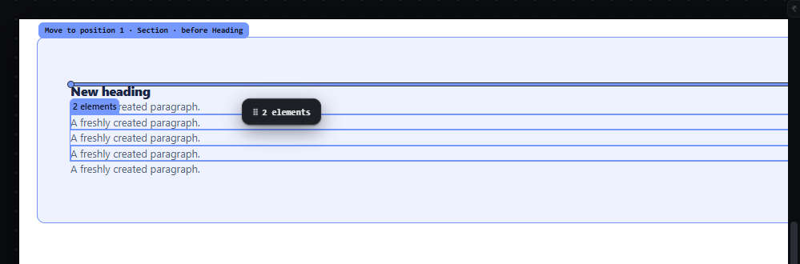

# multi-select-actions — Delete, move and duplicate several selected elements at once

How Pager behaves, observed by running it from `.cache/pager-run` (Chrome, window 1600×900) and read from its source. Source references are `path:line` inside Pager. Test document: Section > [Heading, Paragraph, Paragraph 2, Paragraph 3]; Paragraph 2 and Paragraph 3 selected with click + Shift+click.

## Trigger

The same keys as for one element, with a multi-selection:

| Key / gesture | Multi-selection behaviour | Source |
|---|---|---|
| Alt+ArrowUp / Alt+ArrowDown | move every selected root one step, keeping their order; all must share one parent | `src/features/input/index.js:629-658` |
| Ctrl+D | duplicate each selected root right after itself | `src/app/boot.js:325-336` |
| Delete / Backspace | remove every selected root | `input/index.js:604-627` |
| Drag any selected element | moves the whole group (ghost `⠿ 2 elements`) | `src/features/drag/drag.js:1247-1302`, `:1349-1373` |
| R, C, P, M, F2, Enter | refused: `This action needs one selected element.` | `input/index.js:759-819` |

## Hit zones and thresholds

A press inside the group's union outline, even on empty space between members, grabs the whole group (`boot.js:468-475`). Members that are descendants of other members are ignored (selected roots only).

## Visual feedback

| Stage | What is drawn | Image |
|---|---|---|
| Two paragraphs selected | Union outline and chip `2 elements`. |  |
| After Ctrl+D | The two copies are inserted after their originals and become the selection; status `Duplicated 2 selected elements.` |  |
| Dragging the group over the upper half of the Heading | Ghost `⠿ 2 elements`; line before the Heading; label `Move to position 1 · Section · before Heading`. |  |

## Result in the document

Observed:

| Step | Children of Section | Selection | Status |
|---|---|---|---|
| start | Heading, P, P2, P3 | P2, P3 | — |
| Alt+ArrowUp | Heading, P2, P3, P | P2, P3 | `Moved 2 selected elements within Section.` |
| Ctrl+D | Heading, P2, P2′, P3, P3′, P | P2′, P3′ | `Duplicated 2 selected elements.` |
| Delete | Heading, P2, P3, P | (none) | `Removed 2 selected elements.` |
| Ctrl+Z | back to the Ctrl+D state | P2′, P3′ | `↶ Undone` |
| R / P / M / F2 / Enter | unchanged | unchanged | `This action needs one selected element.` (refusal) |
| drag the group before the Heading | P2′, P3′, Heading, P2, P3, P | P2′, P3′ | `✓ Move to position 1 · Section · before Heading` |

Non-adjacent members dropped together land adjacent, in document order.

## Undo and redo

Each multi-element command is one history entry.

## Nested elements

Only selected roots act; a selected descendant of a selected container moves with the container.

## Zoom other than 100 %

As for a single drag.

## Keyboard equivalent

The keys above.

## Problems in Pager

1. **After a multi-delete nothing is selected.** Required: the selection moves to the element after the last removed one, else before the first, else the common parent (as for a single delete).
2. **`Moved 2 selected elements` / `Removed 2 selected elements`** are fine, but the single-element cases reuse the plural sentence (`Moved 1 selected elements`). Required: correct singular/plural through i18n.
