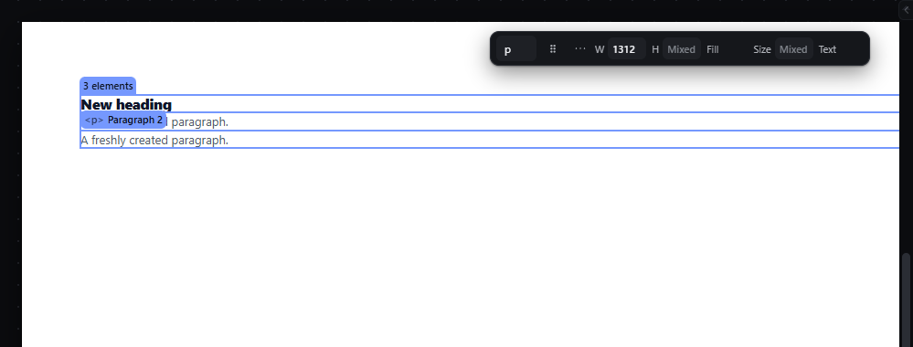

# multi-select-click — Select several elements with Shift+click and Ctrl+click

How Pager behaves, observed by running it from `.cache/pager-run` (Chrome, window 1600×900) and read from its source. Source references are `path:line` inside Pager. Test document: Section > [Heading, Paragraph, Paragraph 2].

## Trigger

- **Shift+press** on a canvas element toggles it in or out of the selection and does not arm a drag (`src/app/boot.js:484`, `selectMore` → `selection.toggle`, `src/features/layers/layers-panel.js:713-717`). The Page root is never added (`:714`).
- **Shift+click** on a Layers row does the same (`boot.js:135`).
- **Ctrl+press** has no selection meaning in Pager: it selects only the clicked element (like a plain press) and, if dragged, duplicates (`boot.js:496-497`, `src/features/drag/drag.js:307-311`).
- **Escape** clears the whole selection (`src/features/input/index.js:682-684`).

## Hit zones and thresholds

Same hit test as `select-click.md`. Caution observed in Pager: the hover chip of a neighbouring element (drawn above that element's top-left corner, min 120 × 20 px) is itself a press target; a Shift+click on the left part of a paragraph's text toggled the paragraph **below** it, whose chip covered that spot.

## Visual feedback

| Stage | What is drawn | Image |
|---|---|---|
| Click Heading, Shift+click Paragraph and Paragraph 2 | One outline around the **union** of the three boxes (not one per element), class `multi`, no resize handles (`style/06-canvas-chrome.css:161`), chip reading `3 elements`; the three Layers rows are highlighted. |  |

## Result in the document

Selection only; the document JSON never changes. Observed sequence:

| Action | Selection |
|---|---|
| click Heading, Shift+click Paragraph, Shift+click Paragraph 2 | Heading, Paragraph, Paragraph 2 |
| Shift+click Paragraph | Heading, Paragraph 2 |
| Ctrl+click Paragraph | Paragraph |
| Shift+click the Heading row in Layers | Paragraph, Heading |
| Escape | (empty) |

The primary element (the one the Inspector edits) is the last one added.

## Undo and redo

Not undo steps.

## Nested elements

An ancestor and its descendant can both be selected; commands then act on the selected roots only (`selectedRoots`, `src/features/drag/drag.js:1349-1354`).

## Zoom other than 100 %

Unaffected; the union outline is mapped through the zoom.

## Keyboard equivalent

See `select-container-children.md` and `layers-keyboard-navigation.md`.

## Problems in Pager

1. **Ctrl+click does not toggle.** Required: Ctrl+click toggles an element in or out of the selection; Shift+click adds (features.json `multi-select-click`).
2. **Shift+click toggles instead of adding,** so a second Shift+click removes an element. Required: Shift+click adds; removing is Ctrl+click.
3. **Only one outline around the union is drawn.** Required: each selected element has its own outline, plus the count chip `N elements`.
4. **Hover chips intercept clicks meant for the element under them** (see Hit zones). Required: chips never cover another element's content while it could be clicked; when they must overlap, clicks on them pass to the element under the pointer unless the chip itself is the intended drag handle of the selected element.
