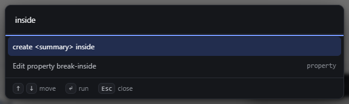

# natural-child-command — Create the natural child inside a container

How Pager behaves, observed by running it from `.cache/pager-run` (Chrome, window 1600×900) and read from its source. Source references are `path:line` inside Pager.

## Trigger

- Command `selection.add` (`src/app/boot.js:220-221`), run by `selbarAction("add")` (`boot.js:288-298`). Its label names the child tag: `create <li> inside` (`selbar.add.into`).
- **Its only door is the command bar** (`Ctrl+K`, type `inside` or `create`). It is not in the context menu (observed on a List: Rename, Copy, Paste, Move up, Move down, Make child of previous layer, Move out of parent, Delete), not in the selection bar, and has no key.
- The command exists when the selected type has a `naturalChild` (`src/model/elements.js`, e.g. `list` → `listitem`, `select` → `option`, `figure` → `figcaption`, `tbody` → `trow`, `details` → `summary`, `table` → `tbody`, `form` → `label`, `fieldset` → `legend`, `blockquote` → `paragraph`) and no ancestor is locked (`boot.js:220`). For a type without one (Paragraph, Section) the command is **absent** from the bar, not shown disabled.

## Hit zones and thresholds

The child type is `NATURAL_CHILD[selected.type]`. Before creating, `siblingBad` is checked (`boot.js:292-293`), so a unique child that is already present is refused **when run**. The command is not disabled in advance.

## Visual feedback

| Stage | What is drawn | Image |
|---|---|---|
| Details that already has its Summary, command bar query `inside` | `create 
 inside` is offered as a normal, enabled row. |  |

After a successful run the new child is selected (outline, chip) and the status reads `Created inside: <name>`.

## Result in the document

Observed (each run from the command bar with the container selected):

| Selected | New child | Status | Selected after |
|---|---|---|---|
| Unordered list | `listitem`, **empty** (no text, no children) | `Created inside: Item` | the new `<li>` |
| Select | `option` with text `Option` | `Created inside: Option` | the new `<option>` |
| Figure (no caption) | `figcaption` with text `Caption` | `Created inside: Caption` | the new `<figcaption>` |
| Table body | `trow` with **no cells** | `Created inside: Row` | the new `<tr>` |
| Details without Summary | `summary` | `Created inside: Summary` | the new `
` |
| Details with its Summary | nothing | `REFUSED 
 accepts a single 
` | unchanged |

The child is appended as the last child (`nwAppendChild`, `boot.js:295`).

## Undo and redo

One transaction, one undo step (observed: Ctrl+Z after creating the Summary removed it, `↶ Undone`).

## Nested elements

Only the selected container gets a child; its descendants are not considered.

## Zoom other than 100 %

Not affected.

## Keyboard equivalent

Ctrl+K, type, Enter.

## Problems in Pager

1. **The command is missing from the context menu.** Required: the context menu of a container with a natural child shows `Create <tag> inside`, naming the child tag (manifest feature `natural-child-command`).
2. **It stays enabled when it can only be refused** (Details with Summary). Required: it is disabled when the element has no natural child or the child is unique and already present.
3. **Some children are created without default content:** an empty `<li>` and a `<tr>` with no cells. Required: the new child gets default content: an `<li>` with a text Paragraph, and a `<tr>` with as many cells as the table's other rows (`th` in a head, `td` elsewhere).
