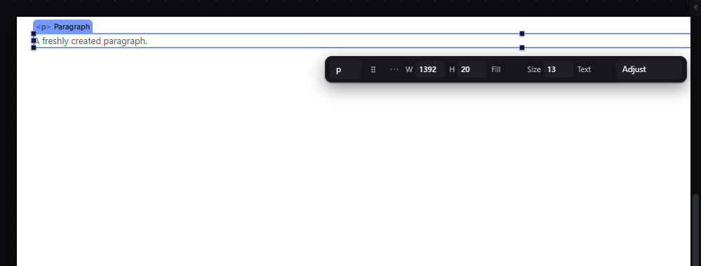

# nest-into-previous — Nest the selection into its previous sibling

How Pager behaves, observed by running it from `.cache/pager-run` (Chrome, window 1600×900) and read from its source. Source references are `path:line` inside Pager. Test document: Page > [Container, Paragraph].

## Trigger

- Context menu (canvas or Layers row) → **Make child of previous layer** (`indentLayer`, `src/features/layers/layers-panel.js:530-544`).
- No shortcut and no other menu entry.

## Hit zones and thresholds

The receiver is the previous sibling in the same parent (`layers-panel.js:531-533`). The command does nothing — silently, with no message — when:
- there is no selection or no parent;
- the element is the first child (no previous sibling);
- the previous sibling is not a container.

It is refused with a status message when a lock applies (`🔒 <name> is locked …`) or when the nesting rules refuse the receiver (`fitsInWhy`, `ancestorBad`, `siblingBad`, `:537-539`).

## Visual feedback

| Stage | What is drawn | Image |
|---|---|---|
| After the menu item on the Paragraph | The Paragraph moves inside the Container (last child), stays selected; status `Placed. Paragraph in Container, position 1 of 1.` |  |
| Same item on the Container (no previous sibling) | Nothing happens and nothing is said; the menu item was enabled. | — |

## Result in the document

`Page > [Container, Paragraph]` → `Page > [Container > [Paragraph]]` (appended as last child, `layers-panel.js:540`). Placement data (grid cell, absolute offsets) is cleared by `nwPlace` when the parent changes.

## Undo and redo

One history entry: Ctrl+Z restored `Page > [Container, Paragraph]` (observed).

## Nested elements

Only one level: the element goes into the immediately previous sibling, never deeper.

## Zoom other than 100 %

Not affected.

## Keyboard equivalent

None in Pager.

## Problems in Pager

1. **The item is always enabled and fails silently** when there is no previous sibling or it cannot contain the element. Required: the item is disabled in those cases (with the reason in its tooltip) and the document JSON is unchanged (manifest feature `nest-into-previous`).
2. **No keyboard shortcut and no Arrange menu entry.** Required: the command is in the Arrange menu and in the keymap owner, so the shortcuts panel lists it (the key choice belongs to the keymap; it must not collide with R, C, P, M).
3. **The status wording (`Placed. … position 1 of 1.`) is the hand's wording.** Required: `Moved <name> into <receiver>, position N of M.`
