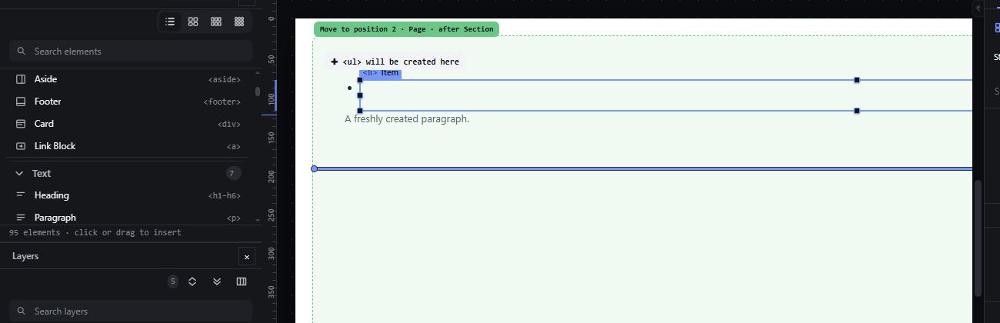

# nesting-grammar-structure — HTML nesting rules for wrap, unwrap, promote, tag switch and hand

How Pager behaves, observed by running it from `.cache/pager-run` (Chrome, window 1600×900) and read from its source. Source references are `path:line` inside Pager. The rule data and functions are the ones described in `nesting-grammar.md` (`src/model/grammar.js`, `src/model/elements.js`).

## Trigger

| Command | Door used | Check in Pager |
|---|---|---|
| Wrap in row/column | `R` / `C` on the canvas | `src/features/input/index.js:781-813`: the element must fit in the new `div`; refusal `a11y.cannotWrap` (`:800`) |
| Promote one level | `P` on the canvas | `input/index.js:765-780`: `fitsIn(child, grandparent)`; refusal `a11y.cannotGoIn` (`:773`) |
| Unwrap (remove wrapper) | selection bar `Remove wrapper` (`data-act="unwrap"`) | `src/app/boot.js:192-217`: every child must fit in the wrapper's parent (`fitsIn`, `ancestorBad`, `siblingBad`, `:204-207`) |
| Tag switch | Inspector → Attributes → `Tag` menu | `src/features/inspector/catalogue.js:248-249` → `nwField(node, "tag", value)` (`src/commands/writes.js:118`): **no nesting check** |
| Hand | `M`, arrows, Enter | the aim goes through the drag validator (`src/features/drag/drag.js:735-779`), so it follows the assist rule: a slot that needs a wrapper is offered, not skipped |

## Hit zones and thresholds

No geometry: each command is checked when it runs. The Tag menu for a container lists `div, section, header, main, footer, nav, aside, article` (`semanticTags`, `src/model/tree.js:431-437`), whatever its children and parent are.

## Visual feedback

| Stage | What is drawn | Image |
|---|---|---|
| `R` on a List item | Nothing on the canvas; the status bar shows the red `REFUSED` tag and `Cannot wrap Item. <li> cannot sit inside 
.` |  |
| List item in the hand, ArrowUp twice (aim at the Page) | The Page gets the green receiver tint, the pill reads `Move to position 2 · Page · after Section`, a Page-level insertion line is drawn, and the marker `✚ <ul> will be created here` is shown. Status: `Page will receive. Position 2 of 2. Through <ul>. Level 3 of 3.` |  |

## Result in the document

Observed with Page > Section > List > [Item, Item]:

- `R` on an Item → refused, document unchanged: `REFUSED Cannot wrap Item. <li> cannot sit inside 
.`
- `P` on an Item → refused, document unchanged: `REFUSED Refused. <li> cannot go in <section>.`
- `Remove wrapper` on the List → refused, document unchanged: `REFUSED Cannot remove List. Refused. <li> cannot go in <section>..` (with a doubled full stop). The button was enabled before the click.
- Section containing a Main, Tag → `header` → **accepted**: the node got `tag: "header"` and the iframe renders `<header><main>…</main></header>`; no message.
- Item taken into the hand (`M`), ArrowUp until `Page will receive … Through <ul>`, Enter → **placed**: a new `<ul>` holding the Item was appended to the Page; status `Placed. Item in Page, position 2 of 2.`; the new `<ul>` was selected.

## Undo and redo

Refusals leave no history entry. The accepted tag switch and the wrapped hand placement are one undo step each.

## Nested elements

Unwrap checks every child of the wrapper; the first child that does not fit refuses the whole command (`boot.js:204-207`).

## Zoom other than 100 %

Not affected.

## Keyboard equivalent

`R`, `C`, `P` and the hand keys are the keyboard doors. Unwrap and the tag switch have no key.

## Problems in Pager

1. **The tag switch ignores the nesting rules** (`<main>` ended inside `<header>`). Required: a tag switch that would break the rules is refused with a message naming the rule and the document JSON is unchanged (manifest feature `nesting-grammar-structure`).
2. **The hand offers targets the rules refuse,** reaching them through an automatic wrapper. Required: the hand never offers a target the rules refuse; such slots are skipped by the arrows.
3. **Each command carries its own copy of the check** (`fitsIn` in `P`, a hand-made loop in unwrap, the drag validator in the hand, nothing in the tag switch), and the messages differ in form (`Refused. … cannot go in …`, `Cannot wrap … cannot sit inside …`, a doubled full stop). Required: wrap, unwrap, promote, tag switch and hand call the same rule function as insert, drag and paste, and word their refusals the same way.
