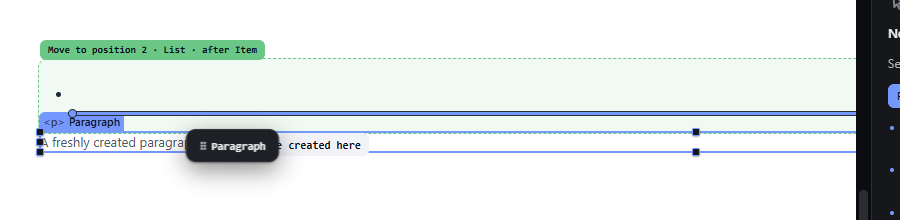
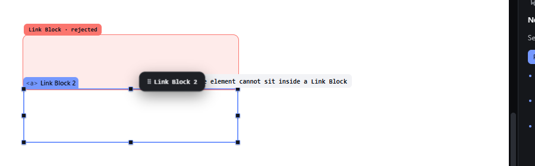

# nesting-grammar — HTML nesting rules for inserting, dragging and pasting

How Pager behaves, observed by running it from `.cache/pager-run` (Chrome, window 1600×900) and read from its source. Source references are `path:line` inside Pager.

## Trigger

The rules are checked whenever an element would get a new parent:

| Path | Where the check runs | What happens when the rules say no |
|---|---|---|
| Palette click (insert at selection) | `insertTypeAtSelection`, `src/features/input/index.js:185-201`, through the drag validator | a wrapper is created when one exists (see below); otherwise status `REFUSED Refused. <reason>` |
| Palette drag, canvas drag, Layers drag | the drag validator, `src/features/drag/drag.js:735-779` (Layers uses the same one, `drag.js:438-442`) | a wrapper is proposed when one exists (`p.assist`); otherwise the target is refused (`p.bad`) |
| Paste | `src/features/layers/layers-panel.js:670` (`fitsInWhy || ancestorBad || siblingBad`) | refused, with the reason in the status bar; never wrapped |
| Layers indent / outdent | `layers-panel.js:537-551` | refused, with the reason |

## Hit zones and thresholds

The rule data (`src/model/elements.js:27-84`, read by `src/model/grammar.js`):

- `only`: allowed children. `ul`/`ol` → `li`; `dl` → `dt`, `dd`; `table` → `caption`, `thead`, `tbody`, `tfoot`; `thead`/`tbody`/`tfoot` → `tr`; `tr` → `th`, `td`; `select` → `option`, `optgroup`; `optgroup` → `option`; `picture` → `source`, `img`.
- `needs`: required parent. `li` → `ul`/`ol`; `dt`/`dd` → `dl`; `caption`/`thead`/`tbody`/`tfoot` → `table`; `tr` → `thead`/`tbody`/`tfoot`; `th`/`td` → `tr`; `legend` → `fieldset`; `option` → `select`/`optgroup`; `optgroup` → `select`; `figcaption` → `figure`; `source` → `video`/`audio`/`picture`; `track` → `video`/`audio`; `summary` → `details`.
- `unique` (at most one per parent): `caption`, `legend`, `figcaption`, `summary` (`siblingBad`, `grammar.js:52-58`).
- Void / leaf elements: only types flagged `container` can have children (`grammar.js:5`, `:105-106`); on the canvas a leaf is never a receiver.
- Forbidden ancestry at any depth (`ancestorBad`, `grammar.js:35-50`): an interactive element inside a Link Block; a Form inside a Form. A Label holds one control only (`grammar.js:55-56`).
- Assist chains:
  - `wrapChain` (`grammar.js:59-69`) climbs `WRAP_IN` up to 4 levels, e.g. `li` → `ul`.
  - `adoptChain` (`grammar.js:70-76`) wraps the element in the parent's natural child, e.g. `p` in `ul` → a new `li`.
- Messages (`src/core/i18n.js:83-85`, `:1096-1103`):
  - `{child} cannot be placed inside {parent}.`
  - `{child} must be inside {ancestor}.`
  - `An interactive element cannot sit inside a Link Block`
  - `{parent} accepts a single {child}`
  - In the drag validator only: `<ul> only accepts <li>`, `<li> only exists inside <ul>, <ol>` (`drag.js:772-773`).

## Visual feedback

| Stage | What is drawn | Image |
|---|---|---|
| Dragging a Paragraph to the gap after a List item (inside a `<ul>`) | **No refusal.** The List gets the green receiver tint, the pill reads `Move to position 2 · List · after Item`, an insertion line is drawn after the item, and the text `✚ <li> will be created here` follows the pointer. Status: `Create <li> + after item`. |  |
| Dragging a Link Block into another Link Block | The target gets a red tint and a red pill `Link Block · rejected`, and there is no insertion line. The reason `An interactive element cannot sit inside a Link Block` is drawn beside the pointer, partly hidden under the drag ghost. `<body>` gets the class `forbid`, and the status reads `Rejected`. |  |

## Result in the document

Observed:

- Page root selected, click **List item** in the palette → a new `<ul>` holding the `<li>` was appended to the Page; status `Placed. List item in Page, position 2 of 2.`; the `<ul>` became the selection.
- List selected, click **Paragraph** → a new `<li>` holding the Paragraph was appended to the List; status `Placed. Paragraph in List, position 2 of 2.`
- Canvas drag of a Paragraph to the gap after a List item, released → the Paragraph ended up inside a new `<li>` in the List; the new `<li>` was selected.
- Copy a List item, select a Section, Ctrl+V → nothing pasted; status `ENGINE <li> must be inside <ul> / <ol>.`
- Link Block selected, click **Link Block** → nothing inserted; status `REFUSED Refused. An interactive element cannot sit inside a Link Block`.
- Link Block dragged into a Link Block and released → nothing changed; status `Cancelled — nothing changed`.

## Undo and redo

A wrapped insert or drop is one undo step (observed: one Ctrl+Z restored the tree exactly). Refusals leave no history entry.

## Nested elements

`ancestorBad` checks every ancestor of the receiver (a button three levels inside a Link Block is still refused). When a whole subtree is moved, every node in it is checked (`grammar.js:36-44`; `drag.js:740-744`).

## Zoom other than 100 %

Not affected: the rules do not depend on geometry.

## Keyboard equivalent

The same checks run for the hand (see `nesting-grammar-structure.md`) and for Ctrl+V.

## Problems in Pager

1. **Invalid placements are silently wrapped instead of refused** (palette click, canvas drag and Layers drag create `<ul>`/`<li>` wrappers). Required: each attempt is refused with a message such as `Refused. <ul> only accepts <li>` and the document JSON is unchanged (features.json `nesting-grammar`).
2. **The paths disagree:** paste refuses where click and drag wrap, and they use different message texts and tags (`REFUSED` vs `ENGINE`). Required: click insert, canvas drag, Layers drag and paste call the same rule function over one rule table (allowed children, required parents, unique children, void elements, no interactive content inside interactive content) and report its refusal the same way.
3. **The reason of a refused drag is lost on release** (`Cancelled — nothing changed`), and during the drag it is partly covered by the ghost. Required: during the drag the refused target shows the refusal indicator and the reason in full; releasing there reports `Refused. <reason>` in the status bar.
