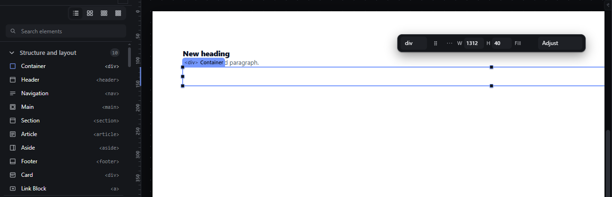

# palette-click-insert — Insert Section, Container, Heading and Paragraph by clicking the Elements panel

How Pager behaves, observed by running it from `.cache/pager-run` (Chrome, window 1600×900) and read from its source. Source references are `path:line` inside Pager.

## Trigger

- A press on a palette tile is recorded on `pointerdown` (capture phase); on `pointerup`, if the pointer moved less than **4 px** from the press and no drag started, the tile's type is inserted at the selection (`src/features/workspace/dock.js:664-676`, threshold `MEASURE_LIMITS.THRESH` = 4 px from `src/core/pointer.js:3`). Observed: presses with 0, 1, 2 and 3 px of movement each inserted one element.
- Moving 4 px or more turns the press into a palette drag instead (see `palette-drag-insert.md`).
- Keyboard: Enter or Space on a focused tile inserts the same way (`src/features/palette/index.js:276-283`).

## Hit zones and thresholds

The whole tile row (icon, label, tag) is the target. Where the new element lands is decided by `insertTypeAtSelection` (`src/features/input/index.js:185-201`):

| Selection | Placement |
|---|---|
| Nothing selected | Last child of the Page root |
| A container (not locked) | Last child of that container |
| A leaf, or a locked container | Right after the selection, in the same parent (`takeTypeIntoHand` aims at index + 1, `input/index.js:150-164`) |
| The placement is refused by the nesting rules | Nothing is inserted; status `Refused. <reason>` (`input/index.js:193-198`) |

Placement goes through the same validator and the same commit as a drop (`commitHand` → `finish`, `input/index.js:173-184`), so assist wrappers apply (see Problems).

## Visual feedback

| Stage | What is drawn | Image |
|---|---|---|
| After clicking Section, Heading, Paragraph, Container (nothing selected at the start) | Each new element appears on the canvas, flashes for 0.9 s, becomes the selection (outline, chip, quick panel) and its Layers row is highlighted. The status bar reads, in turn: `Placed. Section in Page, position 1 of 1.`, `Placed. Heading in Section, position 1 of 1.`, `Placed. Paragraph in Section, position 2 of 2.`, `Placed. Container in Section, position 3 of 3.` |  |

No indicator is drawn before the insert; the tile itself only shows its hover background.

## Result in the document

Observed sequence starting from an empty page:

1. Section (nothing selected) → `Page.children = [Section]`; Section selected.
2. Heading (Section selected, a container) → `Section.children = [Heading]`.
3. Paragraph (Heading selected, a leaf) → inserted after the Heading: `[Heading, Paragraph]`.
4. Container (Paragraph selected, a leaf) → inserted after the Paragraph: `[Heading, Paragraph, Container]`.

The iframe renders `<section>` with `padding: 56px 40px`, `<h2>New heading</h2>`, `
A freshly created paragraph.
` and an empty `
` that keeps a visible 40 px minimum height on the canvas only (class `empty`). New names are unique (`Paragraph 2`, …) and new keys unique (`new-paragraph-2`, …).

## Undo and redo

Each click is one transaction; `Ctrl+Z` removes the inserted subtree and restores the previous selection. Pager keeps at most 80 undo entries (`src/commands/transactions.js:210`).

## Nested elements

Placement always uses the selection's own container or parent; it never searches for another receiver.

## Zoom other than 100 %

Not affected by zoom. The inserted element is scrolled into view if it lands off screen.

## Keyboard equivalent

Tab to the Elements panel, arrow keys between tiles (Home/End jump; `palette/index.js:284-293`), Enter or Space to insert; Escape returns focus to the panel region.

## Problems in Pager

1. **Types that need a parent are wrapped instead of refused.** With the Page root selected, clicking List item created a `<ul>` wrapper holding the `<li>` (`Placed. List item in Page, position 2 of 2.`); clicking Badge with a List selected created an `<li>` wrapper. The new app follows features.json `nesting-grammar`: the insert is refused with a message such as `Refused. <li> only exists inside <ul>, <ol>` and the document JSON is unchanged.
2. **After a wrapped insert the selection is the wrapper,** not the element that was clicked (observed: `new-list` selected after clicking List item). Required: the inserted element itself is selected.
