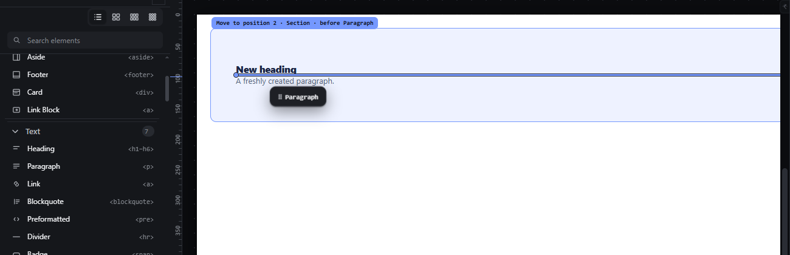
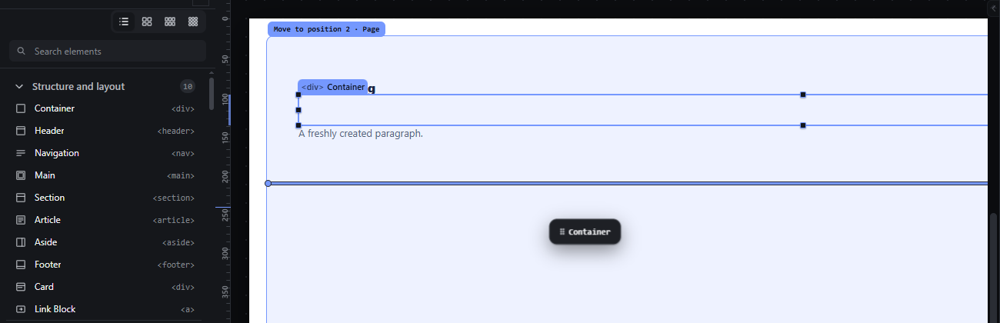
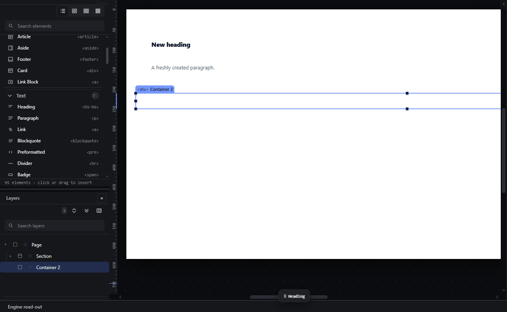

# palette-drag-insert — Drag an element type from the Elements panel to a position on the canvas

How Pager behaves, observed by running it from `.cache/pager-run` (Chrome, window 1600×900, zoom 100 %) and read from its source. Source references are `path:line` inside Pager. Test document: a Section holding a Heading and a Paragraph.

## Trigger

- Primary-button press on a palette tile (`.pi[data-new]`) arms a **creation** drag carrying the element type and its label; the pointer is captured by the canvas stage (`src/app/boot.js:459-461`).
- The drag starts after 4 px of movement (`src/core/pointer.js:3`, `boot.js:507`). Below 4 px, release is a palette click and inserts at the selection (see `palette-click-insert.md`; `src/features/workspace/dock.js:664-676`).
- From then on it is the same engine as a canvas move: one proposal per frame, same resolver, same validator, same indicators (`src/features/drag/drag.js:416-504`, `:730-780`, `src/platform/overlay.js:235-302`). The Layers tree is also a drop surface during the drag (`drag.js:441-442`).
- Release commits the last drawn proposal; `Escape` cancels (`src/features/input/index.js:662-663`, `boot.js:551`).

## Hit zones and thresholds

Identical to `drag-reorder-canvas.md` and `drag-drop-inside.md` (edge bands, leaf halves, empty-container aim of 40 px, escape ladder of up to 12 px, 4 px hysteresis, 56 px autoscroll). The only differences:

- There is no dragged node, so no subtree is excluded from the hit test.
- Outside the page (the dark stage or any panel other than Layers) there is no proposal.
- When the type needs a wrapper to be valid where it is dropped (for example a List item dropped in the Page), the proposal is accepted with an **assist chain** instead of refused (`drag.js:760-774`); see `nesting-grammar.md`.

## Visual feedback

| Stage | What is drawn | Image |
|---|---|---|
| Dragging Paragraph between the Heading and the Paragraph | Ghost chip `⠿ Paragraph` (the tile's label) at pointer +14, +16 px; insertion line above the existing Paragraph; Section tinted; label `Move to position 2 · Section · before Paragraph`; status `Before Paragraph`. |  |
| Dragging Container below the Section | Page tinted as receiver; label `Move to position 2 · Page`; status `Into Page · index 1`. |  |
| Dragging Heading over the dark area outside the page | No line, no tint, no label; cursor `not-allowed`; the status bar tag turns to `REFUSED` with `Outside the canvas — releasing cancels`; read-out `No proposal under the pointer.` |  |
| Escape during a palette drag | Every indicator disappears; status `Cancelled — nothing changed`. | (same as the canvas Escape stage in `drag-level-keys-escape.md`) |

## Result in the document

- A new node is built only on release, from the type's factory, with a fresh key and an auto-numbered name (`drag.js:1172-1175`; observed name `Paragraph 2`, key `new-paragraph-2`) and inserted at the proposal's `(parent, index)`.
- Observed: Paragraph dropped before the existing Paragraph → `Section.children = [Heading, Paragraph 2, Paragraph]` (index 1). Container dropped below the Section → appended to the Page after the Section.
- The new node becomes the selection; it flashes for 0.9 s (`drag.js:1237-1239`).
- Release outside the page, or after Escape, inserts nothing: the document JSON is byte-identical (observed) and the status reads `Cancelled — nothing changed`.

## Undo and redo

Each palette drop is one transaction: one `Ctrl+Z` removes the inserted subtree, including any assist wrappers created with it.

## Nested elements

The receiver is resolved exactly as for a move; the arrow keys change the level during a palette drag too (`input/index.js:664-667`).

## Zoom other than 100 %

Same as a canvas move: zones are measured on the zoomed boxes; the threshold, hysteresis and chips stay in screen px.

## Keyboard equivalent

Focus a palette tile (Tab into the Elements panel, arrows between tiles, `src/features/palette/index.js:276-300`) and press Enter or Space to insert at the selection (`:278-283`). A keyboard way to choose a different position for a new element is the hand: the insert aims beside the selection and the arrows move the aim (`takeTypeIntoHand`, `input/index.js:150-164`).

## Problems in Pager

1. **The label says `Move to position N`** although nothing is being moved. Required: a creation drag reads `Insert <type label> · position N of M in <parent>` (or `Into <parent>` for an empty receiver), with the same wording in the status bar.
2. **The refusal message outside the page says `Outside the canvas`** while the pointer is on the canvas, outside the page. Required: `Outside the page — release to cancel`.
3. **Wrappers are created silently by the drop** when the type needs a parent (`✚ <ul> will be created here`), which contradicts the nesting rules the new app follows (manifest feature `nesting-grammar`: such attempts are refused with a message). Required: the drop is refused with the nesting message and no insertion line; nothing is inserted on release.
4. **The ghost shows only the label.** Required: the ghost shows the element's icon and label so a creation drag is distinguishable from a move of an element with the same name.
