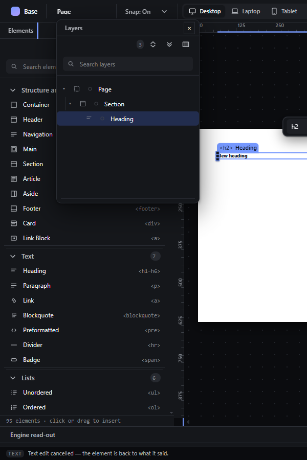
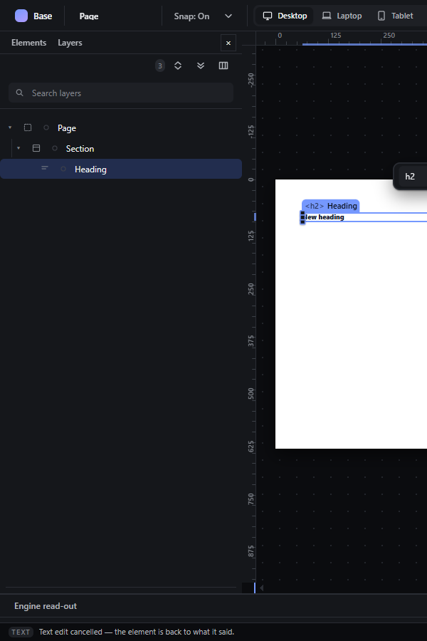
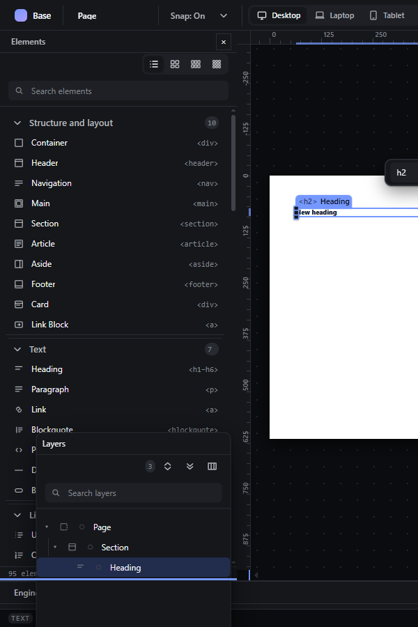
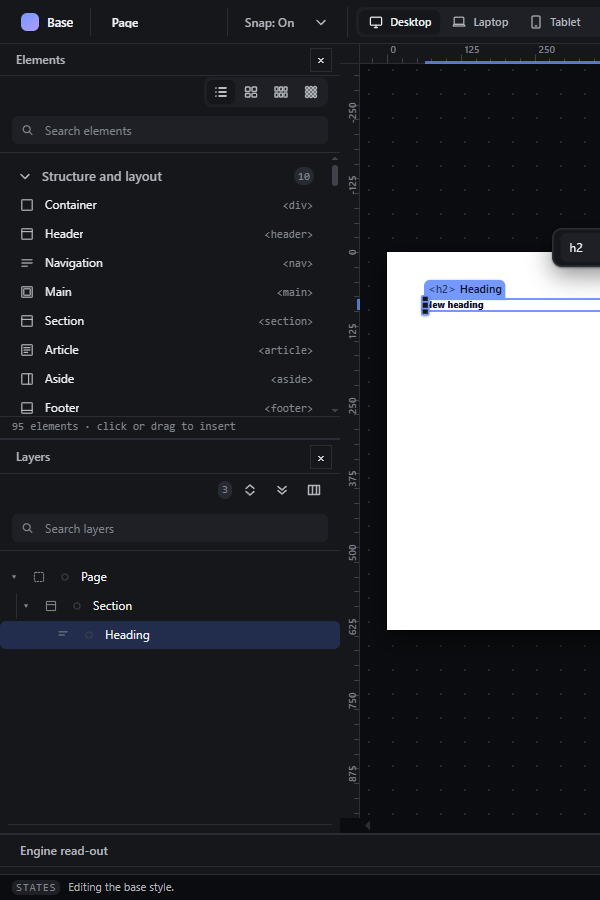

# panel-combine-tabs — Combine panels as tabs or stack them

How Pager behaves, observed by running it from `.cache/pager-run` (Chrome, window 1600×900) and read from its source. Source references are `path:line` inside Pager. Start: Elements and Layers as separate groups in the left dock.

## Trigger

Drag a panel by its bar (or one tab out of a tab group) over another panel and release (`src/features/windows/index.js:589-791`). Threshold 4 px. `Escape` cancels.

## Hit zones and thresholds

- **Tabs:** the pointer is inside the target group's header, i.e. its top **26 px** (`:724-746`). The new tab is inserted before the tab whose centre is right of the pointer, else at the end.
- **Stack:** the pointer is over the target group's body; upper half → the dragged panel goes above, lower half → below (`:747-750`).
- Other panel system (non Elements/Layers panels): upper **45 %** of the target → `Combine as tabs`, lower 55 % → `Stack panels` (`:159`).

## Visual feedback

| Stage | What is drawn | Image |
|---|---|---|
| Layers dragged over the Elements header | A 3 px vertical line in the header at the insertion point between tabs (observed at x = 71.75, 32 px tall). |  |
| Released | One panel with two tabs, `Elements` and `Layers`; the dropped one active. |  |
| The Layers tab dragged over the lower part of the group | A 3 px horizontal line at the bottom edge of the group. |  |
| After release and a reload | Elements and Layers stacked, each with its own title bar and `×`, a 6 px divider between them. |  |

## Result in the document

Never changes the document. The group is stored as `{ids: ["palette","layers"], mode: "tabs"|"stack", active, weights}` in preferences and restored after reload (observed).

## Undo and redo

Not undo steps.

## Nested elements

Not applicable.

## Zoom other than 100 %

Not affected.

## Keyboard equivalent

Tab strips: ArrowLeft/ArrowRight/Home/End switch tabs (`:511-519`); no keyboard way to combine or stack.

## Problems in Pager

1. **The hints are bare 3 px lines.** Required: over the upper part of a panel a `Combine as tabs` hint appears and over the lower part a `Stack panels` hint (features.json `panel-combine-tabs`), drawn as labelled areas.
2. **The tabs zone is only the 26 px header** for Elements/Layers but 45 % of the panel for other panels. Required: one rule for every panel (upper part = tabs, lower part = stack), from the workspace owner.
