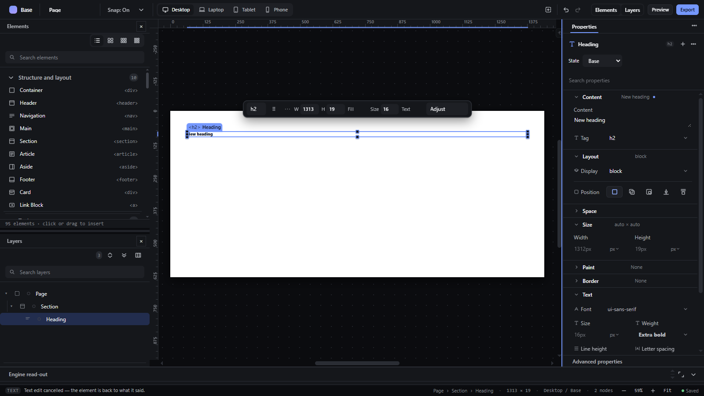

# panel-resize — Resize docks and panels with splitters

How Pager behaves, observed by running it from `.cache/pager-run` (Chrome, window 1600×900) and read from its source. Source references are `path:line` inside Pager.

## Trigger

Pager has two kinds of splitters:

- **Independent-panel splitters** (Elements/Layers docks): the dock edge handle (`independent-resize`, 6 px wide, e.g. at x 274-280 for the left dock) and the divider between stacked panels (`independent-divider`, 6 px tall) (`src/features/windows/index.js:352-428`). Pointer drag or, when focused, ArrowUp/Down (dividers) / ArrowLeft/Right (dock edge) by **8 px**, Shift ×4 (**32 px**). `Escape` during a drag restores the start size.
- **Shell splitters** `#splitInspector`, `#splitBench` (and the code panel's) (`src/features/workspace/dock.js:211-272`): 1 px lines; drag, or arrows by **8 px**, Shift **24 px**; `Escape` restores.

## Hit zones and thresholds

| Splitter | Min | Max |
|---|---|---|
| Left/right independent dock | 200 px (dock) | window width − workspace (≥ 360 px + inspector) |
| Stacked panel divider | 72 px per panel (or half the total) | — |
| Floating panel resize | 240 × 180 px | window |
| Inspector (`#splitInspector`) | 320 px | min(520 px, room left) |
| Workbench (`#splitBench`) | `BENCH_MIN` | 60 % of the window height |

No threshold: the size follows the pointer from the first move.

## Visual feedback

| Stage | What is drawn | Image |
|---|---|---|
| Left dock dragged +60 px | The dock is 340 px wide; the canvas shrinks. |  |

Resizing cursors (`col-resize`/`row-resize`); `is-resizing` on the body during a shell splitter drag. No status message.

## Result in the document

Never changes the document. Sizes are saved in preferences and restored after reload (observed: the 340 px left dock survived a reload).

Observed values: divider `aria-valuenow` 64 → 65 (ArrowDown, 8 px) → 61 (Shift+ArrowUp, 32 px). Inspector splitter ArrowLeft from 300 px → **320 px** (the stored 300 was below the 320 minimum, so the first key snapped to the minimum).

## Undo and redo

Not undo steps.

## Nested elements

Not applicable.

## Zoom other than 100 %

In Fit mode the canvas refits after a resize.

## Keyboard equivalent

Arrows on a focused splitter.

## Problems in Pager

1. **The step is 8 px (Shift 24 or 32 px), not 20 px, and differs between the two splitter kinds.** Required: every splitter resizes its neighbours by 20 px per arrow key, within minimum and maximum sizes (features.json `panel-resize`).
2. **Shell splitters have no `aria-valuenow` and are removed from the Tab order** (`tabindex="-1"` via `sealRegions`, `src/features/input/index.js:403-408`). Required: every splitter has `role="separator"` with `aria-valuenow` (and min/max) and is reachable by keyboard.
3. **The default inspector width (300 px) is below its own minimum (320 px),** so the first keyboard step jumps. Required: defaults respect the limits.
4. **1 px shell splitters are hard to grab.** Required: every splitter has a pointer target of at least 6 px, with the visible line centred on it.
