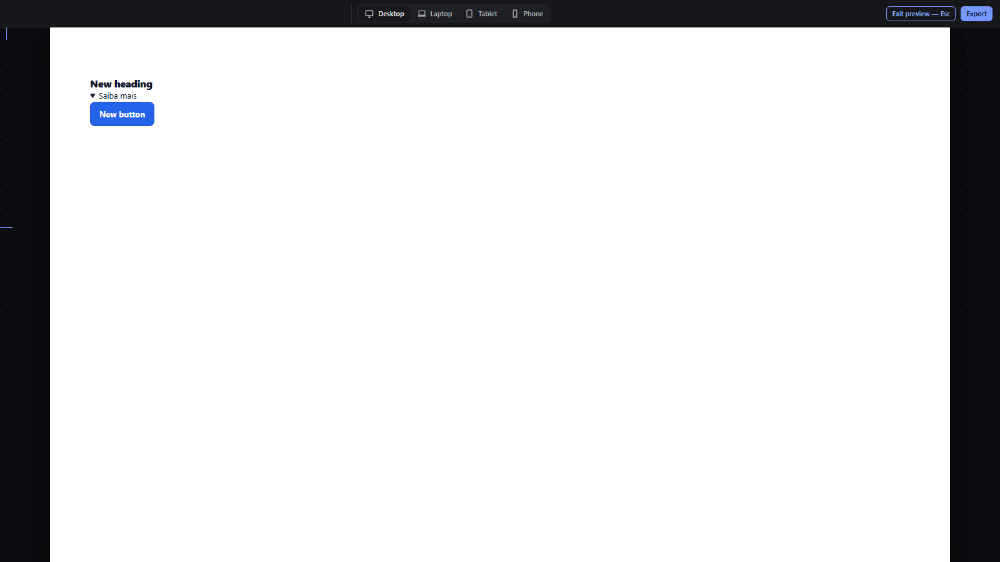

# preview-mode — Preview the page without editor chrome

How Pager behaves, observed by running it from `.cache/pager-run` (Chrome, window 1600×900) and read from its source. Source references are `path:line` inside Pager. Test document: Section > [Heading, Details, Button with a hover background].

## Trigger

- `Ctrl+P` or `Ctrl+Enter` (`view.preview`, `src/features/workspace/dock.js:573`), or the top bar **Preview** button (`dock.js:643`).
- Exit: `Escape` (`src/features/workspace/camera.js:889-892`) or the **Exit preview — Esc** button (`dock.js:644`). `Ctrl+Enter` pressed again does **not** exit (observed: still in preview).

## Hit zones and thresholds

- In preview the page is interactive: pointer and keyboard go to the page; links open in a new tab instead of navigating the editor; forms submit to a new tab (`src/app/boot.js:410-431`); Space belongs to the page (`camera.js:872-876`).
- The zoom is forced to 100 % while in preview (`camera.js:100`).

## Visual feedback

| Stage | What is drawn | Image |
|---|---|---|
| Preview on | Docks, inspector, selection, handles and rulers hidden; a slim top bar remains with the breakpoint switcher, `Exit preview — Esc` and `Export`; status `Preview — interact with the page. Press Esc to return to editing.` Two ruler pointer marks remain visible at the left edge. |  |
| Hovering the Button, clicking the Details summary | The Button shows its hover background (computed `rgb(220, 38, 38)`); the Details opens. |  |
| Escape | Editing returns with the previous selection (Heading), zoom and camera restored; status `Editing Desktop · 1,440 px.` | — |

## Result in the document

Preview never changes the document JSON (observed: byte-identical snapshot before and after). Opening the Details in preview does not store `open`.

## Undo and redo

Not applicable.

## Nested elements

Not applicable.

## Zoom other than 100 %

Preview always shows 100 %; the editing zoom comes back on exit.

## Keyboard equivalent

`Ctrl+P`, `Ctrl+Enter`, `Escape`.

## Problems in Pager

1. **`Ctrl+Enter` enters preview but does not leave it.** Required: `Escape` or `Ctrl+Enter` exits preview and restores the previous selection and zoom (features.json `preview-mode`).
2. **Ruler pointer marks leak into preview.** Required: no editor chrome is visible in preview except the slim bar.
3. **The preview status text is hard-coded English** (`'Preview — interact with the page. Press Esc to return to editing.'` is a literal in `camera.js:822`). Required: all preview texts go through i18n.
