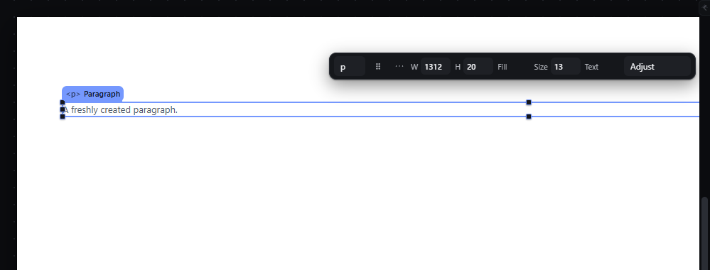

# promote-out — Move the selection out of its parent with P

How Pager behaves, observed by running it from `.cache/pager-run` (Chrome, window 1600×900) and read from its source. Source references are `path:line` inside Pager. Test document: Section > Container > Paragraph.

## Trigger

- `P` with the canvas focused and exactly one element selected (`src/features/input/index.js:765-780`).
- Other doors: selection bar "promote out of the parent, one rung" and Arrange menu run the same key row (`src/app/boot.js:283`, `src/features/workspace/dock.js:419`). The context menu's **Move out of parent** runs a second implementation (`src/features/layers/layers-panel.js:545-558`) with the same result.

## Hit zones and thresholds

The target is the grandparent, at the index right after the former parent (`input/index.js:770-777`). Refused, document unchanged, when:
- the parent is the Page root (no grandparent) — `Nothing to promote out of.`;
- more than one element is selected — `This action needs one selected element.`;
- the element or an ancestor is locked — lock message;
- the nesting rules refuse the grandparent — `Refused. <tag> cannot go in <tag>.` or the rule's own message.

## Visual feedback

| Stage | What is drawn | Image |
|---|---|---|
| After `P` on the Paragraph | The Paragraph now sits after the Container inside the Section, still selected; status `Promoted Paragraph into Section, position 2.` |  |
| Second `P` | `Promoted Paragraph into Page, position 2.` | — |
| Third `P` (now a child of the Page) | Nothing moves; status `Nothing to promote out of.` | — |

## Result in the document

`Section > Container > Paragraph` → `Section > [Container, Paragraph]` → `Page > [Section, Paragraph]`. The node keeps its id; flow placement data is cleared by `nwPlace` when the parent changes.

## Undo and redo

Each promotion is one history entry.

## Nested elements

Exactly one level per press ("one rung").

## Zoom other than 100 %

Not affected.

## Keyboard equivalent

`P` is the keyboard door.

## Problems in Pager

1. **Two implementations** (key row and Layers menu) with different messages (`Promoted … position N` vs `a11y.promoted` via the menu with a different index base). Required: one command for the key, the menus and the selection bar.
2. **The refusal at the top level is not styled as a refusal** (tag stays `ENGINE`). Required: the status explains that a direct child of the Page cannot be promoted, styled as a refusal; the document JSON is unchanged.
