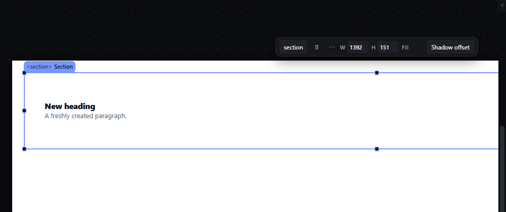
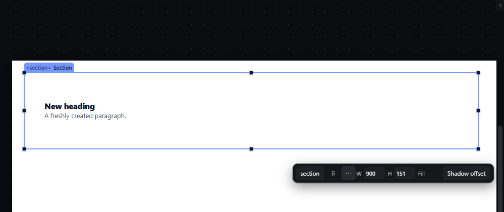
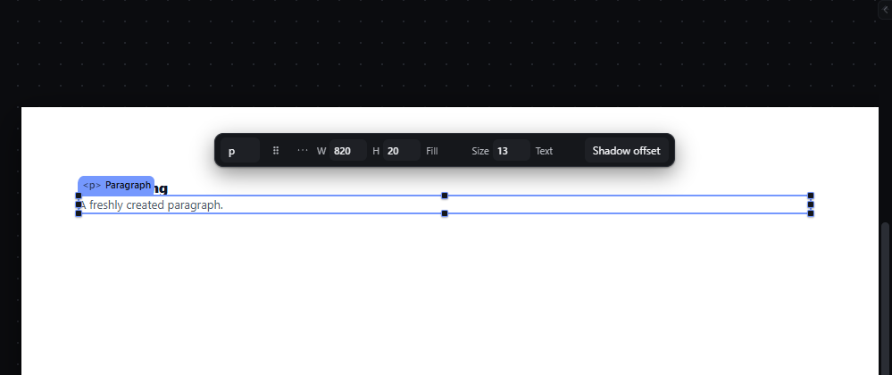
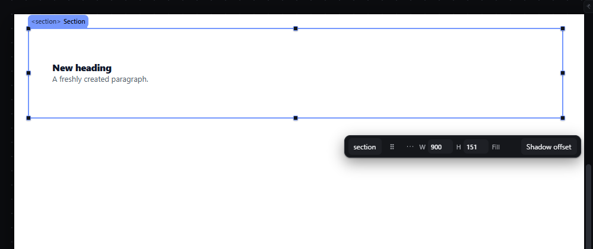

# quick-panel — Floating quick panel over the selection

How Pager behaves, observed by running it from `.cache/pager-run` (Chrome, window 1600×900, zoom 100 %) and read from its source. Source references are `path:line` inside Pager. Test document: Section > [Heading, Paragraph].

## Trigger

- The quick panel (`#selbar`) appears whenever exactly one element or a group is selected and the stage is at least 40 × 40 px (`src/features/selection/selection.js:203-279`). It is hidden during a drag (`style/08-ui-system.css:837`).
- Fields commit on Enter or blur; Escape restores (`src/features/inspector/quick-panel.js:208-219`). The tag select, the colour buttons and the "Edit on canvas" select commit on change.
- **Grip drag:** press on the `⠿` grip (`data-context-drag`) and move: the panel follows the pointer; the offset from the element is remembered **per element key** for the session (`src/features/windows/index.js:810-835`, `src/features/windows/context-position.js:28-33`). `Escape` during the drag restores the previous offset.

## Hit zones and thresholds

- Default placement (`context-position.js:3-26`): inside the stage minus a 20 px inset, the panel is centred on the element horizontally and tried **above** (12 px gap plus 20 px for the element's chip), then **below**, then **right**, then **left**; the first that fits wins; if none fits it is pinned at the top of the stage. A remembered manual offset is used when it fits and does not cover the element; otherwise the candidate nearest to it is used.
- The panel is limited to the stage width minus 40 px (`selection.js:262-264`).
- The grip drag has no threshold of its own; it moves from the first `pointermove`.

## Visual feedback

| Stage | What is drawn | Image |
|---|---|---|
| Section selected | A dark floating bar above the element: tag select `section`, grip `⠿`, `⋯` More actions, `W 1392`, `H 151`, `Fill` (colour swatch), and the "Edit on canvas" select. Padding and Margin fields exist but were not visible in the 399 px bar. |  |
| After dragging the grip (+300, +250 px) | The bar sits where it was dropped. |  |
| Paragraph selected | Text fields appear: family, Size, weight, alignment, text colour; the Edit text action. |  |
| Section at the top of the page | The remembered offset from the drag is reused (bar below the Section at y = 292). |  |

The "Edit on canvas" select kept showing `Shadow offset` after that mode had been left with Escape (observed), so it can show a mode that is not active.

## Result in the document

- Typing `900` in W and Enter wrote `width: 900px` on the Section; status `W set to 900px.` Fields write through the same style writer as the Inspector (`quick-panel.js:354-390`), on the active breakpoint/state layer.
- With several elements selected, fields whose values differ show the placeholder `Mixed` (`:254`, `:433`) and a commit writes to every selected element in one transaction.
- The grip offset is not part of the document.

## Undo and redo

Each committed field is one history entry. Moving the panel is not.

## Nested elements

The panel follows the primary selection.

## Zoom other than 100 %

The panel is window chrome; its placement uses the zoomed element box, its size does not change.

## Keyboard equivalent

The panel's controls have `tabindex="-1"` (sealed out of the Tab order, `quick-panel.js:198`, `:221`, `:230`); there is no keyboard route into it.

## Problems in Pager

1. **The remembered offset is lost on reload** (a `WeakMap` in memory). Required: a dragged quick panel keeps its offset for that element across reloads (manifest feature `quick-panel`), stored with the workspace preferences.
2. **The "Edit on canvas" select shows a stale mode** after the mode ends. Required: the select always shows the active mode, or its neutral label when none is active.
3. **Fields do not fit:** Padding and Margin fields were present but not visible in the bar. Required: every control the panel offers is visible without overlap or clipping.
4. **Not reachable by keyboard.** Required: F6 or a shortcut from the canvas focuses the quick panel; Tab moves through its fields; Escape returns focus to the canvas.
5. **Controls for unbuilt features must be disabled with "not available yet"** (the manifest intent); Pager has no such distinction. Required: each control reads its availability from the one feature registry.
6. **Several visual properties have no control on the canvas:** Pager's panel offers W, H, Fill (a colour) and font Size, but no text colour, gradient, border, opacity, effects or transform. Required: the quick panel also offers Text colour (text elements), Border, Opacity, Effects and Transform (Move X, Rotate, Scale), and Fill opens the same fill editor as the inspector (solid colour or gradient); every control runs the inspector's command for that property (manifest feature `quick-panel`).
7. **More actions opens a separate strip** of action buttons. Required: More actions opens the element's context menu at the button, the same menu as a right-click (see `context-menu.md`).
