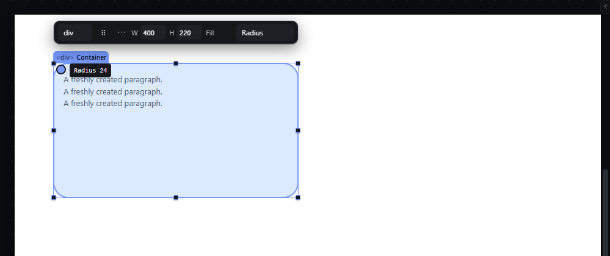
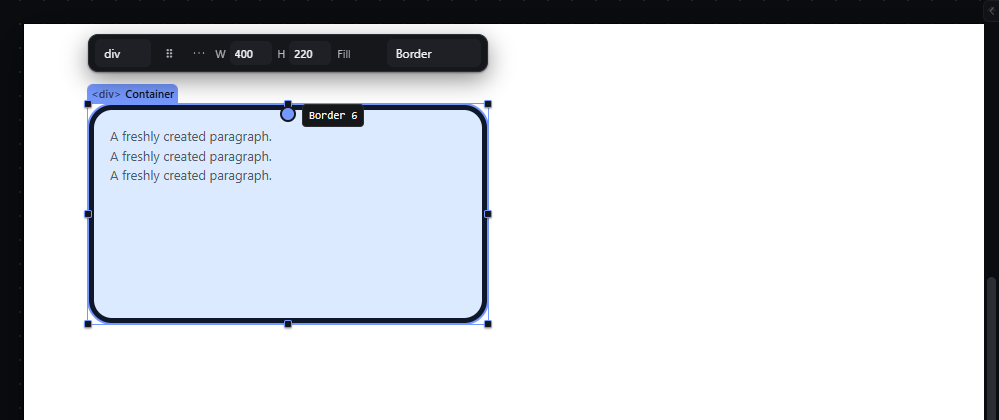
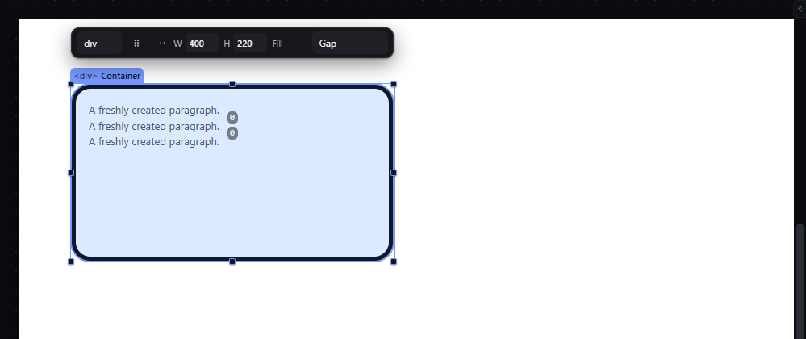
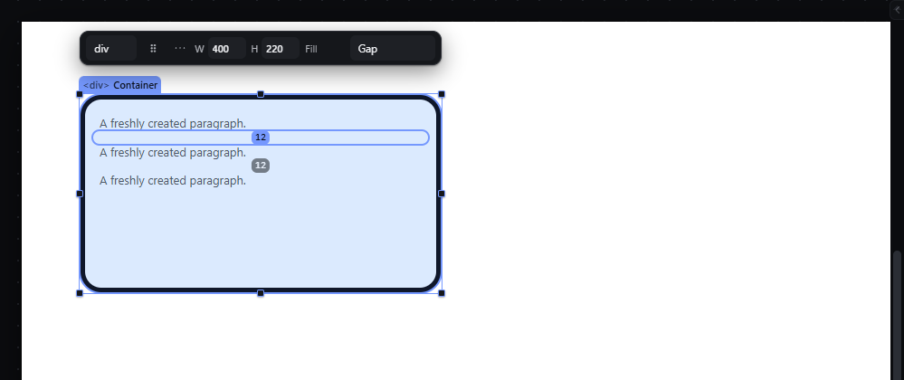

# radius-border-gap-handles — Edit radius, border width and gaps by dragging on the canvas

How Pager behaves, observed by running it from `.cache/pager-run` (Chrome, window 1600×900) and read from its source. Source references are `path:line` inside Pager. Test document: Section > Container (`400 × 220 px`, `padding: 16px`, `display: flex; flex-direction: column`, three Paragraphs), Container selected.

## Trigger

- The quick panel's "Edit on canvas" select offers, after Margin and Padding: **Radius, Border, Gap, Row gap, Column gap, Shadow offset, Shadow blur** (`DIRECT_PROPERTIES`, `src/features/inspector/quick-panel.js:44`, select built at `:416-425`). The three gap options are hidden unless the selection is a container (`:435`).
- **Radius** and **Border** (and Column gap in a column flex, and Row gap in a row flex) show one **direct handle**: a 16 × 16 px round handle with a label (`:68-79`, `:83-85`).
- **Gap** in a row or column flex, and the gap that matches the flow axis (Row gap in a column flex, Column gap in a row flex), switch to **spacing bands** between the children instead (`:420-424`, see `spacing-handles.md`).
- Press on the handle and move at least **4 px** (`:95`); release commits. Release without moving opens a typed field on the handle (`:108`). With the handle focused, ArrowLeft/Down −1, ArrowRight/Up +1, Shift ×10, each press committed at once (`:112`). `Escape` cancels a drag and leaves the mode (`:114`).

## Hit zones and thresholds

| Mode | Handle position | Value change |
|---|---|---|
| Radius | 12 px right of the element's left edge, 10 px below its top (`quick-panel.js:73-74`) | + horizontal movement ÷ zoom (vertical movement is ignored), ≥ 0 |
| Border | horizontal centre, 10 px below the top | + horizontal movement ÷ zoom, ≥ 0; writes `border-style: solid` when the style was `none` (`:61`) |
| Column gap (direct) | 6 px left of the right edge, 10 px above the bottom | + horizontal movement |
| Row gap / Gap (direct, when not the flow axis) | horizontal centre, 10 px above the bottom | + vertical movement |
| Gap bands (flow axis) | a band between each pair of children, as thick as the gap, min 6 px (`src/features/spacing/model.js:36-49`) | + movement along the flow axis ÷ zoom, ≥ 0 |

With Snap on the value snaps to 0, sibling values, ruler steps and grid steps within the snap distance; Ctrl suspends it (`quick-panel.js:98`, `src/features/spacing/handles.js:26-39`).

## Visual feedback

| Stage | What is drawn | Image |
|---|---|---|
| Radius mode | A round 16 px handle near the top-left corner with the label `Radius 0`. |  |
| Dragging it (+24, +18 px) | The corners round live; the label reads `Radius 24`. No status message. |  |
| Border mode, after +6 px | A 6 px solid border on all four sides. |  |
| Gap mode on the column flex | Two 6 px bands between the paragraphs with value chips `0`. |  |
| Dragging a gap band down 12 px | The paragraphs spread live; status `Gap 12px`, then `Gap set to 12px.` |  |

## Result in the document

- Radius +24 → `borderRadius: 24px` (one value for all corners).
- Border +6 → `borderWidth: 6px`, `borderStyle: solid` (all sides).
- Gap band +12 in the column flex → `rowGap: 12px`; the measured distance between the first two paragraphs in the iframe was 12 px.
- The direct-handle writes go to the active breakpoint/state layer (`quick-panel.js:63-67`).

## Undo and redo

One history entry per drag, and one per arrow-key press on a focused handle.

## Nested elements

Only the selected element.

## Zoom other than 100 %

The change is the pointer movement ÷ zoom; the handle keeps 16 screen px.

## Keyboard equivalent

Focus the handle and use the arrows; the Inspector's Border section is the full route.

## Problems in Pager

1. **Radius is changed by sideways movement of a handle placed near a corner,** not by dragging a corner handle inward. Required: Radius mode shows a corner handle labelled with the current radius; dragging it toward the element's centre increases the four corner radii (the `border-radius` composite writes its four longhands in one command), dragging it back decreases them (manifest feature `radius-border-gap-handles`).
2. **Border mode writes all four sides from one handle.** Required: Border mode shows a handle per side; dragging a side writes that side's border width only.
3. **Direct handles write nothing to the status bar.** Required: the live value during the drag and `<Property> set to <value>` at the end, like the spacing bands.
4. **Gap mode writes `row-gap` in a column flex and a direct handle offers `column-gap` there too,** where it has no visible effect. Required: Gap writes `row-gap` and `column-gap` together (the `gap` composite, one command); Row gap and Column gap write their own longhand; options that cannot change the layout (column-gap in a single-column flex) are disabled with the reason.
