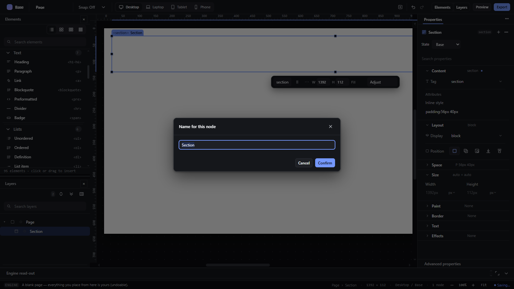
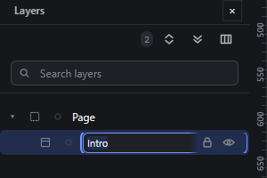

# rename-element — Rename an element with F2 or inline in Layers

How Pager behaves, observed by running it from `.cache/pager-run` (Chrome, window 1600×900) and read from its source. Source references are `path:line` inside Pager.

## Trigger

- `F2` with the canvas focused and exactly one element selected opens a modal prompt (`src/features/input/index.js:814-832`, prompt `win_prompt` `:576-599`).
- Layers: **Rename** in the row context menu replaces the row's name with a text input (`src/features/layers/layers-panel.js:561-581`). **Double-clicking a row does nothing** (observed: no input appeared; no `dblclick` handler on the tree).
- Locked elements are refused (`🔒 <name> is locked …`).

## Hit zones and thresholds

Not a pointer gesture. In the prompt, Enter confirms and Escape cancels (`input/index.js:583-596`). In the inline input, Enter commits, Escape cancels, blur commits (`layers-panel.js:576-580`).

## Visual feedback

| Stage | What is drawn | Image |
|---|---|---|
| F2 on the Section | A modal dialog titled `Name for this node` with a text field pre-filled and selected (`Section`), and Cancel / Confirm buttons. |  |
| Confirm with `Intro` | Status `Renamed to Intro.`; the Layers row and the canvas chip show the new name. | — |
| Layers → Rename | The name in the row becomes a text input with the current name selected. |  |

## Result in the document

- F2 → `Intro`, then inline → `Hero` (observed; the canvas chip read `<section>Hero`).
- An empty name keeps the previous name: F2 writes `trim() || previous` (`input/index.js:830`); inline skips the write when empty (`layers-panel.js:572-574`). Observed: clearing the field and pressing Enter left `Hero`.
- Escape in the inline input restored `Hero` (observed).

## Undo and redo

Each rename is one history entry (`nwRename` inside a transaction).

## Nested elements

Applies to the selected node only.

## Zoom other than 100 %

Not affected.

## Keyboard equivalent

`F2`.

## Problems in Pager

1. **Double-clicking a Layers row does not rename.** Required: double-clicking the row's name edits it in place; Enter commits, Escape cancels, blur commits (features.json `rename-element`).
2. **Two rename implementations** (modal prompt for F2, inline input for the menu) with different empty-name handling paths. Required: one rename command and one inline edit: F2 edits the selection's name in place in its Layers row, exactly like double-clicking the row name, with no dialog (features.json `rename-element`).
