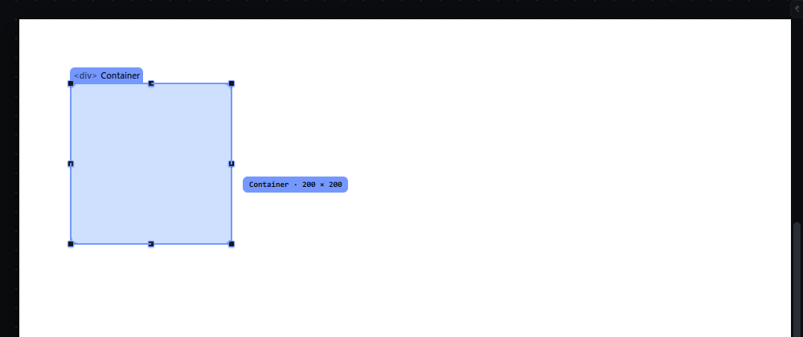
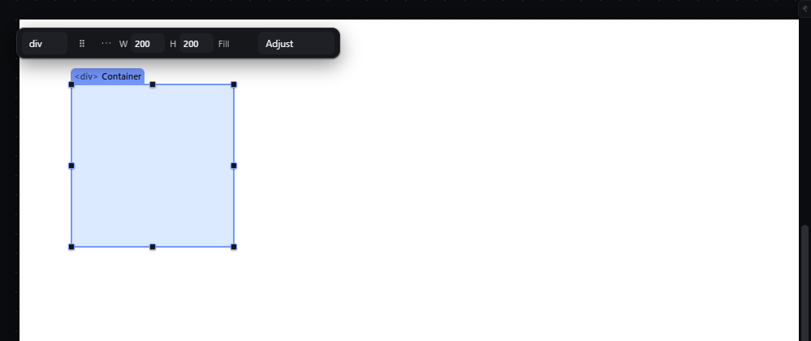
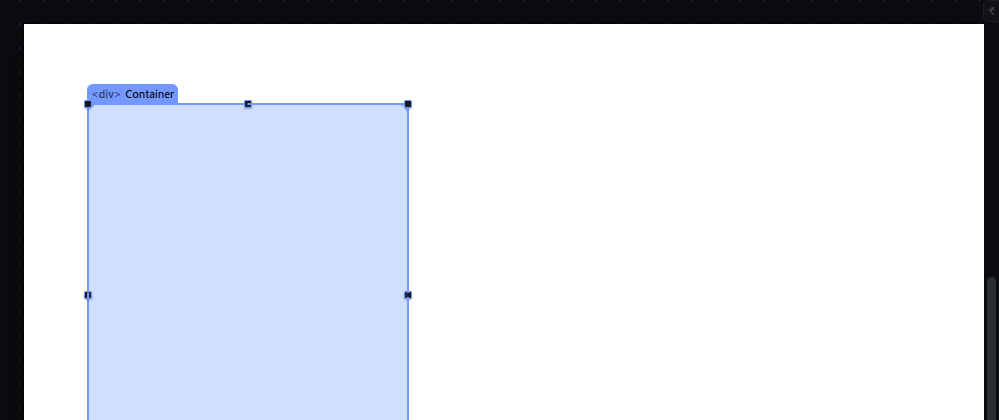
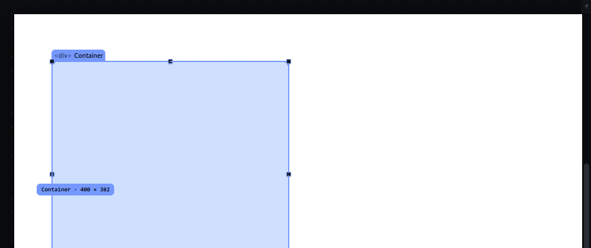
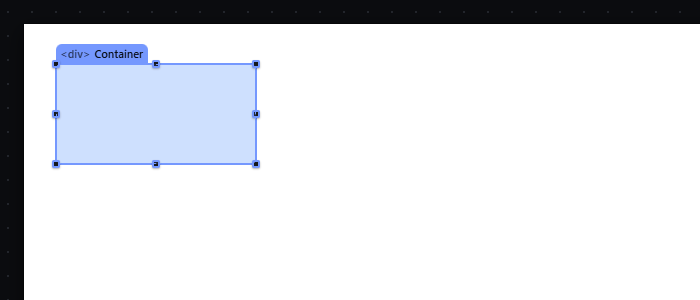

# resize-handles — Resize an element with its eight handles

How Pager behaves, observed by running it from `.cache/pager-run` (Chrome, window 1600×900) and read from its source. Source references are `path:line` inside Pager. Test document: Section > Container (`width: 300px; height: 200px`, light background), selected.

## Trigger

- Primary-button press on one of the eight handles drawn on the selection outline (`nw n ne e se s sw w`, `src/features/resize/index.js:45`, `:339-350`), with exactly one element selected that is not locked or hidden (`:102-106`).
- The resize starts after **4 px** of movement (screen px, `:123`); release before that does nothing.
- Modifiers are read on every move (`src/features/drag/drag.js:307-311`): **Shift** keeps the aspect ratio, **Alt** resizes symmetrically, **Ctrl** suspends snapping.
- `Escape`, `pointercancel`, lost capture, window blur, or any document change cancel (`resize/index.js:208-231`).

## Hit zones and thresholds

- Each handle is an 8 × 8 px circle (`--handle: 8px`, `style/02-tokens.css:230`) centred on the corner or edge centre; it is inverse-scaled so it keeps 8 screen px at any zoom (`style/06-canvas-chrome.css:159`). When the element is smaller than 48 px on either axis the outline gets `compact-handles` (`resize/index.js:377`).
- Handles are hidden for multi-selections, locked, hidden or "borrowed" (zero-size) selections (`:372-378`).
- Size change in CSS px = pointer movement in screen px ÷ zoom (`:129-146`, `a.scale`). Measured at 50 %: dragging the E handle 50 screen px to the right changed `width` from 300 px to 400 px.
- Minimum box: 8 px on each axis (`BOX_MIN_PX`, `src/platform/box-geometry.js:5`).
- Snapping (only when Snap is on): edges within the snap distance (default 6 px, times the zoom) of targets jump to them (`box-geometry.js:125-137`, see `snap-while-moving.md`).
- Written values are `width`/`height` in px, corrected for padding and border when `box-sizing` is `content-box` (`resize/index.js:139-147`), and corrected so a flow element's visible edge follows the pointer (`:151-174`).

## Visual feedback

| Stage | What is drawn | Image |
|---|---|---|
| Dragging the E handle 100 px left | The element is previewed live at its new size (temporary inline declarations, never in the document, `:148-149`); the selection outline follows; a label chip next to the pointer reads `Container · 200 × 200` (`src/platform/overlay.js:284`, `:316`). The status bar reads `Coordinates (0, 0)` during the drag. |  |
| Released | Status `Resized to 200 × 200.` |  |
| SE with Shift | Proportional: the label follows the constrained size. |  |
| W with Alt | Symmetric change (see Result). |  |
| At 50 % zoom | Same chrome; handles keep 8 screen px. |  |

## Result in the document

Observed sequence (all values from the document JSON):

| Gesture | width × height |
|---|---|
| start | 300px × 200px |
| E handle −100 px | 200px × 200px |
| S handle +80 px | 200px × 280px |
| SE handle +60, +30 | 260px × 310px |
| SE handle +60, +10 with Shift | 320px × **381.54px** (aspect kept, fractional px written) |
| W handle −40 px with Alt | 400px × 381.54px (width grew by 80; the left edge stayed where it was because the element is in flow) |
| Escape during an E drag | unchanged; status `Cancelled — nothing changed.` |

Each resize writes only `width` and/or `height` on the active breakpoint and state layer (`:232-251`). Positioned (absolute/fixed) elements also get their offsets rewritten so the opposite edge stays put (`:175-183`).

## Undo and redo

One history entry per resize: Ctrl+Z after the Alt resize restored `320px × 381.54px` (observed).

## Nested elements

Only the selected element is resized; its children reflow.

## Zoom other than 100 %

The CSS change is the pointer movement divided by the zoom (observed at 50 %); handles and label keep their screen size.

## Keyboard equivalent

None for resizing in Pager (the Size fields in the Inspector and quick panel are the typed route).

## Problems in Pager

1. **The status bar shows `Coordinates (0, 0)` while resizing.** Required: the status bar shows the live size `W × H` during the drag and `Resized to W × H` at the end (features.json `resize-handles`).
2. **Shift writes fractional pixels** (`381.54px`). Required: resize results are rounded to whole CSS px (the aspect ratio is kept to the nearest pixel).
3. **Alt on a flow element doubles the change on one side instead of resizing around the centre.** Required: Alt resizes symmetrically around the centre; for an element whose left edge cannot move in its flow, the status explains that the change is applied to the width (`Width changed on both sides by N px`), and the preview shows the true result.
4. **Ctrl suspends snapping here, while features.json assigns that role to Alt** (`snap-while-moving`: "Holding Alt suspends snapping for that gesture"). features.json also gives Alt the symmetric resize (`resize-handles`). Required: the modifiers come from one table in the keymap owner; during a resize, Shift keeps the aspect ratio and Alt both resizes symmetrically and suspends snapping, as the two entries together state; Ctrl has no role in a resize.
5. **Handles are 8 px circles,** hard to hit. Required: handles have the minimum target size given in `DESIGN.md`, and a hover state.
