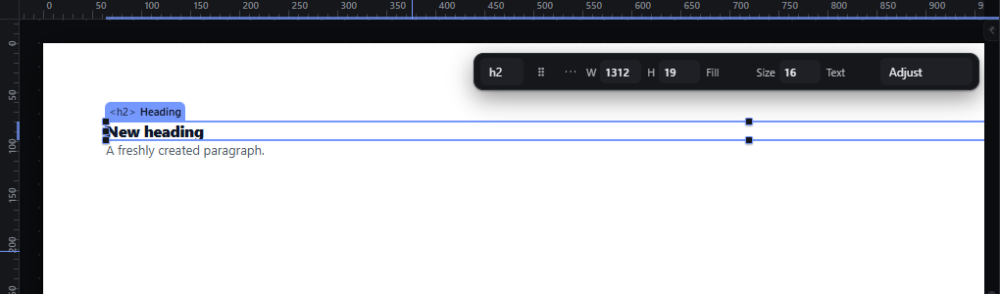
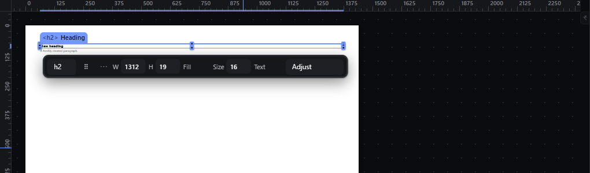

# rulers — Rulers along the canvas

How Pager behaves, observed by running it from `.cache/pager-run` (Chrome, window 1600×900) and read from its source. Source references are `path:line` inside Pager.

## Trigger

Rulers are always drawn along the top and left of the canvas unless switched off in Guides & Grids ("Rulers", stored in the `pe-guides-v2` preference; `src/features/precision/index.js:372-377`). They redraw on zoom, scroll, resize and selection change (`src/features/rulers/index.js:425-474`, `src/features/workspace/camera.js:108`).

## Hit zones and thresholds

- Bands: 20 px (`--ruler-size: 20px`): the top ruler spans the canvas width (observed 984 × 20 px at y = 44), the left ruler its height (20 × 754 px at x = 280).
- Units: page CSS px, 0 at the page's top-left corner; negative values to the left of/above the page (observed labels `-625 … 0 … 250` at 40 %).
- Tick step: the smallest of 1, 2, 5, 10, 25, 50, 100, 250, 500, 1000 px whose screen size is at least **6 px**; every 5th tick is major and labelled (`rulers/index.js:35-39`, `:68-71`, `:78-120`). Observed: at 100 % minor ticks every 10 px, labels every 50 px (50 screen px apart); at 40 % minor every 25 px, labels every 125 px (50 screen px apart).
- Pressing on a ruler starts a guide drag (see `guides-manual.md`).

## Visual feedback

| Stage | What is drawn | Image |
|---|---|---|
| 100 %, Heading selected, pointer over the page | Ticks and labels; the selected element's extent is highlighted on both rulers (`ruler-selection`, observed `left: 108px; width: 1312px` on the top ruler); a pointer marker follows the pointer on each ruler (`ruler-pointer`, `:456-472`). |  |
| 40 % | Labels every 125 px; negative labels left of the page. |  |

## Result in the document

Rulers never change the document.

## Undo and redo

Not applicable.

## Nested elements

The highlight shows the primary selection's box.

## Zoom other than 100 %

Tick steps adapt so labels stay 50 screen px apart or more (see Hit zones).

## Keyboard equivalent

None.

## Problems in Pager

1. **Label spacing can drop to 30 screen px** (for example at 60 %, where the 10 px step gives 6 screen px ticks and labels every 50 px = 30 screen px). Required: labelled ticks sit on round values (10, 25, 50, 100, 250, 500…) chosen so neighbouring labels are at least 40 screen px apart at any zoom (features.json `rulers`).
2. **The pointer markers stay visible in preview** (two blue ticks at the left edge in `preview-mode--01-preview.png`). Required: rulers and their markers are hidden in preview.
