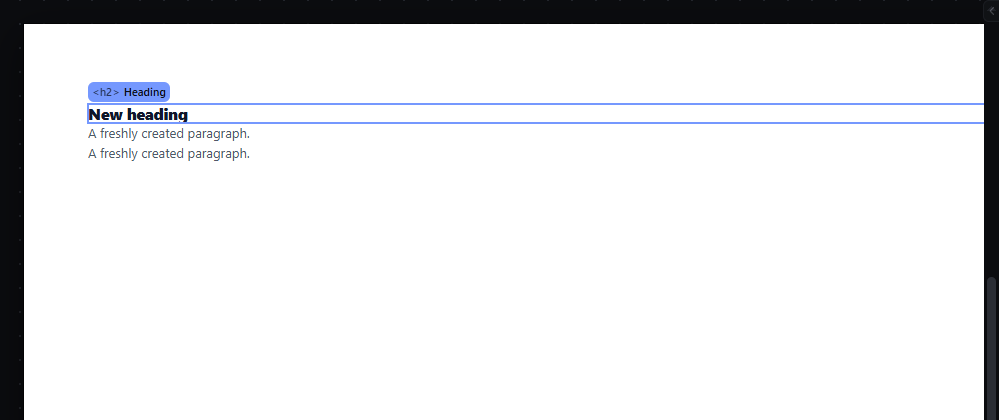
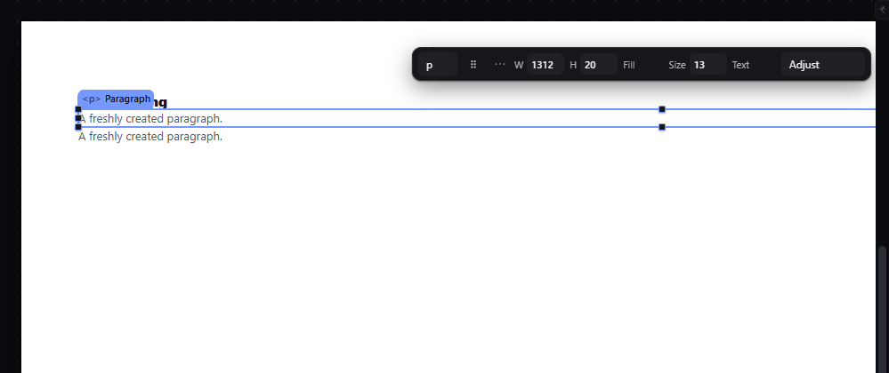
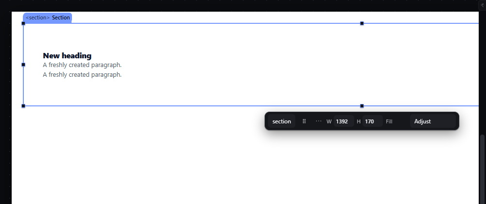
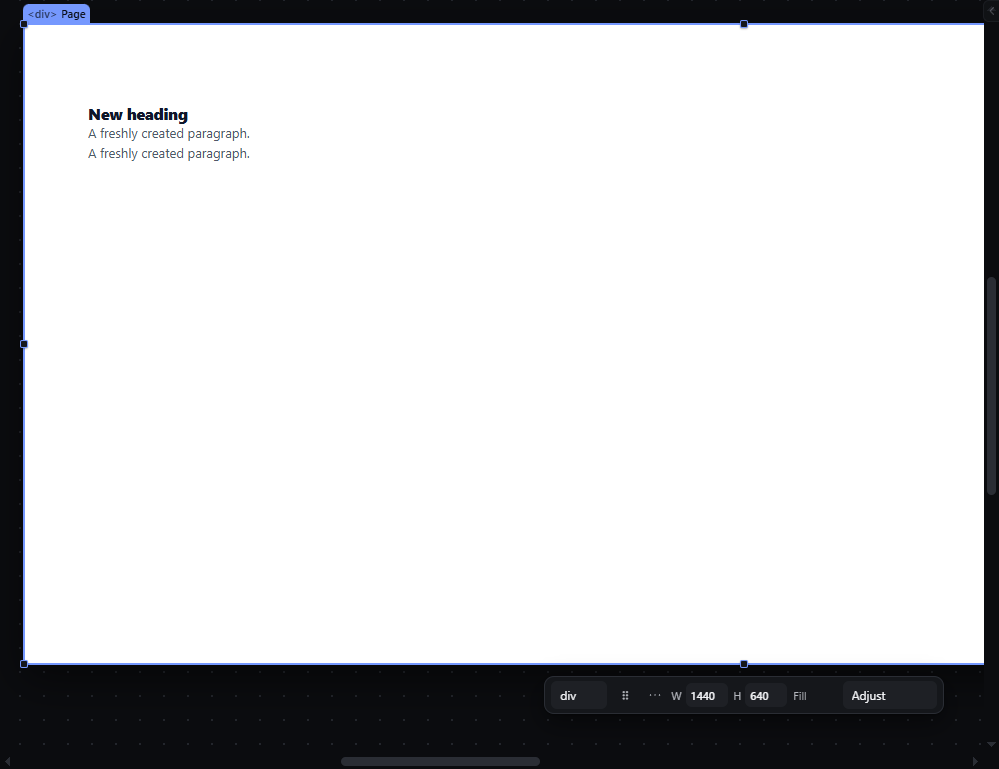
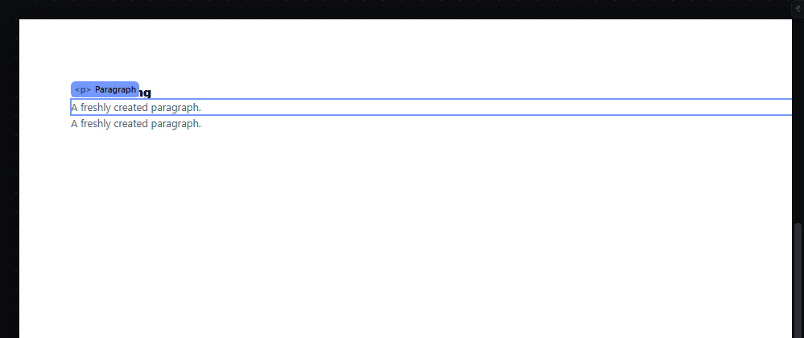

# select-click — Select an element by clicking it on the canvas

How Pager behaves, observed by running it from `.cache/pager-run` (Chrome, window 1600×900, zoom 100 % unless stated) and read from its source. Source references are `path:line` inside Pager.

## Trigger

- Primary-button `pointerdown` on an element in the canvas iframe selects it immediately, on the press, not on the click (`src/app/boot.js:449-502`, selection at `:496` through `selectOnly`). The press also arms a move drag (`:497`); if the pointer is released before it moves 4 px, the press stays a plain selection (`src/app/boot.js:527-539`).
- A press on the Page root (the page background) is taken by the marquee listener, which runs first in the capture phase (`src/features/marquee/index.js:63-78`, `:211`). Released without moving 4 px, it selects the Page root (`:147-151`).
- Hover: every `pointermove` over the canvas resolves the element under the pointer and paints the hover outline (`src/app/boot.js:517-523`, `src/features/selection/selection.js:34-62`). The Page root is never hovered (`selection.js:36`).
- `Escape` with focus on the canvas or on a panel clears the selection (`src/features/input/index.js:682-684`).

## Hit zones and thresholds

- The element hit is the deepest element whose box contains the pointer (`src/app/boot.js:465-477`, `pointerInNode` in `src/features/drag/drag.js:1378`). Padding belongs to the element that owns it: a press in a Section's padding, away from its children, selects the Section.
- Empty page area (inside the page, outside every element) selects the Page root.
- The element's selection label (the tag above the outline) and the hover label are also hit targets: they carry `data-handle`/`data-for` and select or drag the element they name (`selection.js:53`, `:241-242`, `boot.js:462-466`).
- Click-versus-drag threshold: 4 px Euclidean distance in screen pixels (`src/core/pointer.js:3`, used at `src/app/boot.js:507`). It does not change with zoom.

## Visual feedback

| Stage | What is drawn | Image |
|---|---|---|
| Hover | A 2 px outline in the accent ground colour exactly on the element's measured box, and a label chip above its top-left corner reading `<tag> Name` (monospace 11 px, `style/06-canvas-chrome.css:306-315`). When there is no room above the element inside the stage, the chip goes inside the box, 3 px below its top (`selection.js:60`). Hover never changes the selection. |  |
| Selected | A 1 px accent outline on the measured box (`style/06-canvas-chrome.css:140`), a tag chip on the outline's top-left reading `<tag> Name` (min 120×24 px, `:153`), eight 8 px round resize handles on corners and edge centres (`:159-175`, `--handle:8px` in `style/02-tokens.css:230`), and a floating quick panel next to the element. The Layers row of the element is highlighted. |  |
| Section padding clicked | The same selection chrome on the Section box. |  |
| Empty page clicked | Selection chrome around the whole page; the chip reads `
 Page`. |  |
| Escape | All selection chrome and the quick panel are removed. |  |

The status bar facts (breadcrumb, size) update with the selection; the message line does not announce a plain selection.

## Result in the document

Selection is editor state only; the document JSON never changes. Measured in Pager: selecting the paragraph gave the outline `x 388, y 187.19, 1312 × 19.5`, identical to the element's box mapped from the iframe.

## Undo and redo

Selecting is not an undo step. After an undo or redo Pager keeps the selection that the restored document state had (the node ids survive).

## Nested elements

The deepest element under the pointer wins; to reach an ancestor, click its padding, use the breadcrumb, ArrowUp (see `keyboard-tree-walk`), or the Layers panel.

## Zoom other than 100 %

The outline follows the element at any zoom (mapped through the iframe's CSS zoom). The chips and handles are inverse-scaled so they keep their screen size (`--chrome-inv`, `style/06-canvas-chrome.css:159`, `:302`).

## Keyboard equivalent

`Escape` clears. Selecting by keyboard is covered by `keyboard-tree-walk`, `layers-keyboard-navigation` and `select-container-children`.

## Problems in Pager

1. **A click on the dark stage outside the page selects the Page root.** The stage's own handler would clear the selection (`src/features/workspace/dock.js:112-117`), but the marquee capture listener takes the press first (`marquee/index.js:70`) and, on release, selects the Page root. Required: a click outside the page clears the selection; only a click on empty page area selects the Page root.
2. **Selection happens on `pointerdown`.** A press that turns into a drag has already changed the selection, which is what the feature wants, but a press on a multi-selection member collapses the group on release only if no drag started (`boot.js:530-537`). Required: select on press for a single element; for a member of a multi-selection keep the group until release, and only reduce it to that element if no drag started (as Pager does), with the rule written once in the selection owner.
3. **The hover and selection chips cover neighbouring content.** The chip sits above the element's top-left corner and hides the text of the previous sibling (visible in `select-click--02-selected.png`, where the heading text is covered). Required: the chip must not cover the text of other elements while nothing is being dragged; place it outside the element box where there is room (above, else below, else inside), and keep it the same height as the design token for canvas labels.
4. **The Page root's chip reads `
 Page`,** although the Page renders as `<body>`. Required: the chip shows the real tag of the node that is exported (`<body>` for the Page root).
5. **The Page root shows eight resize handles,** which invite a resize the page does not support. Required: the Page root selection shows the outline and chip but no resize handles.
