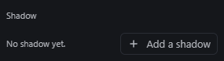
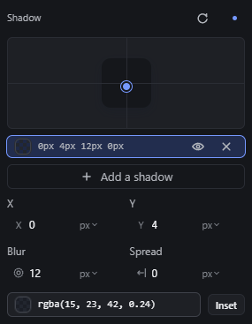
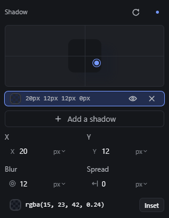
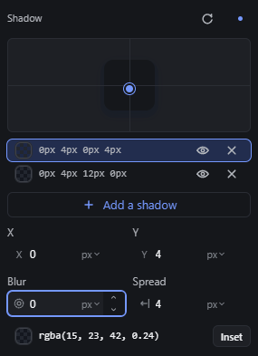
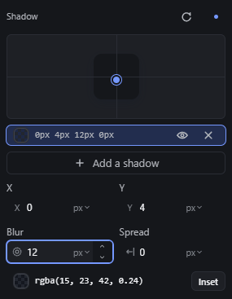

# shadow-editor — Box shadow and text shadow editor

How Pager behaves, observed by running it from `.cache/pager-run` (Chrome, window 1600×900) and read from its source. Source references are `path:line` inside Pager. Test element: a Container 240 × 120 px, white. The editor is `ppShadow` (`src/features/inspector/properties.js:1526-1660`), shown in Effects → Shadow (`data-prop="box-shadow"`).

## Trigger

- **Add a shadow** (shown with `No shadow yet.`) appends a layer `0px 4px 12px 0px rgba(15, 23, 42, 0.24)` and selects it (`properties.js:1550-1554`).
- **Light pad:**
  - Press anywhere in the pad, or on its round handle, and drag: X and Y become the pointer's offset from the pad's centre, in px (`dragTo`, `:1628-1634`; `startLight`, `:1635-1639`).
  - A plain click in the pad jumps the light to that point.
- **Layer rows:**
  - One row per layer: swatch, the values text, an eye (`Hide`/`Show`), `×` (`Remove`) (`:1596-1618`).
  - Clicking a row selects that layer for editing.
- **Fields for the selected layer:**
  - `X`, `Y`, `Blur` (min 0), `Spread`, all number fields with scrub glyphs (`:1557-1569`).
  - The colour field, which opens the colour picker.
  - `Inset`, a toggle button (`:1571-1579`).
- `Reset` in the header removes every layer.
- **Text shadow** is not this editor: `textShadow` is a plain text field in Effects (`properties.js:2404`, `editor: "text"`), where the CSS value is typed by hand.

## Hit zones and thresholds

| What | Value | Source |
|---|---|---|
| Pad | 267 × 102 px | measured |
| Handle | 12 × 12 px | measured |
| Mapping | X = round(pointer x − pad centre x), Y = round(pointer y − pad centre y), 1 screen px = 1 CSS px, **unbounded** | `:1631-1632` |
| Handle drawing | clamped to ±46 px horizontally, ±34 px vertically from the centre | `:1592-1593` |
| Drag start | immediate on pointerdown (`trackGesture(…, true)`) | `:1636` |
| Handle keys | ArrowLeft/Right/Up/Down ±1 px, Shift ±10 px | `:1641-1652` |

## Visual feedback

| Stage | What is drawn | Image |
|---|---|---|
| No shadow | `No shadow yet.` and `Add a shadow`. |  |
| Added | The pad with a cross at the centre, a preview square carrying the shadow, the handle at (0, 4); the layer row; X/Y/Blur/Spread; colour and Inset. |  |
| Dragging the light | The handle follows the pointer; the row text, the X/Y fields, the preview square and the canvas update live (observed `20px 12px 12px 0px`). Past ±46/±34 px the handle stays pinned at the edge while the values keep growing (observed `170px 112px`). |  |
| Two layers | Two rows, the selected one highlighted. |  |
| After hiding the first layer | The hidden layer's row **disappears**; only the other layer is left. |  |

## Result in the document

- `box-shadow` is written as the comma list of the layers in row order (observed: `0px 4px 0px 4px rgba(15, 23, 42, 0.24), 0px 4px 12px 0px rgba(15, 23, 42, 0.24)`); `Inset` prefixes `inset`. The computed `box-shadow` in the iframe matches.
- Blur `-5` + Enter was clamped to `0px` silently.
- **Hide** drops the layer from the written list, and because the editor is rebuilt from the stored value, the hidden layer is lost: its row is gone and it cannot be shown again (observed: after Hide on the first of two rows, one row and one shadow remained).
- Remove on the last layer writes `box-shadow: none`.

## Undo and redo

Each change is one undo step: a light drag (whole gesture), a field commit, Inset, Add, Hide, Remove (observed: after Add + Hide + Remove, two Ctrl+Z brought back first the two layers and then the state before Add; Ctrl+Shift+Z twice re-applied them). Escape during a light drag cancels it (`properties.js:619-621`).

## Nested elements

Not applicable.

## Zoom other than 100 %

Not affected (the pad maps screen pixels to CSS pixels regardless of canvas zoom).

## Keyboard equivalent

- With the handle focused, one arrow key moves the light 1 px (Shift 10 px).
- After that first key the Inspector re-renders and **focus jumps to the X field** (observed). The following arrows then act on the X field: ArrowDown decreased X and Shift+ArrowDown decreased X by 10. Y never changed.
- The handle has `tabindex="-1"`, so Tab does not reach it.

## Problems in Pager

1. **Hiding a layer destroys it.** Required: a hidden layer stays in the editor (row shown dimmed with the eye crossed) and in the document JSON, marked hidden; only the CSS leaves it out; Show puts it back in its place (manifest feature `shadow-editor`).
2. **No text-shadow editor.** Required: a Paragraph's text shadow uses the same layered editor (X, Y, blur, colour; no spread or inset) and writes `text-shadow`; the computed `text-shadow` in the iframe matches.
3. **Keyboard on the light pad works for one key only,** because focus jumps to the X field after the first move. Required: focus stays on the handle; arrows move X/Y by 1 px (Shift 10 px) for as long as it is focused.
4. **A text shadow could only be built layer by layer** (the user's real-use audit, item 1.3: typing `0 1px 2px #000` wrote nothing). Required: the text shadow also has a text field, "Text shadow", in the Text section with the rest of the typography, showing its layers as CSS and taking CSS text (`style.setShadows` with the edit `{ css }`): each comma-separated layer's lengths are X, Y and blur (a bare number is px), the rest its colour (currentcolor when none is typed); an emptied field takes every layer away; a text the browser does not take is refused naming what was typed.
