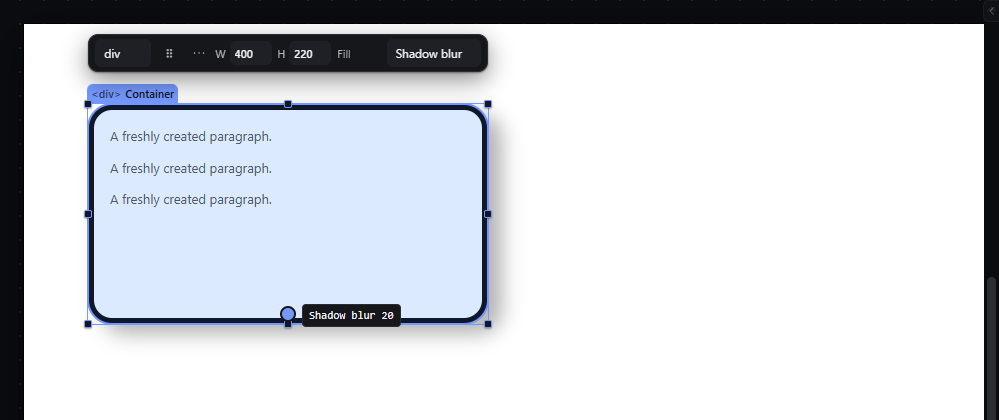

# shadow-handles — Edit shadow offset and blur by dragging on the canvas

How Pager behaves, observed by running it from `.cache/pager-run` (Chrome, window 1600×900) and read from its source. Source references are `path:line` inside Pager. Test document: a Container (`400 × 220 px`) with `box-shadow: 4px 4px 8px rgba(0,0,0,.3)`, selected.

## Trigger

- Quick panel "Edit on canvas" → **Shadow offset** or **Shadow blur** (`src/features/inspector/quick-panel.js:44`, `:416-425`).
- One 16 × 16 px direct handle appears at the element's horizontal centre, 10 px above its bottom edge (`:73-76`). Press, move at least 4 px, release to commit (`:86-109`). Release without moving opens a typed field. Arrow keys on the focused handle step by 1 (Shift 10) and commit each press (`:112`). `Escape` cancels and leaves the mode (`:114`).

## Hit zones and thresholds

| Mode | What the movement changes |
|---|---|
| Shadow offset | first shadow's X = start X + horizontal movement ÷ zoom; Y = start Y + vertical movement ÷ zoom (`:54-59`, `:97-99`) |
| Shadow blur | first shadow's blur = start blur + horizontal movement ÷ zoom, ≥ 0 |

Only the **first** shadow layer is edited. When the element has no shadow, a default layer is created from `blankShadowValue()` (observed: `8px 12px 12px 0px rgba(15, 23, 42, 0.24)` after an (8, 8) px drag). With Snap on, the X value snaps (Ctrl suspends).

## Visual feedback

| Stage | What is drawn | Image |
|---|---|---|
| Shadow offset mode | A round handle at the bottom centre labelled `Shadow offset 4` (only the X value is shown). |  |
| Dragging (+10, +6 px) | The shadow moves live; the label reads `Shadow offset 14`. No status message. |  |
| Shadow blur, after +12 px | The shadow softens; label `Shadow blur 20`. |  |

## Result in the document

- Offset drag (+10, +6) → `boxShadow: 14px 10px 8px 0px rgba(0, 0, 0, 0.3)`.
- Blur drag (+12) → `14px 10px 20px 0px …`; then ArrowRight and Shift+ArrowRight on the focused handle → blur `31px`.
- The computed `box-shadow` in the iframe follows the stored value.

## Undo and redo

One history entry per drag; Ctrl+Z after creating a shadow on a shadow-less element removed `boxShadow` entirely (observed).

## Nested elements

Only the selected element.

## Zoom other than 100 %

Movement ÷ zoom; the handle keeps its screen size.

## Keyboard equivalent

Arrow keys on the focused handle; the Inspector's shadow editor is the full route.

## Problems in Pager

1. **The handle does not follow the pointer and its label shows only X.** During the drag the handle stays at the element's bottom centre (observed: same position before and during the drag) while the shadow moves. Required: the handle moves with the pointer during the drag and its label shows `X, Y` for offset and the blur value for blur.
2. **Silent defaults:** starting on an element with no shadow invents `rgba(15, 23, 42, 0.24)` with blur 12. Required: the shadow modes are disabled (with the reason) when the element has no shadow (the manifest intent starts from "a Container with a box shadow").
3. **No status message.** Required: live value during the drag and `Shadow set to <value>` at the end.
4. **Text shadows have no canvas handles.** Required: on a text element with a text shadow, Shadow offset and Shadow blur edit its first text shadow (X, Y and blur) and write `text-shadow`, each drag one undo step (manifest feature `shadow-handles`).
